## How to read this page

This page documents how Mr Casino thinks, not a set of verified conclusions. Each part is marked for what kind of claim it is:

- **Documented**: well-established history or events, stated plainly.
- **His interpretation / opinion**: his reading of the facts. Attributed to him.
- **Forecast**: his expectation as of late 2024.
- **Disputed / unsupported / contradicted**: claims that stronger evidence does not support, with the reason given.

The trading-relevant parts of the same post live elsewhere: the principles on knowledge and verification in [Morality, Rationality & the Opposing Side](/mrc-tasks/misc/morality-rationality-and-the-opposing-side/) (*Knowledge as an edge*), and the macro view of USD dominance in [Fundamentals: USD, the Banks & Gold](/mrc-tasks/misc/fundamentals-usd-banks-and-gold/) (*The wider picture*).

## Why he shares it

He frames the present as a choice between "the side of empathy, justice, and truth (red pill)" and "the flow of apathy, accepting collective brainwashing and distraction (blue pill)". In his words, "It has always been about the battle between good and evil."

He ties this directly to trading:

> To trade as we do and extract against the manipulation means one has to be intrinsically in mind the side of good "red pill".

The message, he says, "relates to your trading confidently at the highest level, and now it is a necessity as big global change takes place that will affect all." He presents it as facts "that can be verified with proven sources and rationality", while leaving the reaction to each reader: "it is one's decision how to react to the uncomfortable truths. The genuine mind is happy to at least gain perspective."

## The banking-system critique

*His interpretation / opinion throughout, unless marked.*

- **Who holds power.** "Most governments, politicians, and media are not to be trusted operating under a globalist banking network - or at least subject to bought influence (at the minimum to the loans and of the IMF)." He calls this "a fact"; it is his view. IMF lending and its conditions are real and widely debated.
- **What the system was built for.** "The modern banking system could have in theory been used for major good if used equally globally. Rather it was built to consolidate power into a few hands (the banking elite)". In his account it funds "war mongering for world domination", drives "ever rising inflation to protect the assets of the rich", and holds "the debt lock over individuals".
- **"Subtle totalitarianism."** He describes it as "the very subtle totalitarianism system already with a grip over the world only this way for 20 or 30 years, a cause of much inequality."
- **How young the modern world is.** "The modern world as we know it has only been as so for less than 50 years, post two devastating world wars", listing the smartphone, entertainment, social media, nuclear power, AI, "fiat currency and the markets". *Note:* the two world wars ended around 80 years before this post. "Less than 50 years" fits the modern fiat era better (the dollar's link to gold ended in 1971). The general point - that today's financial world is recent and fast-changing - stands either way.
- **The Federal Reserve and WW1.** *Documented:* the Federal Reserve was created in 1913 and the First World War began in 1914. *His question, not a finding:* "Coincidence? Needed catalyst to bring the banking system to play by ridding of other powers?"

This critique is the background to the USD/banks/gold model in [Fundamentals](/mrc-tasks/misc/fundamentals-usd-banks-and-gold/).

## Freemasonry and power, as he sees it

He argues that the banking elite "already had their grips in power" before the Fed, through "the network of Freemasonry", and that this "slowly took control of the world's affairs in a sinister secretive manner." He is explicit about how he wants it read: **"The facts matter more than my complete take on the subject (can always be wrong in opinion, not in fact)."**

He built the history with ChatGPT and shared the answers as screenshots, as an example of his own research instruction: "Use its resource, do not be reliant" (see *Knowledge as an edge* in the [Morality entry](/mrc-tasks/misc/morality-rationality-and-the-opposing-side/)).

The ChatGPT timeline he shared (8 screenshots, 1200s to present)

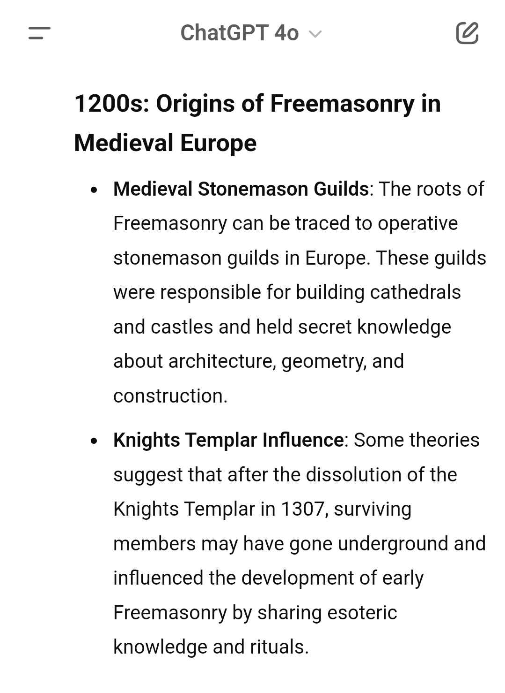
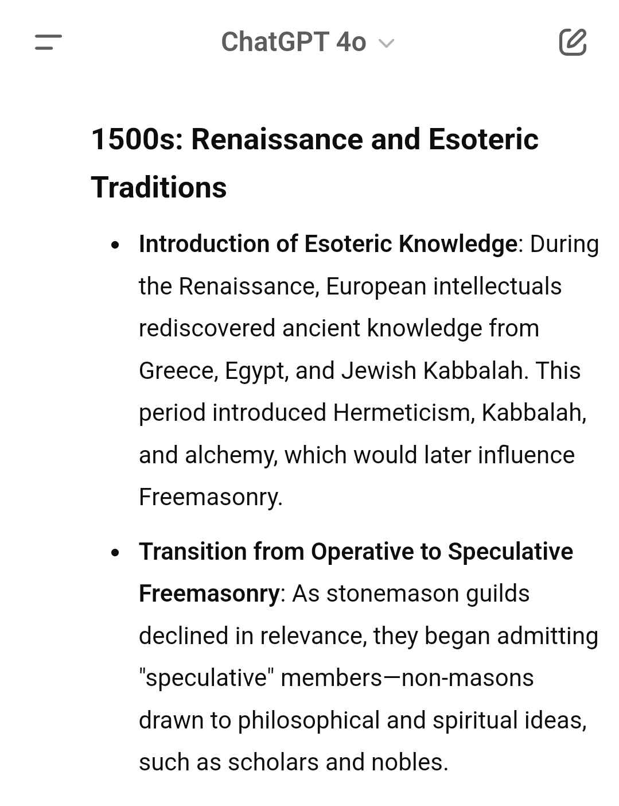
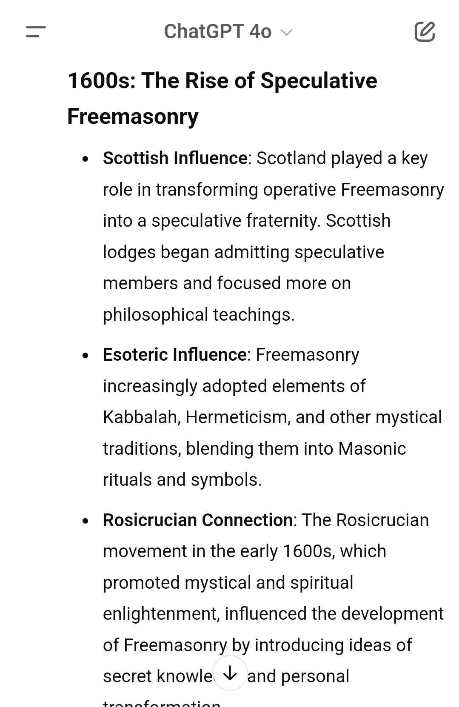
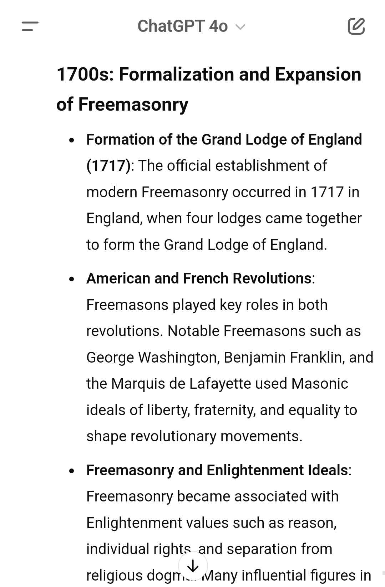
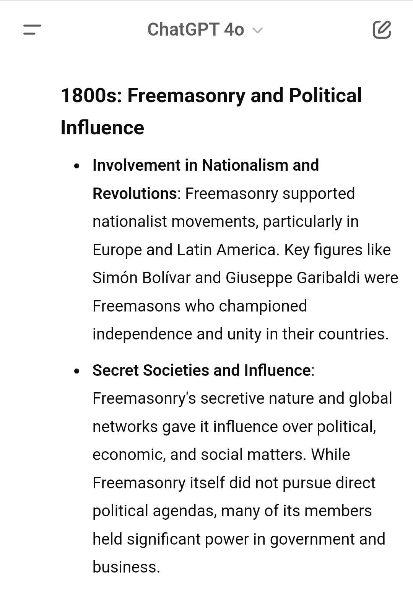
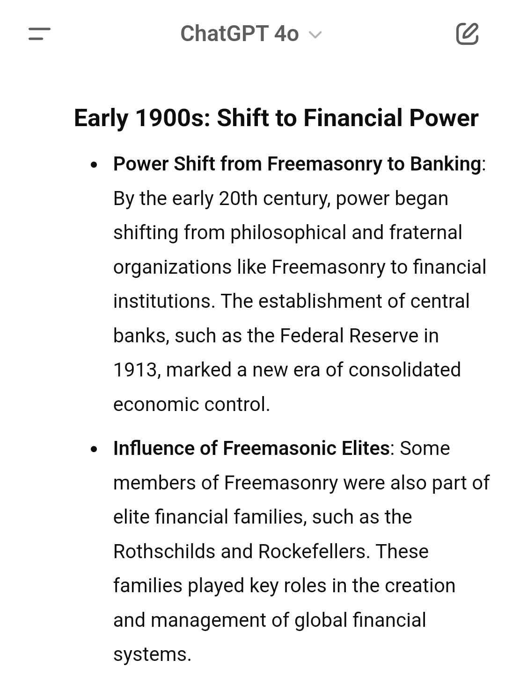
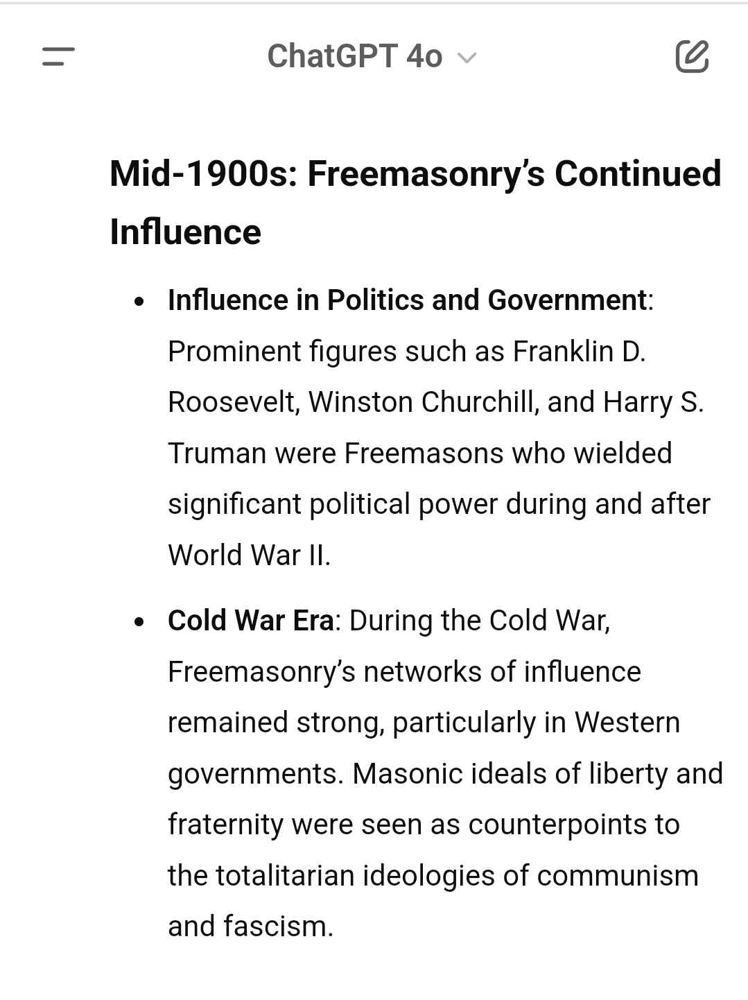
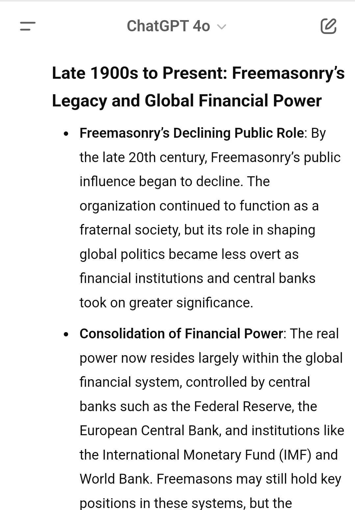

*These are chatbot answers he shared as research, not verified sources. In places they are more cautious than his own reading (the 1200s and 1800s entries in particular).*

### His account, point by point

- **Origins.** He traces it to the 1200s, "where nobles would gather operating under secret knowledge (today is similar)". *Note:* the screenshot he shared describes stonemason guilds, not nobles.
- **The Knights Templar.** He says the Templars and Freemasons "are known to be linked". *Disputed:* mainstream history treats the Templar-Masonic link as legend or unproven, and his own screenshot gives it only as "some theories suggest".
- **The Templar heresy charges.** *Documented:* the Templars were suppressed from 1307 on charges including heresy and idolatry. He asks why "these supposed lovers of Christ" would engage in magic, the occult and Kabbalah: "Were they true Christians after all?" *Contradicted by his own source:* the passage he shared (below) says the confessions came under torture and that historians largely view the charges as fabricated.

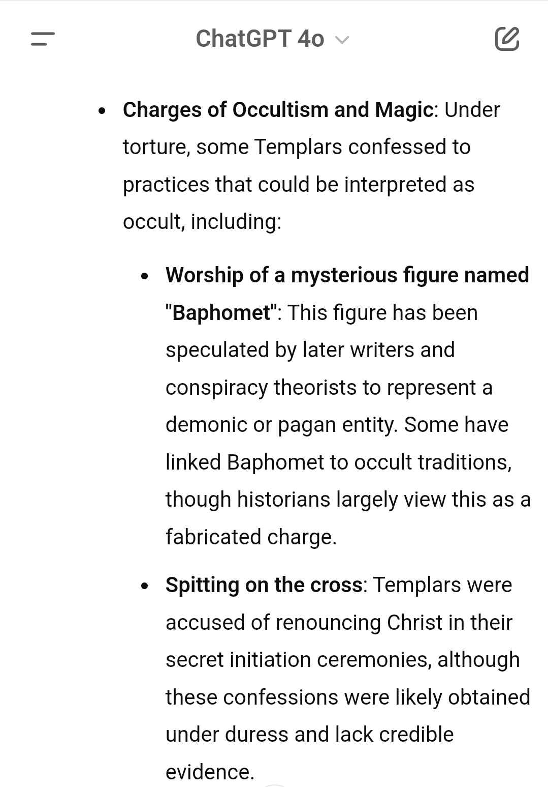

- **The 1700s and the revolutions.** "By the 1700s this was an established network of consolidated power", strong in Britain, "with heavy parts to play in the French and American revolutions." *Documented:* the Grand Lodge of England was founded in 1717, and Freemasons were active among the American and French revolutionaries. *His interpretation:* that this was a coordinated network that "shaped modern history".
- **Famous members.** Washington, Franklin, Garibaldi, Churchill, Roosevelt and Truman: "All part of the same circle." "If it is so unimportant as they claim, why do they not teach this in school as part of history?" *Documented:* these memberships are on record. *His interpretation:* that shared membership means coordinated purpose.

The membership lists he shared (18th, 19th and 20th century)

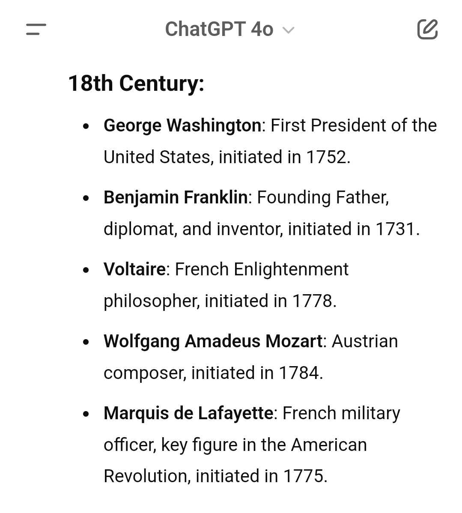
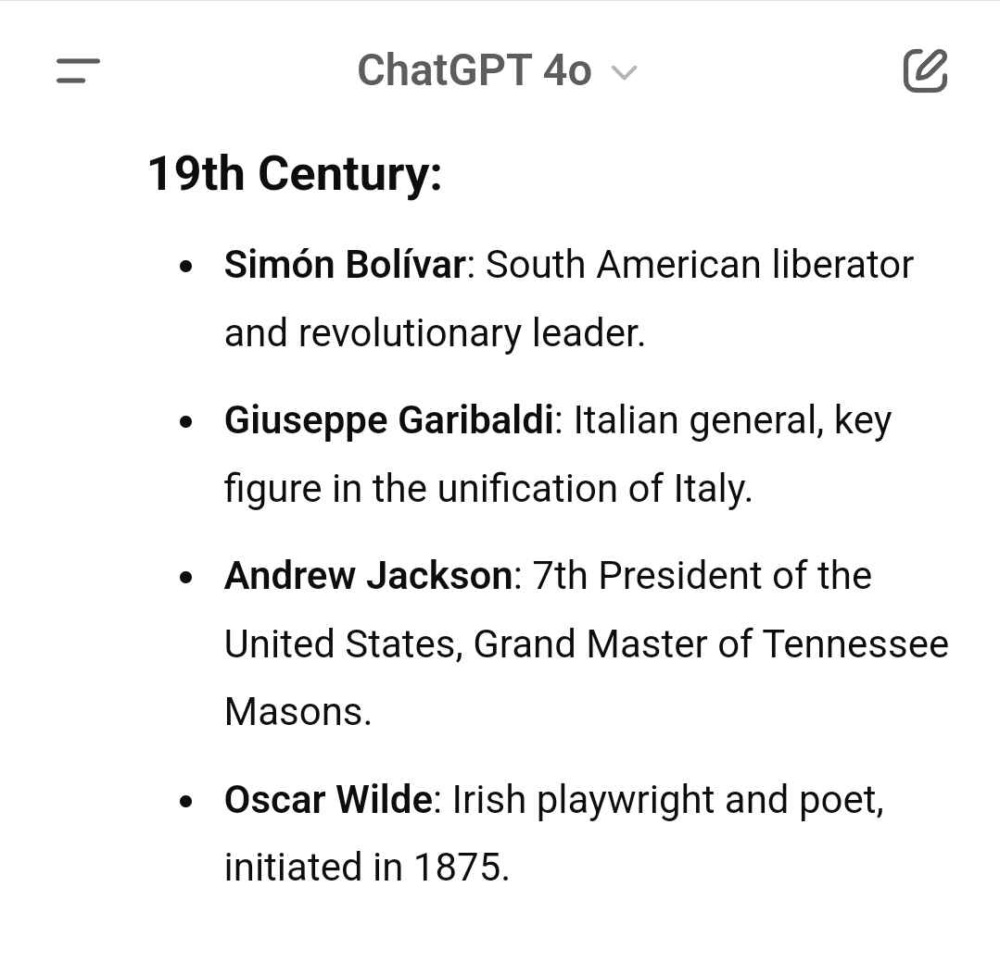
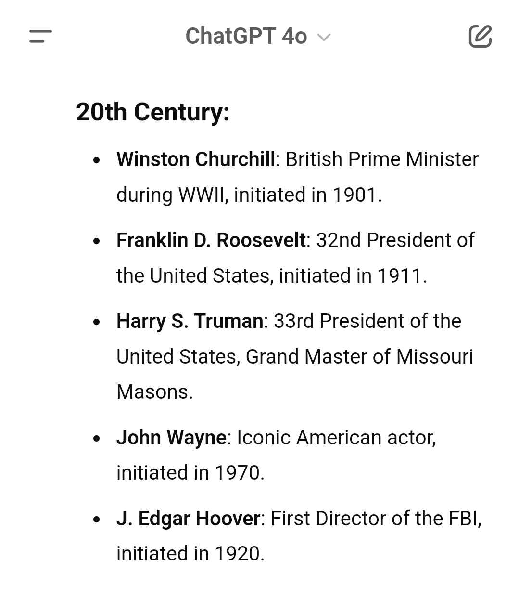

- **"Within circles are circles."** After the Fed and the world wars, he argues, "their power lock over the world was achieved", and Freemasonry is now too mainstream to work as a disguise. His point about tiers: "not all are on the same level of power. Some are only there for the influence and connections (and can thereby be bought), others are more in tune with esoteric beliefs enticed at the ability to attain power through rituals."
- **Symbolism.** He points to symbolism in film and music and on the one-dollar bill. *Disputed:* the Eye of Providence on the Great Seal is often read as Masonic, but its origin is contested.
- **Rituals.** He says magic and rituals are "proven facts", citing the Bohemian Grove exposé, papal bans on occult practice in the 1500s and centuries of witch hunts, and asking "If they are just rituals with no effect, why would they bother to partake?" He concedes "there is much exaggeration. But there is also much we do not know." *Status:* the Bohemian Grove ceremony is real (it was filmed in 2000), and the papal bans and witch hunts happened. They show that people *believed* in magic, not that rituals have real effect. That part is belief, not proven fact.
- **Skull and Bones.** He calls it "a latter inner circle of Freemasonry" and shared a list of its members (Bushes, Kerry, Taft, Harriman and others; broadly accurate). *Inaccurate:* Skull and Bones is a Yale senior society founded in 1832, not a Masonic body or inner circle. The screenshots are kept in the source archive.
- **What ties it together.** "A network in making at least most strongly for the last 300 years", "tied by an esoteric (ultimately corrupted messianic) tradition that helps them justify themselves to be saviors of humanity", and in his view the cause of "much war, financial enslavement, manipulation", and of moral relativism, "an innate corrupt morality". This links back to his rejection of moral relativism in the [Morality entry](/mrc-tasks/misc/morality-rationality-and-the-opposing-side/). He adds that "the totalitarian regime (not bound to any religion but its own teachings) is already here".

## Specific claims he makes

He lists these as examples of what the network has done. **None is supported by the stronger evidence**; they are recorded here because they are part of his worldview.

- **JFK's assassination**, as a killing of someone "against the banking system, and the Israeli development of nuclear weapons". *Unsupported:* a fringe theory that the official investigations do not support.
- **"The inside job of 9/11"**, recommending David Icke's *The Trigger*. *Contradicted:* by the 9/11 Commission and NIST findings. Icke is widely documented as a promoter of antisemitic conspiracy theories.
- **"The Covid vaccine and lockdown scandal."** *Unspecified:* no specific claim is made. Lockdown policy is a legitimate subject of debate, but "scandal" is not defined.
- **The Albert Pike letter (1871)**, said to set out a plan for three world wars. He hedges: "Although its authenticity is not completely verifiable, it cannot be ruled out". *Fabricated:* the text refers to "Fascists" and "Nazism", terms that did not exist until decades after 1871, it first appears in 20th-century conspiracy literature, and the British Library denies holding it. The image he shared is kept in the source archive only.

Immediately after the list he adds a line worth keeping on its own terms: **"Never forget, however - all are human no matter their perceived might - the only power is the barrier of knowledge that separates."**

## The present day, as he reads it

"It all leads back to the present age", above all Gaza, which he calls a genocide, and "a war that spills over the whole Middle East". *His characterisation:* whether it is genocide in law is the subject of ongoing ICJ proceedings (South Africa v. Israel).

- **Resisting powers.** "Although the banking power is vast and strong, much of the world has caught on", with many resisting powers, "not united - each with their own benefits in mind only, some causes more just than others." The market-relevant side of this (Russia, China, BRICS, North Korea) is in [Fundamentals: *The wider picture*](/mrc-tasks/misc/fundamentals-usd-banks-and-gold/).
- **Wider instability.** *Documented events he cites:* the 2024 Bangladesh uprising, the India/Pakistan/Kashmir conflict, and Afghanistan under the Taliban since 2021.
- **Western social upheaval.** *His opinion:* civil unrest after Covid, "transgender propaganda taught in the schooling system", "more than 100% inflation", and "mass immigration purposefully unchecked (a whole purposeful agenda to divide of its own)". *Status:* contested political opinion. The inflation figure has no clear referent (true of some countries, such as Argentina and Turkey, not Western aggregates), and the "purposeful agenda" is unsupported.
- **The media.** *His opinion:* this is "the first time in history such a war of cruelty has been seen, live on air broadcasted for the world to all see on social media"; the media ignore or defend the atrocities, a "media brainwashing" he traces back to 9/11; and the coverage of Russia/Ukraine versus Palestine shows "double standards". Behind it, in his view, is "the real aggressor - the banking system and all the totalitarian control that came with it".
- **Figures he gives.** Three times the amount dropped on Hiroshima/Nagasaki has been dropped on Gaza ("day after day for more than a year"), and "70% of targets are innocent women and children (non-combatants)". *Unsourced in the post.* The tonnage comparison sets conventional explosives against a nuclear yield. A UN human-rights office analysis (Nov 2024) found about 70% of *verified deaths* were women and children, which describes casualties, not targets.

### "Why?" - his answer

He asks why power would be "so ruthless with so much power already?" and gives two reasons:

1. **Financial:** "the financial reasoning to stem resistance".
2. **Belief, "at the very top level":** "the ancient traditions regarding Jerusalem and Armageddon". He argues Freemasonry has its own "distorted version of Armageddon (not Jewish nor Christian)", pointing to the teachings of Sabbatai Zevi and Jacob Frank, and concludes: "These are the beliefs of the highest ranks of Zionism and Freemasonry and the banking system. They are all entwined."

*Status: unsupported, and a recognised antisemitic conspiracy narrative.* Sabbatai Zevi (17th century) and Jacob Frank (18th century) were real messianic figures. There is no evidence that their teachings drive Zionism, Freemasonry or the banking system. The idea of a single hidden "Judeo-Masonic" or Frankist cabal behind banks and wars is a long-standing antisemitic conspiracy theory. It is recorded here because it is the "to whom their loyalties lie" and "apocalypse prophecies" material he promised in the first batch (see [Fundamentals](/mrc-tasks/misc/fundamentals-usd-banks-and-gold/)), not because it is established.

### His forecast and political view

- **Forecast (late 2024):** the war "will only escalate for peace is not the motive"; "the good disposition of humans always wins"; relations are "beyond repair. The point of no return"; "an inevitable major change is undoubtedly coming."
- **US election (opinion):** "Anyone supporting this (after true information) are not to be trusted and show their intrinsic corrupt morality." Of Trump and Musk: "if there was ever a meaning of controlled opposition it would be that pair". This does not cover the Trump assassination attempt he said he would return to; that thread is still open.
- He also urged the team to watch the videos and content he shared. One link survives in the source: [YouTube](https://www.youtube.com/watch?v=NEYEcAd-tzQ) (its content has not been reviewed here).

## His closing stance

- "It really does not matter much what one thinks about the contents of this message." It is "much history condensed", and sharing "the truth and verifiable facts" once is, in his words, his duty.
- "There is no patience for public brainwashing agendas in this team amidst such turmoil and suffering already."
- **"And only with knowledge only do we transcend..."**

---

Related: [Morality, Rationality & the Opposing Side](/mrc-tasks/misc/morality-rationality-and-the-opposing-side/) · [Fundamentals: USD, the Banks & Gold](/mrc-tasks/misc/fundamentals-usd-banks-and-gold/)
