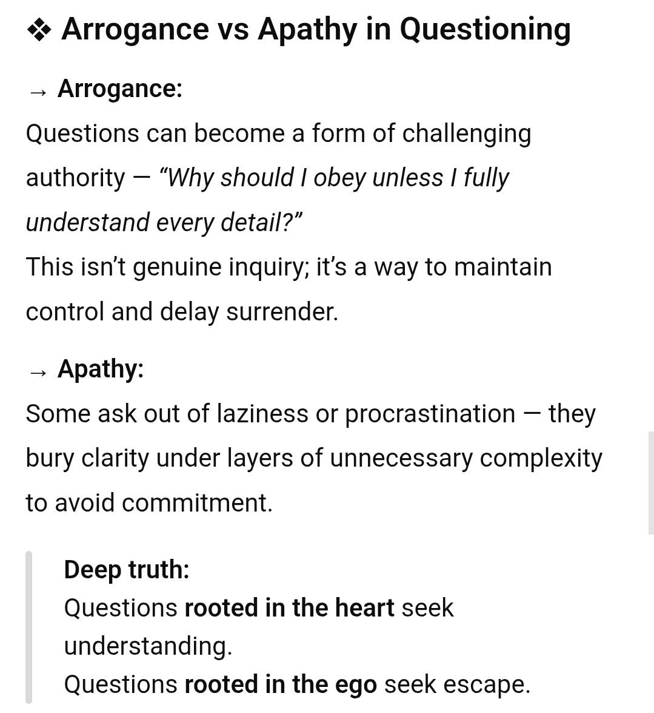
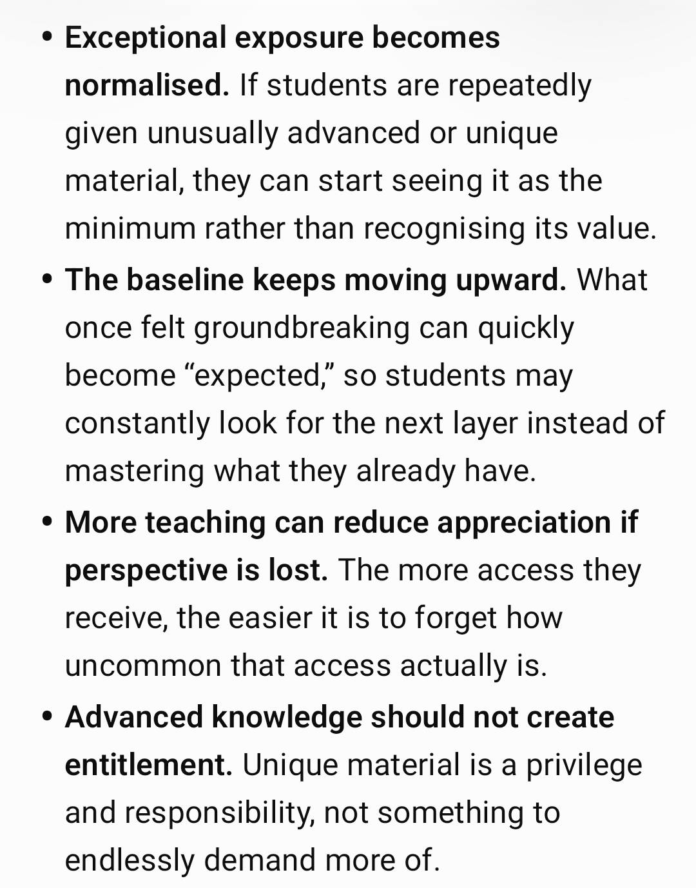
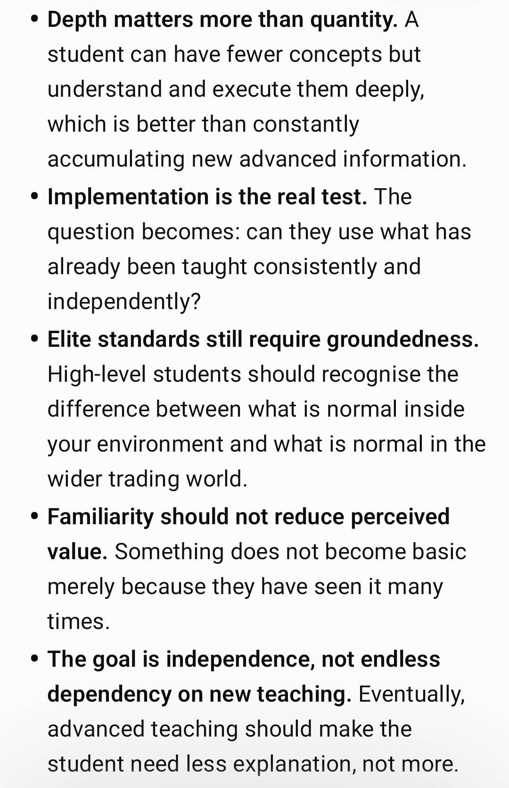
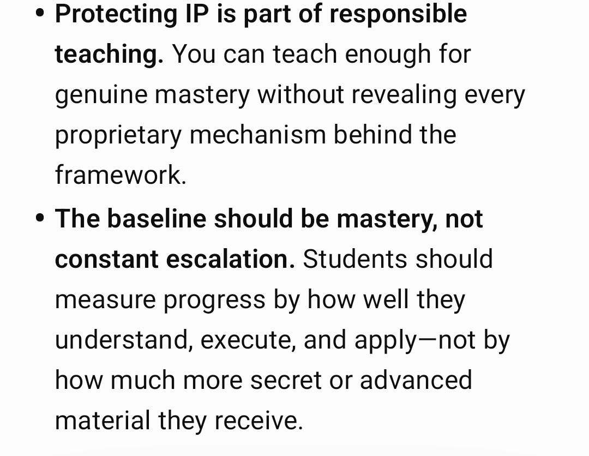

## Where this fits

He opens by describing what he aims for: "We operate here from a unique understanding at the highest levels of extraction found nowhere else." Traders arrive with characteristics and personalities shaped by their "respective societies/economies/education/media/upbringing/self-resilience/habits", some more helpful to trading than others. This post is meant to cover "the real processes of the subconscious as one trades" and to make "the transition into a mindset of true power - for all (irrespective of previous influence)".

It expands the list of distortions named in [Rationality & Backtesting Discipline](/mrc-tasks/misc/rationality-and-backtesting-discipline/) ("society, environment, media, negative habits and targeted distractions"), which he treats as the root that all psychology falls under. He posted it straight before the technical [Practical Rules of Analysis & Extraction](/mrc-tasks/reference/rules-of-analysis/): "This base was more important to set first."

## Why trading is psychology-intensive

**"It is a fact that trading is a game of the most intricate psychology."** He gives three reasons.

1. **Money.** Money-making is one of the most emotionally charged parts of most people's lives, linked to "the innate will for survival, freedom, and then power/influence". Trading offers more potential than anything else, so the trader is even more emotionally involved, "not to mention the fair share of external manipulation shaping perceptions".
2. **Chess versus trading.** They are polar opposites:

   > A game of chess is closed-ended, has fixed rules (complete information), and you are only playing against one.
   >
   > On the contrary, trading is open-loop (has no end), there are no fixed rules (rather vast misinformation), you compete against vast unknown external forces, and have no control over the outcome of price movement (you only control your own decisions).

   So the ordinary trader arrives at the markets with a mind that is "a whirlwind of confusion".
3. **The average trader doesn't see it.** They don't grasp the first two points: the odds stacked against them, and a mind that is "prey to excitement and impulse". That lack of clarity makes them "new retail liquidity". Most were "introduced to the markets via false information - and this is the tainted cycle from which most traders begin."

## So now do the opposite

- **"Work on your relationship with money, understand the default human inclination to be more emotionally impacted."**
- **"Know that trading is open-ended with no rules easy to get lost in - a profitable trading plan objective is to make it akin to a game of chess (mechanical, a limited variation)."**
- Simply knowing these factors and concentrating on improving them strengthens your foundations: "the true trading mindset of clarity".

The chess comparison returns in his [rule 2](/mrc-tasks/reference/rules-of-analysis/#2-pure-price-action-detached): "make it like the closed ended game of chess—you know all the rules".

## Practical action steps

He touches each briefly: "each has far more depth for individual study".

### Risk management, RR and probabilities

> It is a fact that with our system, 1 win makes up for 10 losses or more.

Use that as the base of every trading decision. "The math of RR and its probability is a fact." Becoming emotional leads to poor risk choices that ruin both: over-risking on one trade "ruins average RR", and over-trading on false opportunities "is not adhering to true probabilities".

**"So transform your risk management and mindset into one that thinks mathematically. There is no positive impact from involved emotions."**

See [Task 3 · Risk to reward](/mrc-tasks/tasks/3/assignment/#1--risk-to-reward-and-the--compound) and [rule 11](/mrc-tasks/reference/rules-of-analysis/#11-do-not-get-caught-up-in-entry-models) ("One win makes you x10, x20, x50 any loss").

### Take breaks

**"You do not need to trade every day, every session, or every opportunity. Take breaks and solidify your roots."** In his words, "the returns we earn in a day can be equal to what others take a year to achieve" (his claim about the system). After a bad performance or a good one, take time to clear your mind.

### Backtest more than you trade

> What is certain is you must backtest more than you trade.

Backtesting makes your trading peaceful, your mind stronger and your understanding of RR deeper, and it erases bad habits "via true disciplined efforts". It is confirmed to give more positive change than "any hours spent live trading under stress". **"Quality > quantity."**

The same principle is behind the 500 hours and the stored-data obligation in [Rationality & Backtesting Discipline](/mrc-tasks/misc/rationality-and-backtesting-discipline/), and [Task 3 · Backtest before you trade](/mrc-tasks/tasks/3/assignment/#backtest-before-you-trade).

## Underlying causes: breaking free from the manipulation

Beyond the processes, he turns to the causes underneath: what affects how well one understands the manipulation, how one handles rising equity, how one frees the mind from limiting factors and avoids "targeted distractions". "Part of what makes trading so special is the journey of self-mastery."

> To read past the manipulation, one cannot be part of the manipulated. Rather one must become a counterforce in truth.

*What follows is his worldview and personal conviction, given as he framed it.*

### Money

In his view, "The world is lied to about the true nature of money." Societies run on this lie, "subjugated under a hidden oppression": one side "makes billions daily" while the other works "for $100 a day or less". Seeing this is "a total perspective change", and he ties it directly to trading:

**"You can't read (or believe in) liquidity manipulation truly until you achieve this shift."** Some already know more of it than others, "and so they excel sooner." (Compare Task 2's first foundation, "A firm concrete belief in the manipulation of common retail liquidity", in [Task 2](/mrc-tasks/tasks/2/assignment/#foundations-to-solidify).)

"The other side would not have the common person wake up and there is much distraction in its regard. You must rid yourself of all."

### Media

"False narratives, subconscious programming, stirs low vibrational feelings (divide and conquer strategy)." **"Be only as informed as you need to - via verified independent outlets. A respect for true journalism, not a blind following."** The same principle is in [Morality · Knowledge as an edge](/mrc-tasks/misc/morality-rationality-and-the-opposing-side/#knowledge-as-an-edge-be-informed-verify-everything). In a later post he calls this "the war of disinformation" and restates the principle: **"to beat the manipulation, you can not be the manipulated."** See [Worldview · The war of disinformation](/mrc-tasks/misc/mr-casinos-worldview-banking-power-and-history/#the-war-of-disinformation-a-later-post). His Fundamentals Part 2 (autumn 2025) covers social media, algorithms and censorship in its "Subject 2": see [Fundamentals Series · Social media and news](/mrc-tasks/misc/fundamentals-series-geopolitical-state-of-the-world/#subject-2-social-media-and-news).

### Society

Society reinforces what it has always known. Have patience with those who don't know better: "you are responsible for helping those around you." **"Think objectively always, don't let society steal your dreams as it was for them - you know better."**

### Governments

His view: many patriots still believe their governments have their best interests at heart, which he calls "A fallacy - at least in most major countries of the world" ("we do not speak of all governments here"). "The leading power is the banking system, their network, and funding." He asks how much is spent "on the war machine and how much on social development", whether they have "shown themselves to have upstanding morals", and "How many options were there for the "Democratically elected"?"

"The sooner one stops believing in the government as saviors - is the sooner you unlock mental freedom to act and forge your own powerful path." He acknowledges it is "a harder pill to swallow ... but one cannot shy away from the truth. It matters for your freedom." His wider view of the banking system is in [Mr Casino's Worldview](/mrc-tasks/misc/mr-casinos-worldview-banking-power-and-history/#the-banking-system-critique) and [Fundamentals](/mrc-tasks/misc/fundamentals-usd-banks-and-gold/).

### Entertainment

He quotes: "Give them bread and circuses and they will never revolt". Fun is fine, "but secondary after definitive purpose"; consume mindfully and don't let it distract you from what matters. **"In today's age of AI targeting protecting your dopamine system is more critical than ever. The trader requires a sharp focus."** Instant gratification, or "a lasting meaningful freedom and impact? You choose."

*Editorial note: "bread and circuses" comes from the Roman poet Juvenal; the "they will never revolt" form is a popular modern paraphrase.*

### Bad habits

Poor diet, lack of exercise, smoking, drinking, excessive entertainment: "You are substituting for your willpower, resilience, and focus." Some are worse than others, but what matters most is **"taking accountability"**, "to best the probabilities in your favor". "Each day of life should be an improvement."

### Feeling worthy and mental maturity

**"You want to be in the top 1%, but your actions show otherwise? It does not work like that. You can't trick your subconscious."** If you don't backtest, haven't broken free from manipulation, and keep bad habits without trying to change, "then you are only to blame for your lack of success."

A warning about a type he says he has seen in many traders: after "some small lucky wins (generally via funded accounts)" they think they have made it and "harbor a borderline arrogance", an arrogance and immaturity "that stops them from ever progressing further. ... Do not be from amongst them." He calls it "a form of "doublethink"" (in his view, "Politicians of today specialize in it"); doublethink is covered in [Morality, Rationality & the Opposing Side](/mrc-tasks/misc/morality-rationality-and-the-opposing-side/#from-rationality-to-correct-morality). **"Learn to think rationally and objectively always."**

### Spirituality

He quotes: "Faith in God makes one leave all which is trivial". In his view, to earn at the highest levels or reach the highest ranks of power one must do one of two things:

> A) Sell your soul (this means sacrificing good morality for illicit gain) B) Have faith in God.

He says he does not want to go into theology, but has to mention it at least once "for it certainly relates to our trading path":

> We are up against the bank's manipulation, who are an evil force (some may see that as extreme but it is wholly true), and its opposite force is the force of light. You will certainly find the best traders are those who have this grounding and faith.

### His conclusion

**"And this is how we are able to beat banks at their own game - our minds are stronger."**

## Supplements he suggests

*His personal suggestions, not a trading rule or medical advice.*

- For laziness, or to power through extra study sessions: "coffee (take breaks) or green tea".
- For impulse: "ashwagandha (will alter emotional sensitivity so be careful and only use once or twice a fortnight)".

## Asking questions well (Week 1 reflection)

He closed [Week 1 of the weekly programme](/mrc-tasks/tasks/weeks/1/) with a reflection "In the art of the mind and correct thinking":

**"To avoid making things unnecessarily difficult for yourselves."**

He treats it as part of a larger subject for later ("this is a whole discussion of its own and we will explore it later - it matters now"), rooted in "the age old nature / psychological pattern behaviour of humans we are taught through the history". Some, he says, "ask questions merely for the sake of it without truly delving deep , or show a lack self confidence - it does not come from a genuine place (if done only subconsciously)".

*His view of the cause:* "People who do not attempt to constantly think purely (key word - attempt- essentially the modern day "law of attraction") suffer sometimes from a tainted innate disposition and have apathy/arrogance/ subconsciously take comfort in wallowing in self pity. The root of self sabotage." For some it is "merely a lack of education- but that is not an excuse in the Internet age and one being here now".

The remedy:

> These are problems that can be fixed by rationality. Focus on the advantage first (80% of your thought power) and then any arising questions (20% of thought power). You are already given the researched facts. Remember to use all the contents provided in reflection and previously - they are all linked.

"We do not point to anyone, but to serve reminder to all and to broaden minds. It pertains to, and will strengthen your trading ability. Questions are welcomed- but how much do you first work on your mind to ensure you are proposing your highest researched intellectual capacity and standard?"

"Questions and exploring different analysis scenarios / live price action / reflection/ together are different- the latter is more encouraged and advantageous for your studies + mind power"

He shared a ChatGPT answer alongside it:

ChatGPT output shared by the mentor: "Arrogance vs Apathy in Questioning"

### Using ChatGPT

That ChatGPT answer used the word "surrender". He clarified: "Some may have took that literally. We know the only one to worthy surrender to is god." Then, on the tool itself:

- "Chat gpt is nothing more than a fun tool, the likes of its potential never accessible before in history , yet know the underlying answer you will receive is always linked to the type of question you ask."
- "The objective in a sense is not to take everything it says as the 100% truth (it doesn't have your soul and instincts, and is programmed to say only as much as you ask) - but rather learn something new - to ask then the better question. Use it in this way."
- "Any educational lapse can be filled." Asking it to take you to PhD or masters level on a subject such as maths "may be hard , but possible. Maybe even in an exceedingly shorter timespan. It is basic rationality to make use of this tool (again without being consumed, the human is more powerful). In the right way, to ask better questions and affirm new knowledge."
- "(And no, I do not use it for these writings here)"
- *In a later post (Fundamentals Part 2, autumn 2025) he is more cautious:* "And be even more careful of chat gpt and dependency. It may get more subtly manipulative  Especially for those who see it as a first form of knowledge (it should be used at the end and experimentally, unless learning a factual subject where there is no room for opinion- like math)"

The same principle, "Use its resource, do not be reliant", is in [Morality · Knowledge as an edge](/mrc-tasks/misc/morality-rationality-and-the-opposing-side/#knowledge-as-an-edge-be-informed-verify-everything).

## Choosing one trading style (Segment 3)

In [Segment 3](/mrc-tasks/tasks/segments/3/assignment/#choosing-a-style) he adds: "For traders struggling with psychology it is recommended to choose one of the three as your trading style." The three are the tradable points of the top-down cycle: Origin, Swing Intraday Activation and Intraday Continuation.

## The baseline trap (Trading Psychology #1)

A later post, headed "Trading Psychology #1 — The Baseline Trap": "An aspect that I believe is worth briefly highlighting for the team and a key trap many may fall into , awareness will break it so. One that applies to teaching, learning, and trading implementation alike." He offers it as "a gentle reminder and a form of mental recalibration".

> The baseline trap is when repeated exposure to something exceptional makes it feel normal.

"In trading, this can distort expectations around performance. In learning, it can make unique knowledge feel ordinary simply because you have had continued access to it."

"Overcoming it matters because familiarity should not reduce perspective, gratitude, discipline, or the ability to recognise real value."

The list he posted with it (transcribed from his three screenshots below):

1. **Exceptional exposure becomes normalised.** If students are repeatedly given unusually advanced or unique material, they can start seeing it as the minimum rather than recognising its value.
2. **The baseline keeps moving upward.** What once felt groundbreaking can quickly become “expected,” so students may constantly look for the next layer instead of mastering what they already have.
3. **More teaching can reduce appreciation if perspective is lost.** The more access they receive, the easier it is to forget how uncommon that access actually is.
4. **Advanced knowledge should not create entitlement.** Unique material is a privilege and responsibility, not something to endlessly demand more of.
5. **Depth matters more than quantity.** A student can have fewer concepts but understand and execute them deeply, which is better than constantly accumulating new advanced information.
6. **Implementation is the real test.** The question becomes: can they use what has already been taught consistently and independently?
7. **Elite standards still require groundedness.** High-level students should recognise the difference between what is normal inside your environment and what is normal in the wider trading world.
8. **Familiarity should not reduce perceived value.** Something does not become basic merely because they have seen it many times.
9. **The goal is independence, not endless dependency on new teaching.** Eventually, advanced teaching should make the student need less explanation, not more.
10. **Protecting IP is part of responsible teaching.** You can teach enough for genuine mastery without revealing every proprietary mechanism behind the framework.
11. **The baseline should be mastery, not constant escalation.** Students should measure progress by how well they understand, execute, and apply—not by how much more secret or advanced material they receive.

His original screenshots of the list (3 images)

What this means for progression (independence, protected material, what comes next) is on [Earning the Advanced Stage](/mrc-tasks/misc/earning-the-advanced-stage/#public-and-protected-material-later).

## Still to come

"This section will also be updated more in depth again in the future. It is much information condensed so was kept as much to the point as possible. I will always encourage all to study the points presented objectively, no matter how uncomfortable they may be."

The baseline trap, numbered "#1", partly delivers this. The number implies further psychology posts; none has been announced.

**"All you ever need for your trading psychology at the highest level."**

---

Related: [Rationality & Backtesting Discipline](/mrc-tasks/misc/rationality-and-backtesting-discipline/) · [Morality, Rationality & the Opposing Side](/mrc-tasks/misc/morality-rationality-and-the-opposing-side/) · [Earning the Advanced Stage](/mrc-tasks/misc/earning-the-advanced-stage/) · [Mr Casino's Worldview](/mrc-tasks/misc/mr-casinos-worldview-banking-power-and-history/) (including his [recommended viewing](/mrc-tasks/misc/mr-casinos-worldview-banking-power-and-history/#recommended-viewing)) · [Practical Rules of Analysis & Extraction](/mrc-tasks/reference/rules-of-analysis/) · [Task 3 - RR, Timeframe Strength & Timing](/mrc-tasks/tasks/3/assignment/) · [Week 1: Zones](/mrc-tasks/tasks/weeks/1/)
