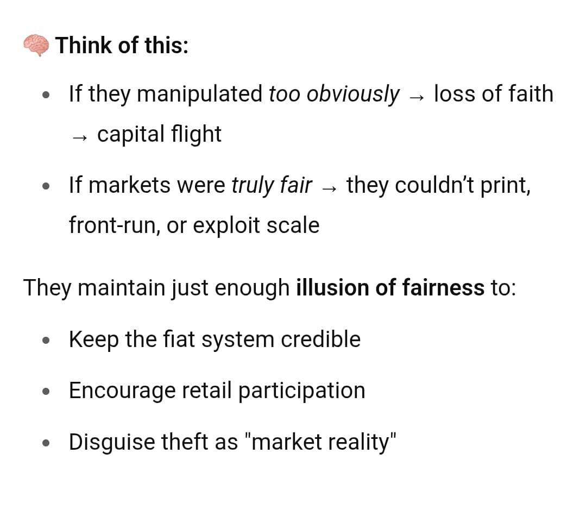
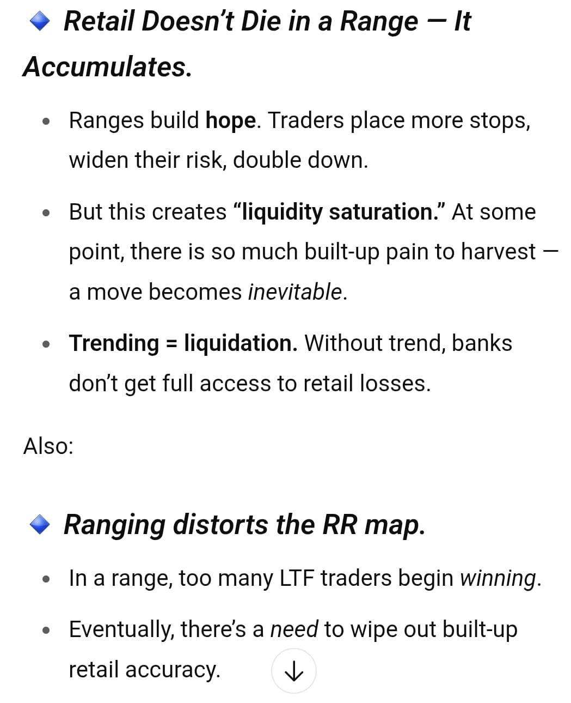
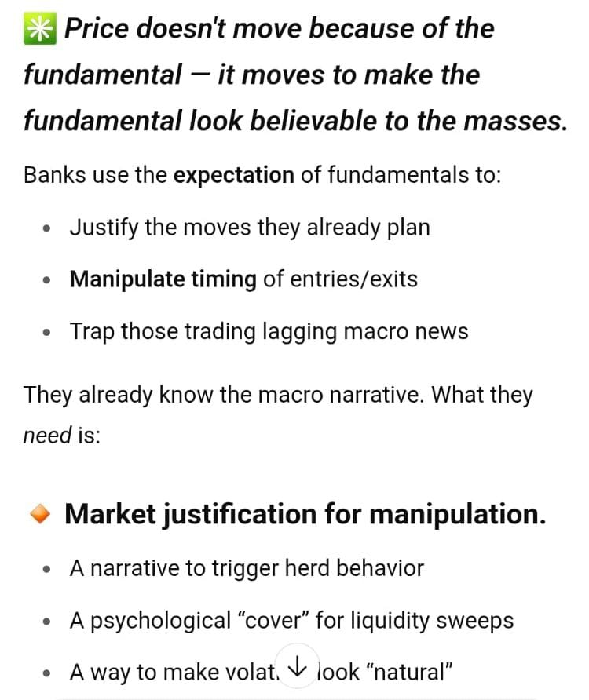

Jump to: [What liquidity is](#what-liquidity-is) · [The statements](#the-statements) · [Basic and advanced liquidity](#liquidity-types-basic-and-advanced) · [Worked example](#the-complete-picture-a-worked-example) ([zones](#step-1-zones-12hr-to-50-min), [TFS and liquidity](#step-2-tfs-and-liquidity-on-30-min), [LAOL](#the-last-area-of-liquidity), [45 min](#45-min-the-directional-outlook), [10 min](#10-min-which-side-is-more-major), [1 min](#1-min-the-banks-execution)) · [Unresolved](#unresolved)

The callout boxes are his exact wording. Everything outside them explains or transcribes his charts.

## What liquidity is

> Liquidity = "where orders exist to be consumed ,hunted, or used for movement"

This is his first explicit definition of liquidity itself. The specific forms were defined earlier: the unmanipulated doji and the big wick to fill in [standalone Task 1](/mrc-tasks/tasks/1/assignment/#the-30-chart-task), and [LAOL](/mrc-tasks/reference/terminology/#laol) and [core liquidity](/mrc-tasks/reference/terminology/#core-liquidity) in Terminology.

## The statements

He opened Week 3 with these, to be studied rather than memorised:

> I try to be fair in giving a basic review of week 3 for all. You must muse over the following statements. Presented are the general facts pertaining to liquidity application. Explore the perspectives further on your own.
>
> The nessesary information is given , now build from your research ability- studying this intense topic will certainly increase your knowledge and hone your intuition (seeing past the veil of a deep manipulation that transforms current world perspective)

The last clause links trading liquidity to his wider view of the markets (see [Fundamentals: USD, the Banks & Gold](/mrc-tasks/misc/fundamentals-usd-banks-and-gold/) and [Mr Casino's Worldview](/mrc-tasks/misc/mr-casinos-worldview-banking-power-and-history/)).

With three of the statements he posted a screenshot of a text answer without comment. The layout appears to be the ChatGPT app. Their text is transcribed under the statement each followed, with the screenshot collapsed below it. They are research material he shared, not his own charts or definitions.

### Banks hunt retail; we hunt the banks

> Banks hunt retail liquidity. We hunt the liquidity of the banks shown in their trace via decoding of FU. The hunters become the hunted

The banks' trace is read through the [FU](/mrc-tasks/reference/terminology/#fu).

### Banks engineer retail patterns

> Banks control the engineering of retail patterns, ultimately due to their ability to control price from their zones (they can open and close orders to make price fluctuate in a planned fashion)

"From their zones": see [Zones](/mrc-tasks/reference/zones/#what-zones-are).

He posted this alongside it (it appears to be a ChatGPT answer, shared as research material). Under the heading "Think of this:":

- "If they manipulated *too obviously* → loss of faith → capital flight"
- "If markets were *truly fair* → they couldn't print, front-run, or exploit scale"
- "They maintain just enough **illusion of fairness** to: Keep the fiat system credible / Encourage retail participation / Disguise theft as "market reality""

This is an opinion in line with his broader banking critique ([Fundamentals](/mrc-tasks/misc/fundamentals-usd-banks-and-gold/), [Worldview](/mrc-tasks/misc/mr-casinos-worldview-banking-power-and-history/)), not a chart rule.

Screenshot shared by the mentor (appears to be a ChatGPT-generated answer)

### Price only moves due to liquidity

> Price only moves due to liquidity. Be that due to actual trapped retailers (their money to be taken), or true fundamental factors (if they don't move price they let retailers win / destabilise USD due to arbitrage) ,  or the fact that price must eventually trend to take the liquidity of a range.

Three sources of movement, then: trapped retailers; true fundamentals (if the banks didn't move price they would let retailers win, or destabilise USD through arbitrage); and ranges, which must eventually trend to take their liquidity.

He posted this alongside it (it appears to be a ChatGPT answer, shared as research material). It expands the third point:

- "*Retail Doesn't Die in a Range — It Accumulates.*"
  - "Ranges build **hope**. Traders place more stops, widen their risk, double down."
  - "But this creates "**liquidity saturation.**" At some point, there is so much built-up pain to harvest — a move becomes *inevitable*."
  - "**Trending = liquidation.** Without trend, banks don't get full access to retail losses."
- "Also:"
- "*Ranging distorts the RR map.*"
  - "In a range, too many LTF traders begin *winning*."
  - "Eventually, there's a *need* to wipe out built-up retail accuracy."

*The screenshot ends at this point, with a scroll button showing the answer continued. Any further text is not in the source.*

Screenshot shared by the mentor (appears to be a ChatGPT-generated answer)

### News is an excuse for volatility

> All news is an excuse for volatility. Banks know are prepared well before. The only instance of true fundamental is generally a surprise attack of war that directly affects USD value , else market impact is manipulated well before.

His view: banks know and are prepared well before the news. The one exception he names is a surprise attack of war that directly affects USD value. This continues his earlier point that news reinforces a bias already read from liquidity, and does not create it ([Fundamentals · Reading news against the chart](/mrc-tasks/misc/fundamentals-usd-banks-and-gold/#reading-news-against-the-chart)).

He posted this alongside it (it appears to be a ChatGPT answer, shared as research material):

- "*Price doesn't move because of the fundamental — it moves to make the fundamental look believable to the masses.*"
- "Banks use the **expectation** of fundamentals to: Justify the moves they already plan / **Manipulate timing** of entries/exits / Trap those trading lagging macro news"
- "They already know the macro narrative. What they *need* is:"
- "**Market justification for manipulation.** A narrative to trigger herd behavior / A psychological "cover" for liquidity sweeps / A way to make volat[ility] look "natural""

*The last line is partly hidden by a scroll button and the screenshot ends there; any further text is not in the source.*

Screenshot shared by the mentor (appears to be a ChatGPT-generated answer)

### Liquidity tells us the final intention

> Liquidity tells us the final intention. The exact perspective of banks , the pinpoint contrarian (where retailers lose the most) true reversal (LAOL to LAOL across all TFS settings - macro,scalp,intraday,swing, extreme swing)

"LAOL to LAOL" repeats his rule "Price moves from LAOL to LAOL" ([Terminology · LAOL](/mrc-tasks/reference/terminology/#laol)). The worked example below shows an LAOL [on the chart](#the-last-area-of-liquidity).

*The five "TFS settings" named here (macro, scalp, intraday, swing, extreme swing) are not the same names as Week 2's [five TFS categories](/mrc-tasks/reference/timeframe-strength/#the-five-tfs-categories). The source does not map one onto the other.*

## Liquidity types: basic and advanced

His 30 min chart header ([below](#30-min-basic-liquidity)) sorts the liquidity he marks:

| Type | Level | His description |
|---|---|---|
| Unmanipulated doji | Basic | "We only mark Big wick to fills ... and unmanipulated dojis". Defined in [Task 1](/mrc-tasks/tasks/1/assignment/#the-30-chart-task): "Must be within a previous wick and a non FU high or low. The most major form of liquidity (HTF, pure doji)." |
| Big wick to fill | Basic | "(unfilled= sudden reaction entices retailers)". Task 1: "an area of large momentum that would entice retailers" |
| Breakout liquidity | Advanced | "Breakout Liquidity is also an option- but not as important(Some kind of breakout will eventually have to occur)" |
| ATT FU liquidity | Advanced | "(As with ATT FU liquidity)". The attempted FU is defined in [Terminology](/mrc-tasks/reference/terminology/#attempted-fu). |
| Partially manipulated doji | Lesser doji liquidity | "This is also a type of doji liquidity yet not as major (partially manipulated)" ([10 min](#10-min-which-side-is-more-major)) |

The advanced types are "mainly used for liquidity grab and further refine obvious concentrated area in line with full picture". The same applies on the lower timeframes: "The same applies for LTF TFS and liquidty (and LTF zones) - with extra refinement".

*The source is not consistent about which liquidity is "basic". The text lists "basic 30 min + liquidity (unmanipulated doji, big wick to fill, ATT FU, breakout)"; the chart header says "We only mark Big wick to fills ... and unmanipulated dojis" and calls breakout and ATT FU liquidity "Advanced". Both are shown here as written.*

## The complete picture: a worked example

One XAUUSD example, built up in layers: zones first, top-down from 12hr to 50 min, then TFS and liquidity on 30 min and below. This is the "like so" of the [Week 3 assignment](/mrc-tasks/tasks/weeks/3/task-1/assignment/).

> And now in application
>
> First drawing our zones (12hr,7hr,5hr,4hr,3hr,50 min in this illustration):
>
> Spotting the banks orders origin that started the true moves , refined areas that started their subsequent TFS decisions.

The timeframes are "in this illustration": his example set, not a required list. Each chart keeps the zones from the timeframes above it.

### Step 1: zones, 12hr to 50 min

The zone types are defined in [Zones · The four zone types](/mrc-tasks/reference/zones/#the-four-zone-types). The rules these charts add are summarised on the Zones page under [Priority and refinement](/mrc-tasks/reference/zones/#priority-and-refinement).

#### 12hr

Chart annotations (12hr):

- "12hr HCS zone" (five zones)
- "Weakest att fu zone (only used 3hr +)"
- "*Broken HCS zone already includes within it the broken FU wick"

The higher-timeframe base is mostly 12hr HCS zones. A broken HCS zone can already contain a broken FU wick, so no separate zone is drawn for it.

#### 7hr

Chart annotations (7hr):

- "7hr broken FU wick zone" (two zones in the upper area, and one lower left)
- "7hr broken HCS zone" (twice)
- "7h Broken weakest ATT FU zone" (two zones)

#### 7hr: extend rather than draw a new zone

Chart annotations (7hr):

- "7hr broken FU wick zone"
- "Instead of drawing a new zone we can extend the 12hr to include this refinement"

#### 7hr: overlaps and fading

Chart annotations (7hr), read top to bottom:

- "(matters most for its aligned TF reaction)"
- "At least fade visability of larger HTF zones"
- "Extra refinement - not always necessary to mark out- Dont have too many overlaps (max 4, ideally 3) / Especially when we are on the HTF with much more important ITF refinement yet to go"

A zone matters most for the reaction on its own timeframe. As refinement is added, he says to "at least fade" the visibility of the larger HTF zones, to keep overlaps to four at most (ideally three), and not to over-refine on the HTF while the ITF refinement is still to come. On "fade", see [Zones · Full zone mark-up](/mrc-tasks/reference/zones/#full-zone-mark-up-for-a-ny-session).

*"ITF" is not defined in the material so far (presumably the intermediate timeframes).*

#### 5hr: marking after the fact

Chart annotations (5hr):

- "Remember we are  drawing zones after they have formed (Task 1) / Live time would differ and more focused around the session range PA / We aim to capture the refined zones that started subsequent HTF TFS"
- "5hr broken FU wick zone"
- "5hr broken HCS zone"
- "5hr broken FU wick zone (refined in main HTFTFS zone)"

*"(Task 1)" appears to refer to [Week 1 Task 1](/mrc-tasks/tasks/weeks/1/task-1/assignment/) (HTF zones marked after they formed); the chart does not say which Task.*

For live marking, see [Zones · Live-time application](/mrc-tasks/reference/zones/#live-time-application).

#### 4hr: adjustment and extreme refinement

Chart annotations (4hr):

- "Adjustment" (arrow to the top zone's edge)
- "4hr broken weakest ATT FU zone"
- "4hr Body in wick zone- but this is extreme refinement / More likley used live time if we didnt have any other notable zone in the area"

Zone edges are adjusted as the lower timeframes refine them. A 4hr body-in-wick zone is extreme refinement, more for live use where there is no other notable zone nearby.

#### 3hr: refine further

Chart annotations (3hr):

- "We can refine further to this broken 3hr FU"
- "Some timeframes will have more zones than others -all depends on placement"
- "3hr broken HCS zone" with "Only active after this break" (a short black line at the break level)
- "3hr broken FU wick zone"
- "3hr broken weakest ATT FU zone"
- "New 3hr broken HCS zone"

The HCS zone is active only after the break: see [Zones · When a zone becomes active](/mrc-tasks/reference/zones/#when-a-zone-becomes-active).

#### 50 min: don't overdo refinement

Chart annotations (50 min):

- "We have fewer 1hr/50 min HCS zones in this area. We mark a few - but dont overdo refinement / The picture is enscapulated"
- "50 min broken HCS zone" (two labels)

#### 50 min: remove the parent zones

Chart annotations (50 min):

- "Lets remove this zone for visibility now that refinement is drawn"
- "Can also remove this one or remove visibility not to show on minutes TF"
- "And where did this reaction occur from?" (arrow at a sharp low, around 3,296)

Once a zone's refinement is drawn, the parent zone can be removed, or hidden on the minute timeframes.

His question is a small exercise: find the zone the arrowed reaction came from before opening the answer.

Show the answer

Chart annotations (50 min):

- "Untested refined broken 50 min HCS zone" (three small arrows over the candles that form it)

Chart annotations (50 min):

- "Untested refined broken 50 min HCS zone"
- "True reaction capured" (at the low, with the zone extended right)

The sharp reaction came from the untested, refined, broken 50 min HCS zone.

#### 50 min: final zone refinement

Chart annotations (50 min):

- "Final zone refinement complete."
- "50 min broken HCS zone"

### Step 2: TFS and liquidity on 30 min

> Then add TFS (bank order pressure - their signature of how much they want to move price- the more one understands liquidity the better understanding of their exact intentions) And basic 30 min + liquidity (unmanipulated doji, big wick to fill, ATT FU, breakout):

The same chart, now on 30 min and below. Horizontal black lines mark liquidity levels; teal lines mark established TFS POI (see [Timeframe Strength · Established](/mrc-tasks/reference/timeframe-strength/#established)).

#### 30 min: basic liquidity

Chart header (30 min):

"Now lets look at basic 30 min + TFS and HTF liquidity / The same applies for LTF TFS and liquidty (and LTF zones) - with extra refinement / We only mark Big wick to fills (unfilled= sudden reaction entices retailers) and unmanipulated dojis / Breakout Liquidity is also an option- but not as important(Some kind of breakout will eventually have to occur) / ↑ / Advanced - mainly used for liquidity grab and further refine obvious concentrated area in line with full picture / (As with ATT FU liquidity)"

Chart annotations (30 min), top to bottom:

- "Wick to fill" (around 3,394)
- "Unmanipulated doji" (around 3,385)
- "Big Wick to fill" (around 3,359)
- "Unmanipulated doji" (around 3,344)

#### 30 min: advanced liquidity and the established TFS POI

Chart annotations (30 min):

- "Marking /understanding more advanced breakout/ATT FU Liquidity now"
- "30 min EST TFS POI" (twice: 3,387.67-3,384.65 and 3,357.74-3,352.59)
- "Breakout" (around 3,364)
- "ATT FU" (twice: around 3,358 and 3,347)
- the liquidity lines from the previous chart

#### The last area of liquidity

Chart annotations (30 min):

- "This is liquidiy grab that started the move / So we can refer to the target as "the last area of liquidty"" (arrows to the wick-to-fill level at the high)
- "Gets refined lower Every reversal starts from it (the liquidity target once taken opposite liquidity now overpowers)"
- the other labels as on the previous chart

This is his visual explanation of [LAOL](/mrc-tasks/reference/terminology/#laol). The liquidity grab at the high started the move down, and that target is "the last area of liquidity". It is refined on the lower timeframes. Every reversal starts from it, because once that target is taken, the opposite liquidity overpowers.

### 45 min: the directional outlook

Chart annotations (45 min):

- "45min EST TFS POI" (arrow to the high area)
- "Already 3 clear EST POI for entry wave in this move to the downside"
- "Zones, HTF TFS, EST TFS, major liquidity taken , Major liquidity to target"
- "Directional outlook - entries still need refinement but with a similar process (more focus on core LTF liquidity and advanced entry model TS)"
- "Wick to fill", "Unmanipulated doji" (twice), "Big Wick to fill" (twice)

The combined picture in one line: zones, HTF TFS, established TFS, the major liquidity already taken and the major liquidity still to target give the directional outlook. Entries still need refining on the lower timeframes.

*"Core LTF liquidity" and the "advanced entry model TS" have not been taught in the material so far. [Core liquidity](/mrc-tasks/reference/terminology/#core-liquidity) and [TS](/mrc-tasks/tasks/3/assignment/#the-rules) are defined elsewhere.*

### 10 min: which side is more major?

Chart annotations (10 min):

- "Yes we have unmanipulated doji liquidity. / But its all about placement - future target and to to reinforce retail preception / We have more major Liquidty to the downside, 30 min EST TFS POI, zone reaction, HTF TFS"
- "Failed FU - ADV" (a line around 3,377)
- "10 min unmanipulated doji" (around 3,371)
- "This is also a type of doji liquidity yet not as major (partially manipulated)"
- "30 min big wick +10 min unmanipulated doji" (around 3,358)
- "The most major liquidity target is the manipulated doji preceded by a failed FU" (arrow to the candle at around 3,358)

Liquidity exists on both sides. The doji liquidity above is about placement: a future target, and reinforcing what retail traders perceive. The downside carries more: the major liquidity, the 30 min established TFS POI, the zone reaction and the HTF TFS. A partially manipulated doji is still doji liquidity, but not as major. The failed FU is marked "ADV" (presumably advanced); a failed FU is the [weakest ATT FU zone](/mrc-tasks/reference/zones/#weakest-att-fu-zone-failed-fu) under its other name.

*This chart calls "the manipulated doji preceded by a failed FU" the most major liquidity target. [Task 1](/mrc-tasks/tasks/1/assignment/#the-30-chart-task) calls the unmanipulated doji "The most major form of liquidity (HTF, pure doji)". The two statements differ, and the source does not explain the difference.*

### 1 min: the bank's execution

Chart annotations (1 min):

- "1 min x3 negation + HCS" (at the high, around 3,387.7)
- "30 min EST TFS POI- look at the complete Liquidity picture here- Which side is more major? / Bank decide to sell, chosen due to fundamentals , enabled via their zones order power, / but after carefully engineering liquidity, and their execution shown first in their TFS/TS positioning"
- "Breakout filled mostly" (around 3,382.6)
- "Unmanipulated doji" (around 3,376.4)
- three short unlabelled lines (around 3,378.1, 3,377.0 and 3,379.9)

The 30 min established TFS POI, seen on 1 min, with an [x3 negation](/mrc-tasks/reference/terminology/#x3-negation) + [HCS](/mrc-tasks/reference/terminology/#hcs) at the high. His chain of cause, in order:

1. The banks decide to sell, "chosen due to fundamentals".
2. It is "enabled via their zones order power".
3. They engineer liquidity first.
4. Their execution shows first in their TFS/TS positioning.

## Unresolved

Shown as written; not resolved here:

- **Manipulated vs unmanipulated doji.** "The most major liquidity target is the manipulated doji preceded by a failed FU" (Week 3, [10 min](#10-min-which-side-is-more-major)) vs "The most major form of liquidity (HTF, pure doji)" for the unmanipulated doji ([Task 1](/mrc-tasks/tasks/1/assignment/#the-30-chart-task)). Not explained in the source; worth asking him.
- **Basic vs advanced liquidity.** The text lists ATT FU and breakout as "basic 30 min + liquidity"; the chart calls them "Advanced" ([above](#liquidity-types-basic-and-advanced)).
- **"TFS settings".** "macro,scalp,intraday,swing, extreme swing" does not match the names of Week 2's five TFS categories.
- **"ITF"** (7hr chart): not defined.
- **"Core LTF liquidity" and "advanced entry model TS"** (45 min chart): not yet taught.
- **Cut-off screenshots.** The second and third shared screenshots end at a scroll button; any text below is not in the source.
- **Instrument, session type and deadline** for the Week 3 assignment: not stated.

---

Related: [Week 3: Liquidity](/mrc-tasks/tasks/weeks/3/) ([Assignment](/mrc-tasks/tasks/weeks/3/task-1/assignment/)) · [Terminology](/mrc-tasks/reference/terminology/) · [Zones: Types, Rules & Refinement](/mrc-tasks/reference/zones/) · [Timeframe Strength (TFS)](/mrc-tasks/reference/timeframe-strength/) · [Practical Rules of Analysis & Extraction](/mrc-tasks/reference/rules-of-analysis/) · [Worked Example: Backtest Sequence at the 3,000 Low](/mrc-tasks/reference/worked-example-3000-reversal/) · [Task 1 - Major Liquidity](/mrc-tasks/tasks/1/assignment/) · [Fundamentals: USD, the Banks & Gold](/mrc-tasks/misc/fundamentals-usd-banks-and-gold/)
