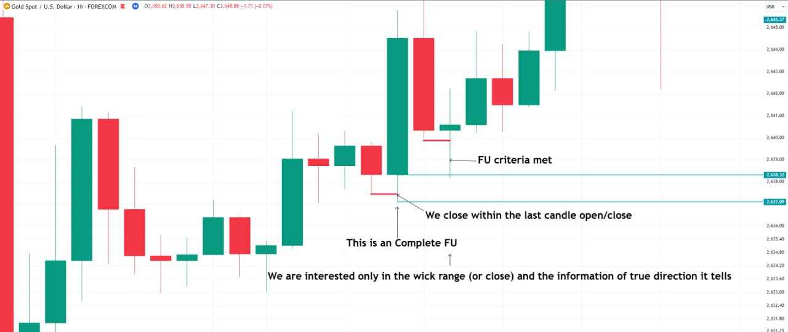
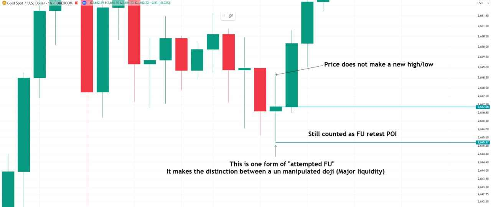
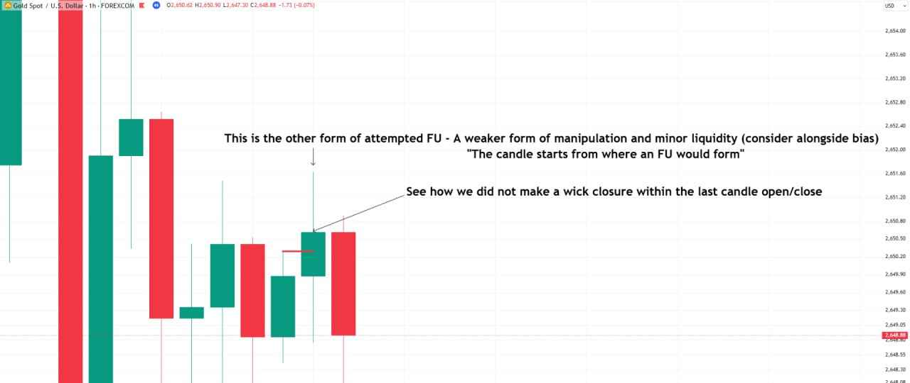
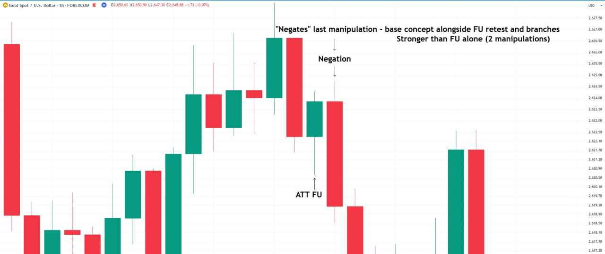
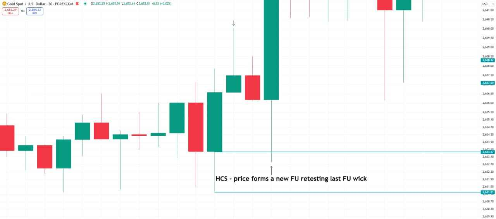
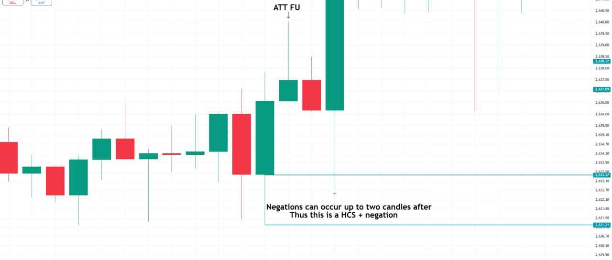
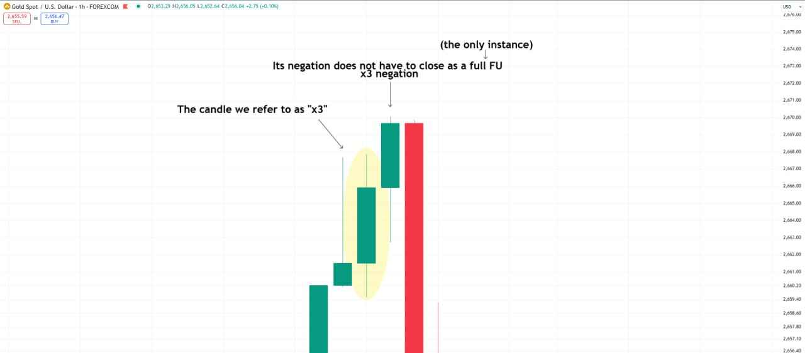
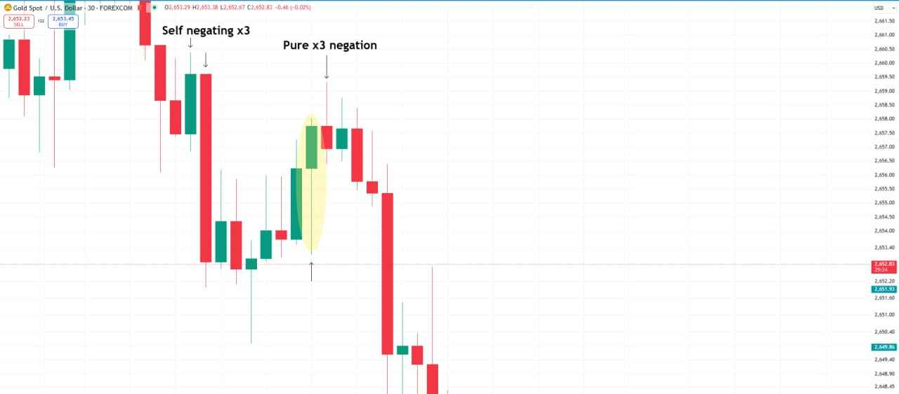
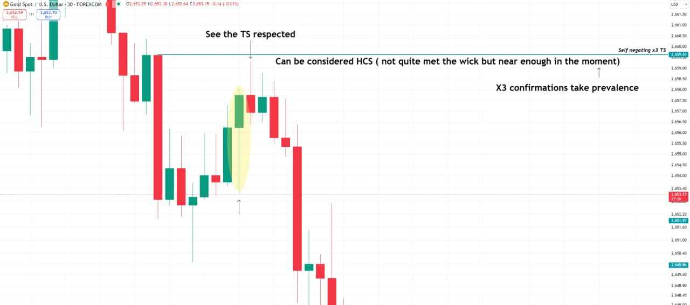
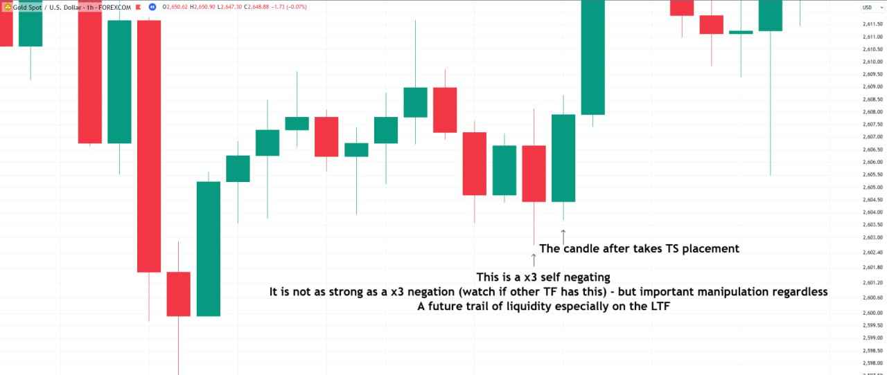

Jump to: [FU](#fu) · [Attempted FU](#attempted-fu) · [Negation](#negation) · [HCS](#hcs) · [x3](#x3) · [Strength at a glance](#strength-at-a-glance) · [LAOL](#laol) · [Core liquidity](#core-liquidity) · [Used on the charts](#used-on-the-charts) · [Defined elsewhere](#defined-elsewhere)

The definitions in the callout boxes are his exact wording. Everything outside them explains or transcribes his charts.

## FU

> **FU** = Refers to candle of manipulation - the macro level banks get in

Chart annotations (1hr):

- On a long green candle whose lower wick runs just below the previous red candle: "This is a complete FU" and "We close within the last candle open/close".
- Later, on a small candle whose lower wick dips below the big red candle before it: "FU criteria met".
- "We are interested only in the wick range (or close) and the information of true direction it tells".

*These charts show what an FU is, on any timeframe. Using FU closures to read the prevalent direction is a separate rule: "Only on the 3hr + will we pay attention to confirmed FU closures that indicate a prevalent direction, on the lower timeframes we are only concerned with HCS + negation" ([Task 3, rule 4](/mrc-tasks/tasks/3/assignment/#the-rules)).*

## Attempted FU

Written "attempted FU" on his charts, and "ATT FU" in short. It comes in two forms.

### Form 1 - no new high/low, still an FU retest POI

Chart annotations (1hr):

- "Price does not make a new high/low"
- "Still counted as FU retest POI"
- "This is one form of "attempted FU" It makes the distinction between an unmanipulated doji (Major liquidity)"

This is the distinction [Task 1](/mrc-tasks/tasks/1/assignment/#the-30-chart-task) held back: "The doji we Mark is separate from the attempted FU - a subject of later discussion."

### Form 2 - the weaker form

Chart annotations (1hr):

- "This is the other form of attempted FU - A weaker form of manipulation and minor liquidity (consider alongside bias)"
- ""The candle starts from where an FU would form""
- "See how we did not make a wick closure within the last candle open/close"

Task 3 uses the same term in its negation rule: "if the first candle after doesn't make a complete FU wick but reacts - ATT FU" ([rule 5](/mrc-tasks/tasks/3/assignment/#the-rules)).

## Negation

> **Negation** = "Negates" (Look up definition) previous FU manipulation - more powerful than the sole FU

Chart annotations (1hr):

- "ATT FU" on a candle's lower wick at the top; "Negation" on the upper wick of the red candle that follows, before price falls.
- ""Negates" last manipulation - base concept alongside FU retest and branches"
- "Stronger than FU alone (2 manipulations)"

## HCS

> **HCS** = When a new FU forms retesting the other - Base refined entry anticipation

He never spells out "HCS" as an abbreviation, so it is left as written.

Chart annotation (30 min): "HCS - price forms a new FU retesting last FU wick"

### HCS + negation

Chart annotations (30 min, same chart):

- "ATT FU" at an upper wick two candles earlier.
- "Negations can occur up to two candles after"
- "Thus this is a HCS + negation"

This is the same rule as [Task 3, rule 5](/mrc-tasks/tasks/3/assignment/#the-rules): "A negation can be counted two candles after an FU". Task 3's [task aid](/mrc-tasks/tasks/3/assignment/#task-aid---clarifications-on-timeframe-strength) adds: "For the HCS there is an FU from the left to react" and "When an FU is retested - the wick retest becomes part of the HCS range".

## x3

> **x3** = Refers to that candle which has both FU and negation aspects embedded at a macro level within the single candle

### x3 negation

Chart annotations (1hr):

- On a green candle with long wicks on both sides: "The candle we refer to as "x3""
- On the candle two after it, at the top: "x3 negation"
- "Its negation does not have to close as a full FU" ... "(the only instance)"

The x3's negation is the one case where a negation need not close as a full FU.

### Self-negating x3 and pure x3 negation

Chart annotations (30 min):

- "Self negating x3" on a candle whose top is negated straight away by the next large red candle.
- "Pure x3 negation" on the upper wick of the candle after a highlighted x3 candle, followed by the decline.

Chart annotations (30 min, same chart):

- "See the TS respected" at the later top, which stops just under the line "Self negating x3 TS".
- "Can be considered HCS ( not quite met the wick but near enough in the moment)"
- "X3 confirmations take prevalence"

Chart annotations (1hr):

- "This is a x3 self negating" (a red candle's long lower wick at the low)
- "It is not as strong as a x3 negation (watch if other TF has this) - but important manipulation regardless"
- "A future trail of liquidity especially on the LTF"
- "The candle after takes TS placement"

He repeats the point in a later Q&A: "X3 self negation is weaker by default (not enough on its own for a strong POI)" (see the [worked example](/mrc-tasks/reference/worked-example-3000-reversal/#qa-why-the-big-4hr-candle-was-not-a-poi)).

*x3 is defined here. The **"x3 entry model"** mentioned in [Task 3](/mrc-tasks/tasks/3/assignment/#11hr--1-min-swing-breakdown-worked-example) ("this is for the advanced stage based on x3 confirmation") and the phrase **"x3 by x3"** on a later 1 min chart are not defined anywhere yet, and are left undefined here.*

## Strength at a glance

A summary of the comparisons stated on these charts.

| Stronger | Weaker | Where he says it |
|---|---|---|
| Negation ("2 manipulations") | FU alone | Negation definition and 1hr chart |
| x3 negation | x3 self negating | "It is not as strong as a x3 negation" (1hr chart) |
| x3 confirmations | other confirmations | "X3 confirmations take prevalence" (30 min chart) |
| Attempted FU, form 1 (still an FU retest POI) | Attempted FU, form 2 | "The other form ... A weaker form of manipulation and minor liquidity" |

## LAOL

> **LAOL** = Last area of liquidity (within reversal POI)

His fuller statement, from the [rules of analysis](/mrc-tasks/reference/rules-of-analysis/#6-laol):

> LAOL = refined liquidity area within POI (TS/TFS) where we expect reversal—our extended major targets. Price moves from LAOL to LAOL. We have scalp, intraday, and swing LAOL targets in this regard (we determine depending on TFS strength, core targets opposite, and new POI/TS respected - task 2).

LAOL has no definition chart of its own. It is shown in the [worked example](/mrc-tasks/reference/worked-example-3000-reversal/#lower-timeframe-the-laol-and-its-trail) ("LAOL example - we have a trail of liquidity onto this point"). Task 2 already uses the term: "last area of liquidity found on 4hr" and "The LAOL accounted for in the moment" ([Task 2](/mrc-tasks/tasks/2/assignment/)).

## Core liquidity

> **Core liquidity** = liquidity which has to be taken or manipulated greatly first (Swing hint always present)

His fuller statement, from the [rules of analysis](/mrc-tasks/reference/rules-of-analysis/#5-core-liquidity):

> Core liquidity = most important (obvious/concentrated) liquidity that confirms direction for confident entry—that which you would like to hold minimum until. Something that finalizes bias.

The two statements describe the same thing from two sides: the obvious, concentrated liquidity that must be taken or heavily manipulated first, and, once direction is confirmed, the minimum target to hold until. On the worked example's 10 min chart it is labelled "Core Breakout Liquidity - minimum target after LAOL opposite/ POI respected".

## Used on the charts

These appear on his charts but are not formally defined. The explanations are read from how he uses them.

- **Trail / trail of liquidity**: used as a series of liquidity left behind during a move, leading onto a level. "core + trail + LAOL to target" ([final entries rule](/mrc-tasks/reference/rules-of-analysis/#10-final-entries)); "A future trail of liquidity especially on the LTF" (1hr chart above); a line labelled "Trail" on the worked-example charts.
- **EST**: his short form for *established*, the opposite of *forming* (e.g. "10 min TS EST").
- **£**: marks on his charts that sit on liquidity levels (dojis, wicks to fill, retail liquidity).

## Defined elsewhere

Used on these charts, but defined in the Tasks. Their definitions stay where he gave them:

- **TS** (true stop) and the HTF true stop: [Task 3, rule 1](/mrc-tasks/tasks/3/assignment/#the-rules).
- **TFS** (timeframe strength): "when price establishes a confirmed prevalent direction" ([Task 3](/mrc-tasks/tasks/3/assignment/#timeframe-strength---definition)).
- **Doji** (unmanipulated doji, major liquidity): "Must be within a previous wick and a non FU high or low. The most major form of liquidity (HTF, pure doji)." ([Task 1](/mrc-tasks/tasks/1/assignment/#the-30-chart-task)).
- **Big wick to fill**: "an area of large momentum that would entice retailers" ([Task 1](/mrc-tasks/tasks/1/assignment/#the-30-chart-task)).
- **POI**: used throughout but never spelled out. Task 3's aid gives "The base definition of a POI one must wait for on the 10 min + to establish" ([task aid](/mrc-tasks/tasks/3/assignment/#task-aid---clarifications-on-timeframe-strength)).

---

Related: [Practical Rules of Analysis & Extraction](/mrc-tasks/reference/rules-of-analysis/) · [Worked Example: Backtest Sequence at the 3,000 Low](/mrc-tasks/reference/worked-example-3000-reversal/) · [Task 1 - Major Liquidity](/mrc-tasks/tasks/1/assignment/) · [Task 2 - Top-Down Analysis](/mrc-tasks/tasks/2/assignment/) · [Task 3 - RR, Timeframe Strength & Timing](/mrc-tasks/tasks/3/assignment/)
