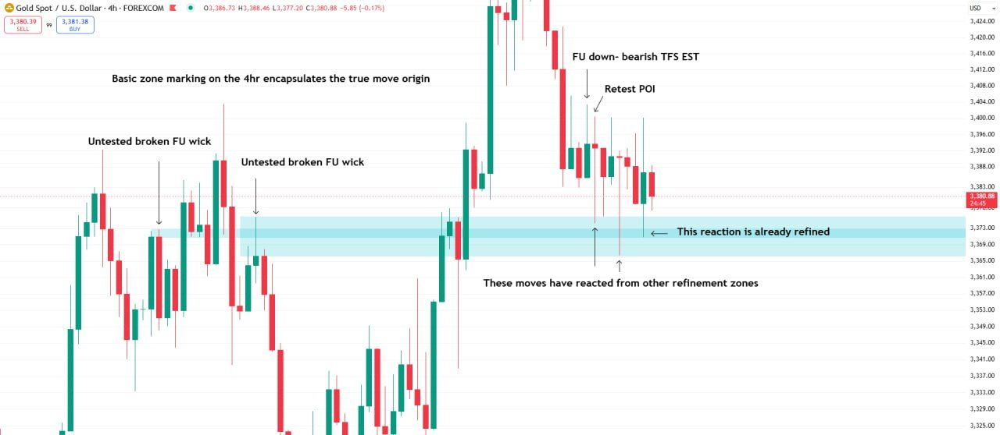
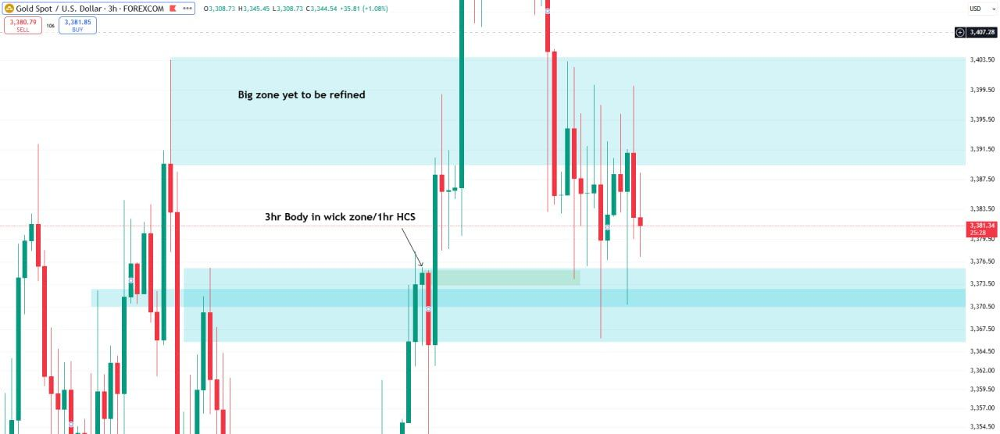
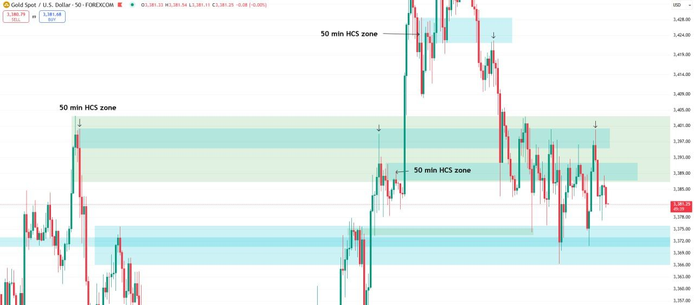
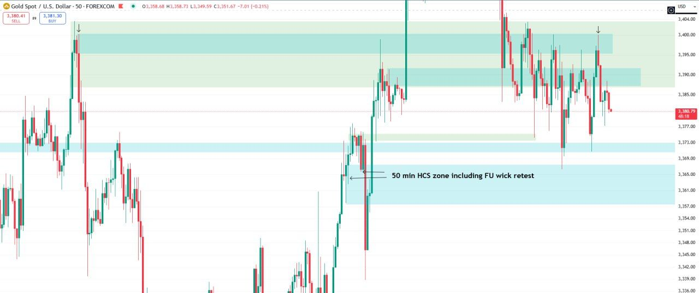
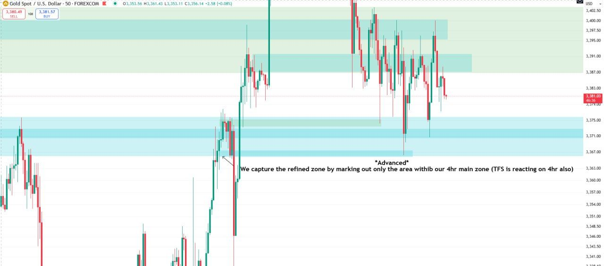
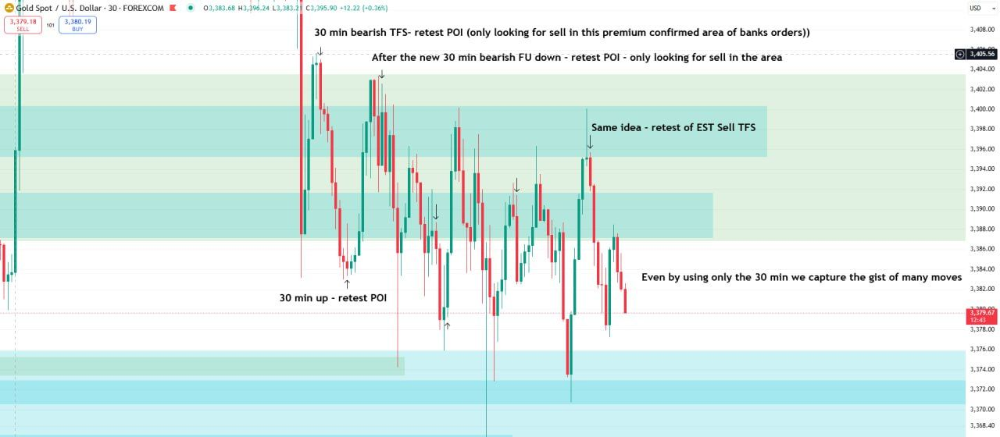
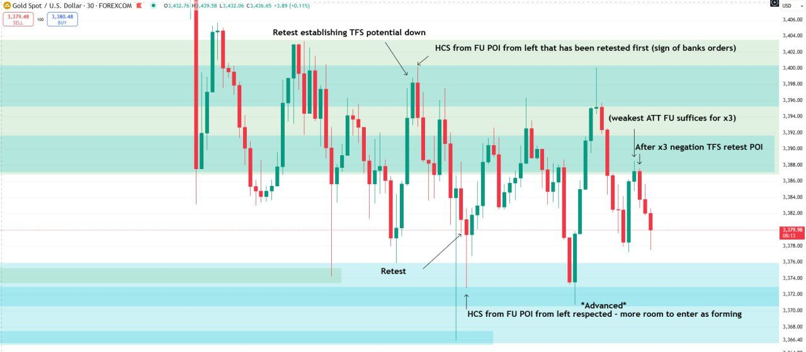
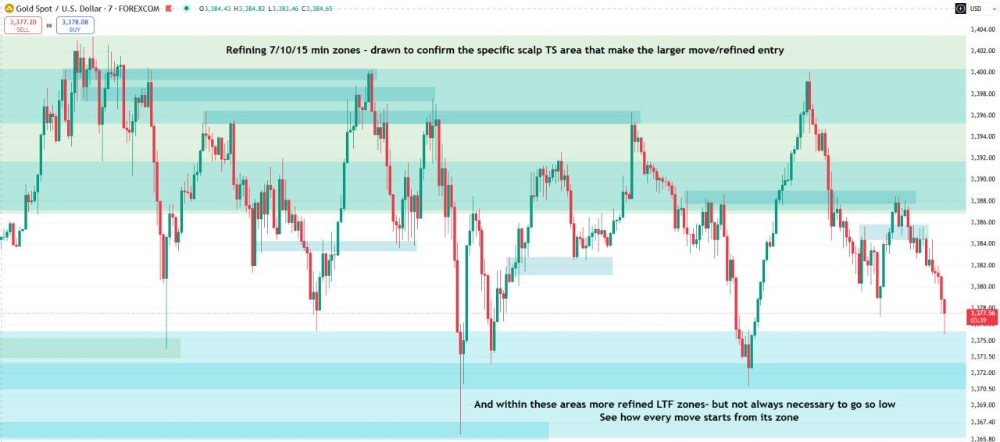

Jump to: [What TFS is](#what-tfs-is) · [Theory](#the-theory-advanced) · [Five categories](#the-five-tfs-categories) · [LTF and HTF](#the-ltf-builds-the-htf-but-htf-commands-the-ltf) · [Two ways to use TFS](#two-ways-to-use-tfs) · [TFS and zones](#tfs-and-zones) · [Established TFS retest](#the-established-tfs-retest) · [Both sides established](#both-sides-established) · [Advanced hints](#lower-timeframes-and-exact-entries-advanced-hints) · [Worked example](#worked-example-zones-and-tfs-on-current-price)

## What TFS is

Standalone Task 3 gave the first definition: timeframe strength is **"when price establishes a confirmed prevalent direction"** ([Task 3 · Timeframe strength](/mrc-tasks/tasks/3/assignment/#timeframe-strength---definition)).

Week 2 opens by placing it next to zones:

> Zones contain the energy from which all subsequent market reactions occur. Timeframe strength contains the signature of the directional energy release (overpowering true profitable move - from utmost premium - contrarian lowest liquidity move)

Week 3 adds a further description, alongside (not replacing) the two above: TFS as "bank order pressure - their signature of how much they want to move price" ([Liquidity · Step 2](/mrc-tasks/reference/liquidity/#step-2-tfs-and-liquidity-on-30-min)).

Zones are covered in [Zones: Types, Rules & Refinement](/mrc-tasks/reference/zones/) (Week 1). TFS is the release of the energy those zones hold.

## The theory (advanced)

> Without liquidity understanding we would not have TFS. However since the discovery is already made we can explore it first (instead of the reverse energinerring process which led to its finding). For we already have various manipulation strength formats (starting with types of FU, negation, HCS and advanced entry models - all derived from liquidity and banks true order power) , TFS mastery already carries within it elements of all other key concepts—liquidity, TS, and zone markings. Try to really understand this passage. Come back to it. It contains a key perspective of our comprehensive outlook and the profound utiliazition of time frame strength (In a way akin to the x= part of algebraic equation).
>
> I leave some aspects for you to think over. The above passage is  is more difficult advanced theory (what I do not expand more on - you are expected to complete - through your own comprehension, research and practice)

He deliberately leaves this passage unexplained: **"Try to really understand this passage. Come back to it."** "Advanced entry models" are not defined anywhere in the material so far.

## The five TFS categories

> There are 5 categories of TFS:
>
> 1 min -5 min = LTF (makes minimum scalp move) 
> 7min -30 min =scalp TFS (makes intraday move) 
> 30 min - 3hr = intraday TFS (100 + pips) 
> 3hr -7hr = swing TFS (250 + pips) 
> 7hr -4D + = strongest longterm swing potential (350 + pips)
>
> These are our minimal average ranges based upon negation / HCS , but when we utalize entry models we know of the stronger or weaker potential (and expanded ranges on news days)

| Timeframes | Category | Move |
|---|---|---|
| 1 min - 5 min | LTF | "makes minimum scalp move" |
| 7 min - 30 min | scalp TFS | "makes intraday move" |
| 30 min - 3hr | intraday TFS | 100 + pips |
| 3hr - 7hr | swing TFS | 250 + pips |
| 7hr - 4D + | strongest longterm swing potential | 350 + pips |

*The boundaries are as written: 30 min, 3hr and 7hr each appear in two categories, and nothing is listed between 5 and 7 min. Standalone Task 3's earlier tier table (10 min + scalp, 1hr + intraday, 3hr + swing, 11hr + multi-day; [Task 3 · The rules](/mrc-tasks/tasks/3/assignment/#the-rules)) classifies trade types by the timeframe of the true stop and uses different boundaries, and [Rules of analysis § 8](/mrc-tasks/reference/rules-of-analysis/#8-tfs) gives "1hr/3hr/4hr/5hr/7hr/11hr backed generally gives a 300 pip + AVG move". Each is kept as he wrote it.*

*The Segments draw the swing on 3hr/4hr, the intraday on 30 min and the scalp on 10 min and on 5 min: see [The Top-Down Extraction Cycle](/mrc-tasks/reference/top-down-extraction-cycle/#the-cycle).*

*[Recap & Puzzle](/mrc-tasks/tasks/segments/4/) (after Segment 3) sets a puzzle chart with the hint "Established - TF catagory width". His answer has not been posted.*

## "The LTF builds the HTF but HTF commands the LTF"

> Study now this statement : "The LTF builds the HTF but HTF commands the LTF".
>
> (HTF TFS = strongest orders = price has already manipulated sufficiently on LTF)

He refers back to it in [Week 2 Task 2](/mrc-tasks/tasks/weeks/2/task-2/assignment/): "Price moves similarly across the LTF. Remember the statement mentioned previously that you are to study."

## Two ways to use TFS

> The two ways we use TFS:

### Established

> 1) Established - the confirmed prevalent direction. The power depends on the TFS category , manipulation entry model, and aligned multi TF alignment.

EST on his charts is short for *established* ([Terminology · Used on the charts](/mrc-tasks/reference/terminology/#used-on-the-charts)). The established use is practised in [Week 2 Task 1](/mrc-tasks/tasks/weeks/2/task-1/assignment/): see [The established TFS retest](#the-established-tfs-retest) below.

### Forming: the power POI

> 2) As forming - must be used in conjcture with some kind of already established prevalent TFS (more on this when we speak about TS). Presents the power POI (more stronger with certain entry models and aligned multi TFS) - the premium level for that category.

The forming use is practised in [Week 2 Task 2](/mrc-tasks/tasks/weeks/2/task-2/assignment/). His example there adds one line: "Any multi forming 3hr+ TFS from zone falls into our swing category and so we pay extra attention for the true moves of higher potential (following and confirmed by the EST TFS POI)".

Earlier material on forming vs established: [Task 3's note on "forming" vs "established"](/mrc-tasks/tasks/3/assignment/#the-rules) and the forming 10 min entry in [Worked Example · 1 min entries](/mrc-tasks/reference/worked-example-3000-reversal/#1-min-the-entries). "More on this when we speak about TS" is still to come.

## TFS and zones

> . All TFS must have some kind of refined zone reaction. When we have matching TFS with the same TF zone - the strongest true move potential/power POI.

This answers Week 1's "The more HTF zone we react from (with same TF reaction), the more powerful we can expect the move to be (later explored with TFS)" ([Zones · Live-time application](/mrc-tasks/reference/zones/#live-time-application)).

## The established TFS retest

Week 2 Task 1 is "Focused on the retest of established TFS POI", and "The rules are given within the chart examples to dissect". The charts, with every annotation, are on [Week 2 Task 1](/mrc-tasks/tasks/weeks/2/task-1/assignment/#the-rules-in-the-charts). The rules they give:

1. An FU establishes TFS in its direction: "Price forms the FU to the downside. We now have Established TFS down" ([45 min](/mrc-tasks/tasks/weeks/2/task-1/assignment/#45-min-the-concept)).
2. Enter on its retest: "We look to enter upon its retest with a confirmed direction (prevalent TFS)" ([45 min](/mrc-tasks/tasks/weeks/2/task-1/assignment/#45-min-the-concept)).
3. "Generally 30 min + (intraday) is our minimum requirement for a true move", which will "capture majority daily" ([45 min](/mrc-tasks/tasks/weeks/2/task-1/assignment/#45-min-the-concept)).
4. "we Start with marking only the true moves in relation to TF" ([3hr](/mrc-tasks/tasks/weeks/2/task-1/assignment/#3hr-the-rules)).
5. An HCS counts as an established-TFS retest only once the FU was retested first: "This HCS was established as we had price first retest the FU" ([1hr](/mrc-tasks/tasks/weeks/2/task-1/assignment/#1hr-established-vs-not-established-hcs), [50 min](/mrc-tasks/tasks/weeks/2/task-1/assignment/#50-min-zoom-price-retested-fu-first)).
6. "Fu retest adds to FU range (for latter HCS to occur from)" ([1hr](/mrc-tasks/tasks/weeks/2/task-1/assignment/#1hr-established-vs-not-established-hcs)).
7. Advanced, "beginners can ignore": "x3 negation doesn't need full Fu closure" and "HCS doesn't need full Fu closure (weakest ATT FU suffices)" ([3hr](/mrc-tasks/tasks/weeks/2/task-1/assignment/#3hr-the-rules)).
8. Work down the timeframes to "Fill in the gaps"; by 30 min "We have already captured almost every true move- following the established TFS retest POI" ([50 min](/mrc-tasks/tasks/weeks/2/task-1/assignment/#50-min-fill-in-the-gaps), [30 min](/mrc-tasks/tasks/weeks/2/task-1/assignment/#30-min)).

Rule 3 is about the true move to follow. Task 3's "10 min +" is the minimum backing for an entry ([Task 3 · The rules](/mrc-tasks/tasks/3/assignment/#the-rules)). The same 45 min chart notes that the scalp TFS "needs more advanced TS/liquidity understanding".

*Standalone Task 3 (rule 4) states: "Only on the 3hr + will we pay attention to confirmed FU closures that indicate a prevalent direction, on the lower timeframes we are only concerned with HCS + negation." The Week 2 examples establish TFS from FU closures down to 45 min and 30 min ([Week 2 Task 1](/mrc-tasks/tasks/weeks/2/task-1/assignment/#worked-example-top-down-3hr-to-30-min); [Week 2 Task 2 · 30 min](/mrc-tasks/tasks/weeks/2/task-2/assignment/#30-min-live-time-retests); [30 min basic retest POI](#30-min-basic-retest-poi) below). The supplied source does not explain how these statements fit together.*

### When an established TFS is nullified

From the Week 2 Q&A, on the 1hr chart's "not established" HCS: after price moved away from the original FU POI and retested the opposite FU, "That previous "established" TFS is null now". With no new established TFS, "we wait for the new closure, and retest". An HCS that forms after an FU retest, with no new established TFS opposite, "falls into the criteria of established TFS retest" even though it looks like entering as it forms. His answer in full: [Week 2 Task 1 · Clarifications](/mrc-tasks/tasks/weeks/2/task-1/assignment/#when-an-established-tfs-is-nullified). The same point appears on [Week 2 Task 2's last 30 min chart](/mrc-tasks/tasks/weeks/2/task-2/assignment/#30-min-an-hcs-as-it-forms).

### How close is a retest?

Asked why a point was marked that had not retested the FU exactly:

> Price does not always have to meet the exact FU wick. It is ideal yes , but close enough still counts (think of anything past the 70% fib of the full FU as a weak retest, touching the FU wick stronger, and touching the 50% of the FU wick stongest)

| Price reaches | Retest |
|---|---|
| anything past the 70% fib of the full FU | weak |
| the FU wick | stronger |
| the 50% of the FU wick | strongest |

For which part of a wick makes a zone, see [Zones · Which part of the wick](/mrc-tasks/reference/zones/#which-part-of-the-wick) (a different question).

## Both sides established

A student asked, on a 1hr chart, whether TFS after a given candle was a sell or a buy. The answer:

> When we come to the lower bullish FU wick retest , we can look for the buy POI
>
> When we come to the upper bearish FU retest , we can look for the sell POI
>
> Each side will give us a fixed main direction to look at so there isn't a confusion
>
> Here price has established both sides. We have notable POI in both regions.
>
> Ultimately it will come to HTF (we only see one TF here) and liquidity calauction + entry model (we had a x3 negation up which was more powerful)

See [x3](/mrc-tasks/reference/terminology/#x3) and [Negation](/mrc-tasks/reference/terminology/#negation).

## Lower timeframes and exact entries (advanced hints)

> .As we go down to scalp TFS and lower , liquidity and TS becomes more important (as we read macro price action) Know that with its full understanding however , it is possible to enter upon exact swing lows / highs , of course all in full context.
>
> (For example using the refined zone as a TS antipcating the power POI TFS forming , with news volatility, LAOL reaction, already prevalent TFS, and extreme liquidity opposite)
>
> That is not our focus yet , we will work on mastering intraday and swing first (general flow of price action, and moves similarly on LTF/scalp). The hints were given here first for advanced learners.

Not the current focus. [LAOL](/mrc-tasks/reference/terminology/#laol) and TS ([Task 3 · The rules](/mrc-tasks/tasks/3/assignment/#the-rules)) are defined elsewhere.

## Worked example: zones and TFS on current price

Posted after the Week 2 Tasks: "How we would understand current price action with only basic application of the two concepts we have covered, zones and TFS". Top-down on XAUUSD, from 4hr to 7 min. The zone types used are in [Zones · The four zone types](/mrc-tasks/reference/zones/#the-four-zone-types).

### 4hr: the base

"Starting from the 4hr only , we have a strong base to follow".

Chart annotations (4hr):

- "Basic zone marking on the 4hr encapsulates the true move origin"
- "Untested broken FU wick" (twice, on the left)
- "FU down- bearish TFS EST" → "Retest POI" (top right)
- "These moves have reacted from other refinement zones" (two wicks in the zone)
- "This reaction is already refined" (the last candle, in the darker band)

### 3hr and 50 min: both sides

Chart annotations (3hr):

- "Big zone yet to be refined" (the upper box)
- "3hr Body in wick zone/1hr HCS" (a narrow band below it)

Chart annotations (50 min):

- "50 min HCS zone" (three zones)

"Adding the 3hr and 50 min encapsulates already the true moves of both sides (prepared for TFS extraction)".

### 50 min: refinement within the main zone (advanced)

Chart annotations (50 min):

- "50 min HCS zone including FU wick retest" (the lower box)

Chart annotations (50 min):

- "*Advanced* / We capture the refined zone by marking out only the area within our 4hr main zone (TFS is reacting on 4hr also)" (a thin band)

"The above is an advanced rule. I would advise beginners to come back to this." "Simply : marking the key refinement in the zone that corresponds with TFS". Background: [Zones · Priority and refinement](/mrc-tasks/reference/zones/#priority-and-refinement).

### 30 min: basic retest POI

Chart annotations (30 min):

- "30 min bearish TFS- retest POI (only looking for sell in this premium confirmed area of banks orders))"
- "After the new 30 min bearish FU down - retest POI - only looking for sell in the area"
- "Same idea - retest of EST Sell TFS"
- "30 min up - retest POI"
- "Even by using only the 30 min we capture the gist of many moves"

"Basic 30 min retest POI following established TFS." **"I note many have been overcomplicating this concept. Simply: you have the buy or sell signal and its refined POI"**

### 30 min: advanced

Chart annotations (30 min):

- "Retest establishing TFS potential down"
- "HCS from FU POI from left that has been retested first (sign of banks orders)"
- "(weakest ATT FU suffices for x3)"
- "After x3 negation TFS retest POI"
- "Retest"
- "*Advanced* / HCS from FU POI from left respected - more room to enter as forming"

"Advanced rule." See [x3](/mrc-tasks/reference/terminology/#x3) and [the weakest ATT FU](/mrc-tasks/reference/zones/#the-weakest-att-fu-in-depth).

A student then asked whether this can be read simply as FU → retest → HCS, with a small diagram. His reply: "A clear explanation well done." and "Same theory as normal TFS (banks orders are in, then entry from premium established retest area)".

### 7 min: LTF zone refinement

"Finally adding LTF zone refinement."

Chart annotations (7 min):

- "Refining 7/10/15 min zones - drawn to confirm the specific scalp TS area that make the larger move/refined entry"
- "And within these areas more refined LTF zones- but not always necessary to go so low / See how every move starts from its zone"

"And we have like that we are able to follow the gist of current price action , prepared with refined POI for extraction (liquidity and TS build)". The 7/10/15 min level is in [Zones · 7/10/15 min](/mrc-tasks/reference/zones/#71015-min).

---

Related: [The Top-Down Extraction Cycle](/mrc-tasks/reference/top-down-extraction-cycle/) · [Week 2: Timeframe Strength](/mrc-tasks/tasks/weeks/2/) ([Task 1](/mrc-tasks/tasks/weeks/2/task-1/assignment/), [Task 2](/mrc-tasks/tasks/weeks/2/task-2/assignment/)) · [Week 1: Zones](/mrc-tasks/tasks/weeks/1/) · [Week 3: Liquidity](/mrc-tasks/tasks/weeks/3/) · [Zones: Types, Rules & Refinement](/mrc-tasks/reference/zones/) · [Liquidity](/mrc-tasks/reference/liquidity/) · [Terminology](/mrc-tasks/reference/terminology/) · [Practical Rules of Analysis & Extraction § 8](/mrc-tasks/reference/rules-of-analysis/#8-tfs) · [Worked Example: Backtest Sequence at the 3,000 Low](/mrc-tasks/reference/worked-example-3000-reversal/) · [Task 3 - RR, Timeframe Strength & Timing](/mrc-tasks/tasks/3/assignment/)
