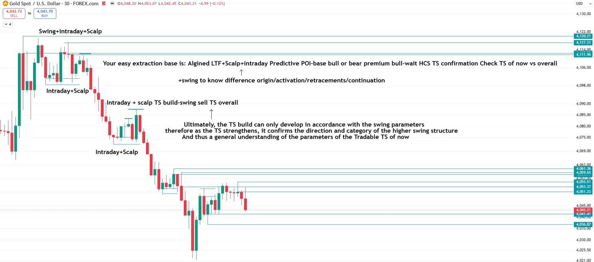
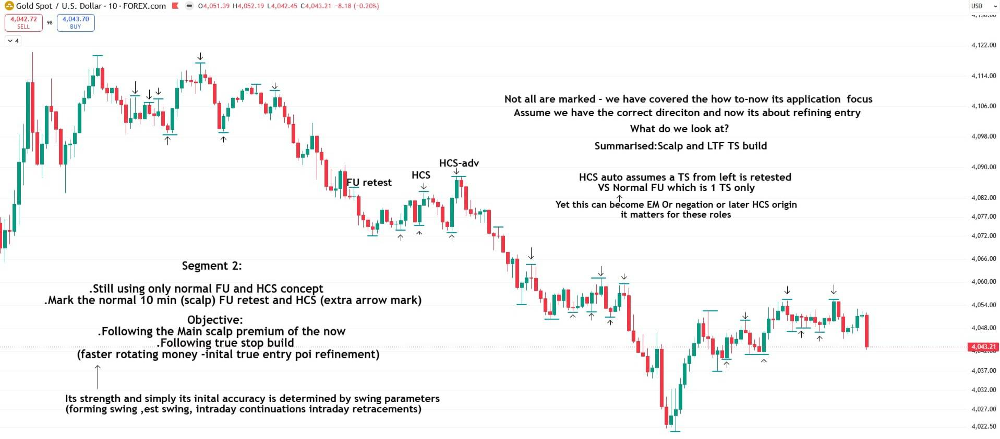
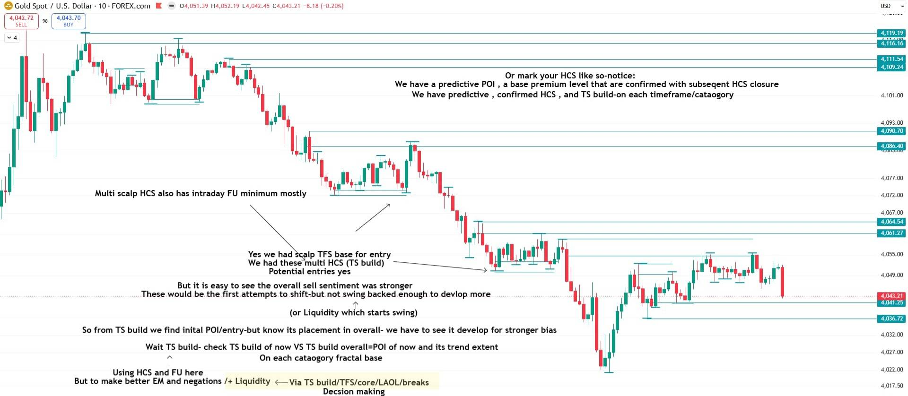
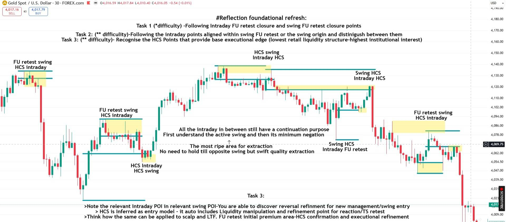
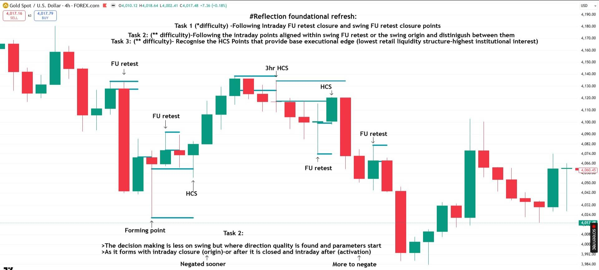

Jump to: [The cycle](#the-cycle) · [The base execution and extraction model](#the-base-execution-and-extraction-model) · [TS build](#ts-build) · [HCS as the refinement](#hcs-as-the-refinement) · [LAOL down the cycle](#laol-down-the-cycle) · [The three tradable points](#the-three-tradable-points) · [LAOL, TS and TFS](#laol-ts-and-tfs) · [Unresolved](#unresolved)

The callout boxes are his exact wording. Each Segment builds one level of the cycle: [Segment 1](/mrc-tasks/tasks/segments/1/assignment/) direction through swing and intraday points, [Segment 2](/mrc-tasks/tasks/segments/2/assignment/) the scalp POI and its TS build, [Segment 3](/mrc-tasks/tasks/segments/3/assignment/) the whole cycle down to the LTF entry. His charts are XAUUSD.

*After Segment 3 he set a recap of the swing / intraday direction layer and a puzzle: [Recap & Puzzle](/mrc-tasks/tasks/segments/4/).*

## The cycle

> Swing Campaign - Intraday Wave - Scalp Flow - LTF Timing. The top down fractal extraction cycle. Emphasis once again on how it all relates first to swing parameters - the main strongest premium to premium focus.
>
> Hierarchy is not to be ignored - it plays the most immense role in true RR quality extraction.

| Level | On his charts | What it is (his chart text) |
|---|---|---|
| Swing campaign | 3hr (Segment 3), 4hr (Segment 1) | "Swing to swing / The start and end of the "campaign" / The main premium to focus on and parameters that make/continue within it" |
| Intraday wave | 30 min | "Intraday- The current wave." / "Intraday to intraday wave=main confirmed extraction" |
| Scalp flow | 10 min (Segment 2), 5 min (Segment 3) | "Scalp =Flow" / "POI is refined to a select area" / "Ready to extract with local confirmed flow" |
| LTF timing | 1 min | "LTF - Timing" / "Top down LAOL has found us our executeable areas with refined planned perspective" |

Segment 1 opened the programme as "the comprehensive top-down processes at its different levels of advancement (swing to final entry - assured profitable edge)". Its focus: use "swing + intraday for direction and using the same method on scalp + LTF to understand how to take a final entry, in alignment with correct HTF flow. Do not expect to get swing direction perfect, but enough to spot correct areas and entry potential".

*Timeframes as drawn: the scalp is on 10 min in Segment 2 ("the normal 10 min (scalp)") and on 5 min in Segment 3; the intraday is on 30 min; the swing on 3hr and 4hr. The [five TFS categories](/mrc-tasks/reference/timeframe-strength/#the-five-tfs-categories) put 1-5 min in "LTF" and the scalp at 7-30 min, and [standalone Task 3's tiers](/mrc-tasks/tasks/3/assignment/#the-rules) put the scalp at 10 min + and the intraday at 1hr +. Each is kept as he wrote it; the source does not reconcile them.*

## The base execution and extraction model

From [Segment 2](/mrc-tasks/tasks/segments/2/assignment/#1-follow-premium-flow), outcome 1, "Follow premium flow":

> Follow Scalp-to-Scalp premium flow as it develops within Intraday-to-Intraday premium flow, while understanding where both sit within the governing Swing structure.
>
> Base execution and extraction model: 
> Predictive POI → HCS/FU confirmation → TS build → refined entry → extraction through the established flow

His 30 min chart gives the same sequence as "Your easy extraction base":

Chart annotations (30 min): "Swing+intraday+Scalp" (the top high), "Intraday+Scalp" (the range below it), "Intraday + scalp TS build-swing sell TS overall" (the middle range), "Intraday+Scalp" (the lower range); price-tagged lines from 4,120.21 down to 4,036.87.

- "Your easy extraction base is: Algined LTF+Scalp+intraday Predictive POI-base bull or bear premium bull-wait HCS TS confirmation Check TS of now vs overall"
- "↑ +swing to know difference origin/activation/retracements/continuation"
- "Ultimately, the TS build can only develop in accordance with the swing parameters"
- "therefore as the TS strengthens, it confirms the direction and category of the higher swing structure"
- "And thus a general understanding of the parameters of the Tradable TS of now"

## TS build

"TS build" (true stop build; [TS](/mrc-tasks/tasks/3/assignment/#the-rules) = true stop) is the central idea of [Segment 2](/mrc-tasks/tasks/segments/2/assignment/): "Key: TS build incorporates liquidity and negation."

> TS build confirms whether a POI has enough structural backing to trade. It shows how established and protected the current flow is.
>
> Its extent is understood through the full top-down structure, but it begins from the immediate TS build, which forms toward liquidity and creates the basis for a profitable move.
>
> A protected TS build is not negated by one  opposing reaction; it requires relevant opposing structure to negate it. However, relevant stronger retracement TS builds can still be traded without assuming the governing flow has been fully replaced.

He says himself that it is taught mainly through practice: "Serious learners will extract the meaning from the key themes discussed only through the repetition; further explanation will not be given in this segment as much".

Reading a TS build means four things, which he asks for on each trade presented or planned: "the reading of the TS build, the liquidity it targets, the structure protecting it, and the conditions required for its negation" ([Segment 2 · 2)](/mrc-tasks/tasks/segments/2/assignment/#2-what-ts-build-reveals)).

### HCS and FU in the TS build (10 min)

Chart annotations (10 min), a downtrend with many FU retest / HCS points marked (most unlabelled; "FU retest", "HCS" and "HCS-adv" labelled in the middle):

- Left:
  - "Segment 2:"
  - ".Still using only normal FU and HCS concept"
  - ".Mark the normal 10 min (scalp) FU retest and HCS (extra arrow mark)"
  - "Objective:"
  - ".Following the Main scalp premium of the now"
  - ".Following true stop build"
  - "(faster rotating money -inital true entry poi refinement)"
  - "↑ Its strength and simply its inital accuracy is determined by swing parameters"
  - "(forming swing ,est swing, intraday continuations intraday retracements)"
- Right:
  - "Not all are marked - we have covered the how to-now its application  focus"
  - "Assume we have the correct direciton and now its about refining entry"
  - "What do we look at?"
  - "Summarised:Scalp and LTF TS build"
  - "HCS auto assumes a TS from left is retested"
  - "VS Normal FU which is 1 TS only"
  - "↑ Yet this can become EM Or negation or later HCS origin"
  - "it matters for these roles"

The key contrast: an HCS "auto assumes a TS from left is retested", whereas a normal FU "is 1 TS only".

*"EM" is not spelled out. It is probably "entry model" (an inference from "using HCS in lieu of entry model" and "HCS is Inferred as entry model" in Segment 1), not confirmed in the source.*

*Segment 2 marks FU retests on the 10 min, and Segment 1 Task 1 speaks of "Intraday FU retest closure". Standalone [Task 3, rule 4](/mrc-tasks/tasks/3/assignment/#the-rules) says: "Only on the 3hr + will we pay attention to confirmed FU closures that indicate a prevalent direction, on the lower timeframes we are only concerned with HCS + negation." The Segments mark FU retests as premium areas rather than FU closures for direction, but the source does not say how the statements fit together. This joins the open question noted on the [TFS page](/mrc-tasks/reference/timeframe-strength/#the-established-tfs-retest).*

### Predictive POI, confirmed HCS, TS build (10 min)

Chart annotations (10 min, same move): horizontal levels with price tags (4,119.19, 4,116.16, 4,111.54, 4,109.24, 4,090.70, 4,086.40, 4,064.54, 4,061.27, 4,041.25, 4,036.72) and small range boxes.

- Top right:
  - "Or mark your HCS like so-notice:"
  - "We have a predictive POI , a base premium level that are confirmed with subseqent HCS closure"
  - "We have predictive , confirmed HCS , and TS build-on each timeframe/cataogory"
- Middle left: "Multi scalp HCS also has intraday FU minimum mostly" (arrows to two ranges)
- Centre:
  - "Yes we had scalp TFS base for entry"
  - "We had these multi HCS (TS build)" (arrow to the lower range)
  - "Potential entries yes"
  - "But it is easy to see the overall sell sentiment was stronger"
  - "These would be the first attempts to shift-but not swing backed enough to devlop more"
  - "↑ (or Liquidity which starts swing)"
  - "So from TS build we find inital POI/entry-but know its placement in overall- we have to see it develop for stronger bias"
  - "Wait TS build- check TS build of now VS TS build overall=POI of now and its trend extent"
  - "On each cataogory fractal base"
  - "↑ Using HCS and FU here"
  - "But to make better EM and negations /+ Liquidity ⟵ Via TS build/TFS/core/LAOL/breaks" (highlighted)
  - "Decsion making"

The order is: a **predictive POI** ("a base premium level"), **confirmed** by a later HCS closure, then the **TS build**. Compare the TS build of now with the TS build overall: the counter-trend multi-HCS builds here were "Potential entries", but "not swing backed enough to devlop more".

## HCS as the refinement

[Terminology](/mrc-tasks/reference/terminology/#hcs) defines HCS as "When a new FU forms retesting the other - Base refined entry anticipation". The Segments add what it does in the cycle:

> Observing HCS refinement power - the retest of a true stop - a level above the ordinary FU retest - the first gist of entry (refinement and confirmation) and from which, after entry, model refinement applies (full swing participation calculation).

(Segment 1 focus.) Segment 1 also uses "HCS in lieu of entry model - auto area of lessened retail participation and high institutional probability" (see [Rules of analysis § 11](/mrc-tasks/reference/rules-of-analysis/#11-do-not-get-caught-up-in-entry-models)).

### Intraday POI inside the swing POI (30 min)

Chart annotations (30 min, [Segment 1 · Task 3](/mrc-tasks/tasks/segments/1/assignment/#task-3--hcs-points-base-executional-edge)):

- Boxes marking swing POIs with the intraday point inside each: "FU retest swing / HCS intraday" (top left), "FU retest swing / HCS intraday" (middle left), "HCS Intraday / HCS swing" (low), "HCS swing / Intraday HCS" (top), "Swing HCS / Intraday HCS" (right, high), "Swing HCS / Intraday FU retest" (right, low), "FU retest swing / HCS intraday" (right).
- Centre text:
  - "All the intraday in between still have a continuation purpose"
  - "First understand the active swing and then its minimum negation"
  - "The most ripe area for extraction" (arrow up to the central box)
  - "No need to hold till opposite swing but swift quality extraction"
- Bottom text, "Task 3:":
  - "Note the relevant Intraday POI in relevant swing POI-You are able to discover reversal refinement for new management/swing entry"
  - "HCS is Inferred as entry model - it auto includes Liquidity manipulation and refinement point for reaction/TS retest"
  - "Think how the same can be applied to scalp and LTF. FU retest initial premium area-HCS confirmation and executional refinement"

The roles: the FU retest is the initial premium area; the HCS is the confirmation and executional refinement.

### What HCS represents (1 min)

Chart annotations (1 min, [Segment 3](/mrc-tasks/tasks/segments/3/assignment/#what-does-hcs-represent)): a line from a prior high's FU to a later spike that retests it exactly (around 4,360.4), arrow down.

> What does HCS represent? 
> FU formed-LAOL taken-respected 
> FU body retest=weak refinement area 
> FU wick retest=Strong refinement area

Compare the zone rule on [which part of the wick](/mrc-tasks/reference/zones/#which-part-of-the-wick).

## LAOL down the cycle

[LAOL](/mrc-tasks/reference/terminology/#laol) = "Last area of liquidity (within reversal POI)". Segment 3 explains the cycle "through the most raw component of the fractal cycle - the LAOL (and its early buyers/sellers offshoot)". One bullish move, from the swing low around 4,330.03, from 3hr down to 1 min; each level's LAOL is carried down.

### LAOL and early buyers/sellers (3hr)

Chart annotations (3hr):

- "LAOL and early buyers/sellers" (with a key symbol under the title)
- "4 fractally applied concepts relate :"
  1. "Base defination -1st or 2nd candle after FU =LAOL" (arrow to a low around 4,330.03)
  2. "Attempted fu /x3 self negating high/low serves as early buyers/sellers check mostly" (arrows to two highs/lows in the range)
  3. "or x3 self negating taken within HCS can be LAOL" (arrow to a low line)
  4. "A new LAOL from fresh price action needs twice the (general) proof"
- "-True sell starts to buy LAOL from left-"
- "-New price action produces new LAOL-"
- "- Requires Twice the proof comapred to old preset laol from left-"

Terms: [Attempted FU](/mrc-tasks/reference/terminology/#attempted-fu), [self-negating x3](/mrc-tasks/reference/terminology/#x3).

### Swing campaign (3hr)

Chart annotations (3hr, same chart, clean):

- "Swing to swing"
- "The start and end of the "campaign""
- "The main premium to focus on and parameters that make/continue within it"
- A line labelled "Swing L" at 4,330.03.

### Intraday wave (30 min)

Chart annotations (30 min): lines "Intraday LAOL" 4,342.20, "Intraday LAOL" 4,331.58, "Swing LAOL" 4,330.03.

- "Intraday- The current wave."
- "Here we find the tradable swing activation (optimal premium)"
- "Or continuation (swing to swing moves in multiple intraday waves)"
- "Intraday to intraday wave=main confirmed extraction"
- "After this we have intresting conditon for optimal premium" (arrows to the two intraday LAOLs)

### Scalp flow (5 min)

Chart annotations (5 min): lines "Scalp LAOL" 4,355.66, "Intraday LAOL" 4,342.60, "Scalp LAOL" 4,337.29, "Intraday LAOL" 4,331.58, "Swing LAOL" 4,330.03; a "Scalp LAOL" label on the left.

- "Scalp =Flow"
- "POI is refined to a select area"
- "Ready to extract with local confirmed flow"
- "Scalp is also the minimum area a higher Forming intraday /swing can occur from"
- "Each a first checkpoint of sorts (has given previous profitable postion)"
- "↑ What type of scalp one is trading-early premium or intraday continuation or more later persistant scalp until opposite?"

### LTF timing (1 min)

Chart annotations (1 min): lines "LTF LAOL" 4,356.50, "Scalp LAOL" 4,355.66, "LTF LAOL" 4,355.03, "Intraday LAOL" 4,342.60, "LTF LAOL" 4,340.43, "LTF LAOL" 4,338.37, "Scalp LAOL" 4,337.29, "Intraday LAOL" 4,331.58, "Swing LAOL" (around 4,330). Two "Entry" arrows (one around 4,338.4 after the scalp LAOL, one at the top right around 4,355) and "Entry Advanced origin" (arrow to around 4,337).

- "LTF - Timing"
- "Top down LAOL has found us our executeable areas with refined planned perspective"
- "See how from LAOL TS and TFS is made"
- "TS and TFS makes the confirmation -but LAOL premium levels are preset"
- "(By ensuring each LAOL comes after in time from higher catgagory LAOL includes TFS as it will need new development of price and closed structures of its own)"
- Bottom:
  - "Early buyers/sellers or can be interpreted as LAOL"
  - "For best confirmed flow each LAOL should be newer than its last cataogry"
  - "However for origin trades (forming swing TFS) advanced traders can find the LAOL in a similar area"
  - "We focus on confirmed TFS type LAOL-but hint is given for future origin lesson"

### The LAOL rules, together

- **Base definition:** "1st or 2nd candle after FU =LAOL".
- **Preset vs new:** "LAOL premium levels are preset" from the left; "A new LAOL from fresh price action needs twice the (general) proof" ("Twice the proof comapred to old preset laol from left"). The two statements describe different cases, the preset LAOL from the left and a new one from fresh price action.
- **Order in time:** "For best confirmed flow each LAOL should be newer than its last cataogry": each lower-category LAOL forms after the one above it, which is how the LAOL "includes TFS". Origin trades (forming swing TFS) are the exception.
- **Confirmation:** "LAOL itself does not confirm an area. It is core Liquidity or macro calculation that does" ([below](#laol-ts-and-tfs)).

Segment 3's Task A practises this: "30 repetitions of the cycle onto LTF final entry using only LAOL and some early buyers/sellers understanding (as extra filter where needed)" ([Segment 3 · Task A](/mrc-tasks/tasks/segments/3/assignment/#task-a--30-repetitions-of-the-cycle)).

## The three tradable points

> Origin - Swing Intraday Activation - Intraday Continuation
>
> The main tradable points of the top down cycle.

| Tradable point | His description |
|---|---|
| **Origin** | "Earliest premium and highest RR but also lesser confirmation and requires the most extra confluence check." |
| **Swing Intraday Activation** | "The calmest extraction moment and most technically sound." |
| **Intraday Continuation** | "New wave to wave until new swing is established - it is the most repeatable per session (sometimes multiple times) / full scale extraction. Yet requires the most management and special care to developing opposite swing." |

### Origin vs activation on the swing (4hr)

The distinction first appears in [Segment 1 · Task 2](/mrc-tasks/tasks/segments/1/assignment/#task-2--intraday-points-within-swing-fu-retest-or-origin):

Chart annotations (4hr):

- "FU retest" (a high, left), "FU retest" (middle), "HCS" (a low, arrow up), "Forming point" (at the low's wick, with a line drawn from it), "3hr HCS" (top), "HCS" (a lower high), "FU retest" (a low, arrow up), "FU retest" (a lower high, right).
- Bottom text, "Task 2:":
  - "The decision making is less on swing but where direction quality is found and parameters start"
  - "As it forms with intraday closure (origin)-or after it is closed and intraday after (activation)"
- Two arrows point up at that last line: "Negated sooner" (under "(origin)") and "More to negate" (under "(activation)").

### Origins and their intraday retests (3hr)

Chart annotations (3hr, an earlier swing): alternating labels, "(origin) Swing LAOL-TS-TFS" at highs and lows, and "Retest - Intraday LAOL-TS-TFS" at the retests that follow (four origins, four retests). Each swing origin is followed by its intraday retest.

### What an origin is (30 min)

Chart annotations (30 min, the same swing): four "(origin) Swing LAOL-TS-TFS" marks.

- "Origin=The intraday rule closure (inlcudes scalp) forming swing rules (includes intraday)"
- "Not the strongest confirmed swing-but the most contarian premium-banks decide here"
- "LAOL itself does not confirm an area. It is core Liquidity or macro calculation that does"
- "or: TS-TFS" (arrows from "core Liquidity" and "macro calculation")
- "One can technically trade both ways - TS needs more focus on Liqudity"
- "TFS auto includes and assumes confirmed displacement once swing parameter conditons are met"

### Choosing a style

> For traders struggling with psychology it is recommended to choose one of the three as your trading style.
>
> Or advanced - use all three but be aware of the different premiums advantages/disadvantages - and make prior planning for risk plan for each or total swing cycle.

Practice: 10 repetitions of each, separately ([Segment 3 · Task B](/mrc-tasks/tasks/segments/3/assignment/#task-b--10-repetitions-of-each)). Also in Misc: [Trading Psychology](/mrc-tasks/misc/trading-psychology-the-mindset-of-clarity/#choosing-one-trading-style-segment-3).

Optional advanced practice: "P.s: Zones (50 min/1hr HCS - 3hr normal or HCS) can also create their own LAOL/ find the imperfect origin reasoning (advanced practice)" ([Zones](/mrc-tasks/reference/zones/#where-zones-sit-in-the-analysis)).

## LAOL, TS and TFS

What each adds, in his words:

- "LAOL itself does not confirm an area. It is core Liquidity or macro calculation that does", "or: TS-TFS" (30 min origin chart).
- "See how from LAOL TS and TFS is made" / "TS and TFS makes the confirmation -but LAOL premium levels are preset" (1 min chart).
- "One can technically trade both ways - TS needs more focus on Liqudity" / "TFS auto includes and assumes confirmed displacement once swing parameter conditons are met" (30 min origin chart).

He set the comparison as a theory task, "LAOL alone vs. LAOL + TS vs. LAOL + TS + TFS. The advantages and disadvantages of each", to be explored "further in future (locked) final advanced segement" ([Segment 3 · Task C](/mrc-tasks/tasks/segments/3/assignment/#task-c--laol-vs-laol--ts-vs-laol--ts--tfs)). No answer is given in the source. TFS itself: [Timeframe Strength (TFS)](/mrc-tasks/reference/timeframe-strength/).

## Unresolved

Kept as written; the source does not define or settle these:

- **"3×3 task segment"** (the programme opener) is not explained.
- **"Estimated time taken: 1-3 hours each ×3"** (Segment 1): per Task in total or per day is not stated.
- **"each needing at least half to negate..\*"** (Segment 1 extension): half of what is not stated; the "..\*" has no footnote.
- **"Adv HCS", "Adv FU retest", "weaker HCS", "Weaker HCS-using ATT FU", "HCS-adv"**: chart grades, not defined.
- **"EM"**: probably "entry model" (inference, not confirmed).
- **Segment 2's 30 days**: whether they also cover outcome 2 (TS build reading) is not stated.
- **"Early buyers/sellers"**: only described by his 3hr and 1 min charts.
- **"Macro calculation"**: not defined.
- **Instrument**: not specified; every chart is XAUUSD.
- Announced but not given: a "future origin lesson" and a "future (locked) final advanced segement".

---

Related: [Segment 1](/mrc-tasks/tasks/segments/1/assignment/) · [Segment 2](/mrc-tasks/tasks/segments/2/assignment/) · [Segment 3](/mrc-tasks/tasks/segments/3/assignment/) · [Terminology](/mrc-tasks/reference/terminology/) · [Timeframe Strength (TFS)](/mrc-tasks/reference/timeframe-strength/) · [Liquidity](/mrc-tasks/reference/liquidity/) · [Zones: Types, Rules & Refinement](/mrc-tasks/reference/zones/) · [Practical Rules of Analysis & Extraction](/mrc-tasks/reference/rules-of-analysis/) · [Worked Example: Backtest Sequence at the 3,000 Low](/mrc-tasks/reference/worked-example-3000-reversal/)
