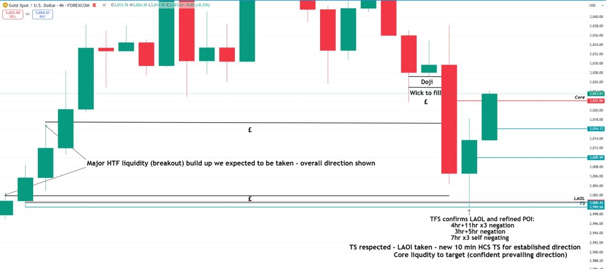
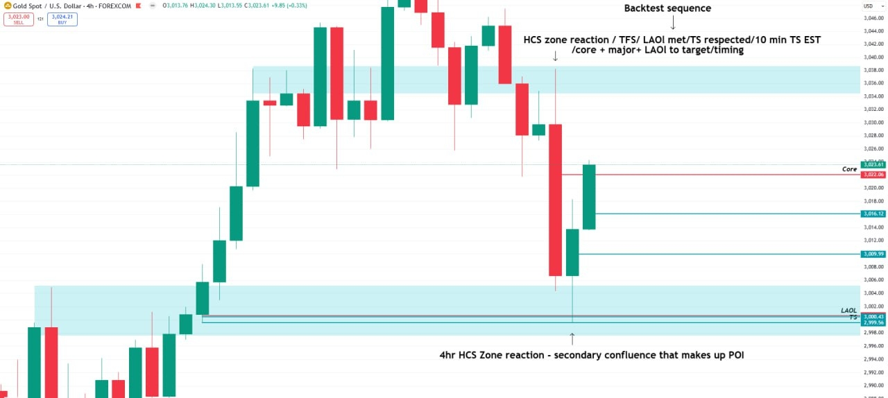
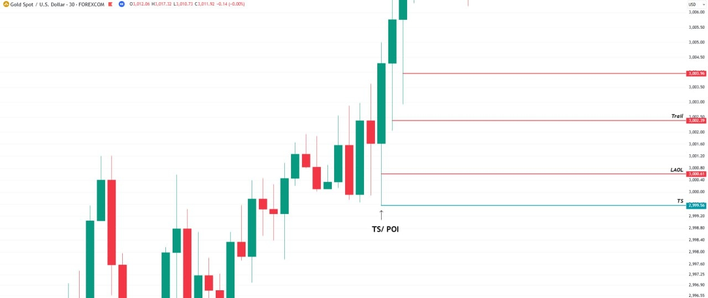
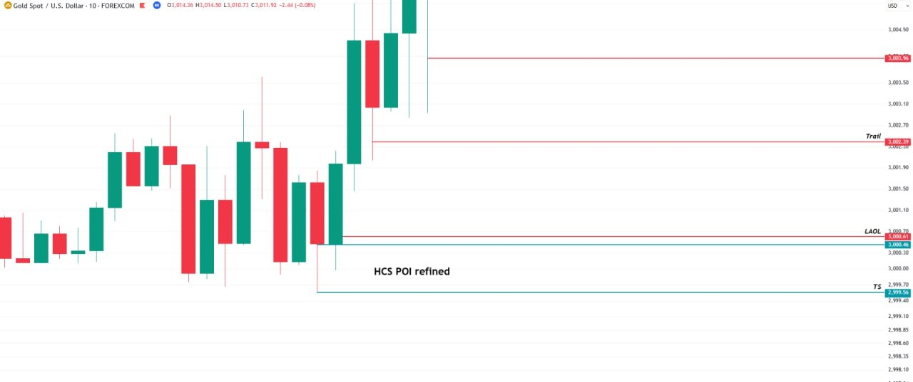
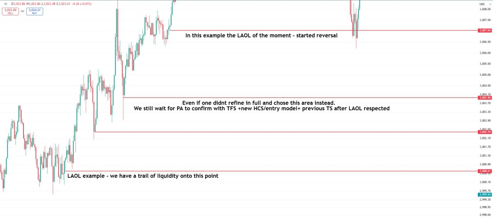
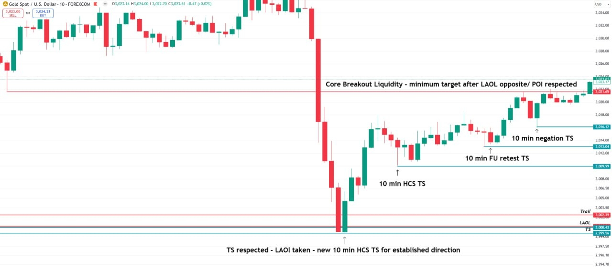
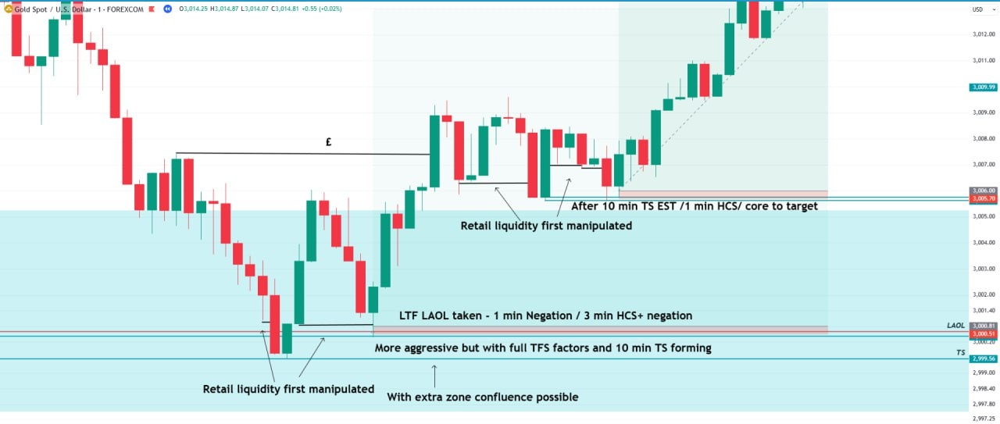
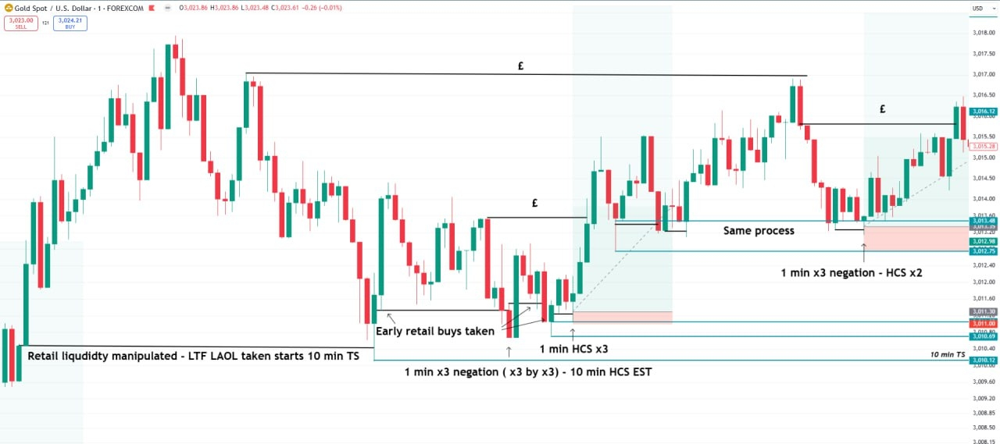
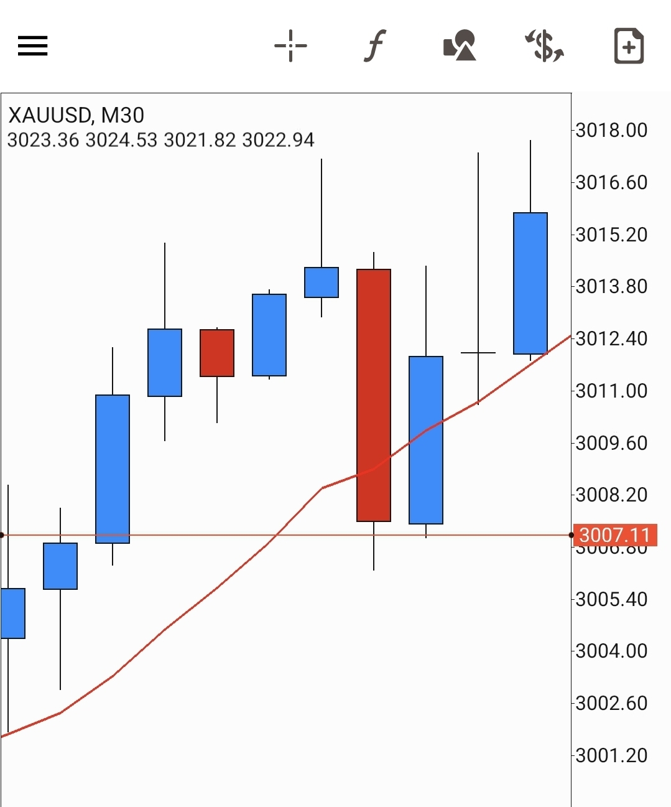

Jump to: [4hr](#4hr-context-and-tfs-confirmation) · [30 min](#30-min-ts--poi-laol-and-trail) · [10 min](#10-min-the-refined-hcs-poi) · [Lower timeframe](#lower-timeframe-the-laol-and-its-trail) · [10 min after](#10-min-after-the-ts-is-respected) · [1 min entries](#1-min-the-entries) · [Q&A](#qa-why-the-big-4hr-candle-was-not-a-poi)

## About this example

- **Instrument:** XAUUSD (gold), TradingView charts.
- **When:** not stated. The live price on the charts (about 3,023) and gold's first move above $3,000 suggest roughly late March 2025. This is an inference from the charts, not a date he gives.
- **Key levels** (they recur on every timeframe): TS **2,999.56** · LAOL **~3,000.4-3,000.8** (redrawn slightly per chart: 3,000.61 on the 30 min and 10 min, 3,000.43 on the 4hr and later 10 min) · Trail **3,002.39** · Core **3,021.65** (10 min) / **3,022.06** (4hr).
- **Order:** he posted these charts in the order of his rules (LAOL, TS/POI, TFS, zones, then 1 min entries). They are shown here top-down, 4hr to 1 min, following his "Backtest sequence" note on the 4hr chart and the top-down method of [Task 2](/mrc-tasks/tasks/2/assignment/#full-multi-timeframe-breakdown-worked-example). Each chart links to the rule it illustrates in [Practical Rules of Analysis & Extraction](/mrc-tasks/reference/rules-of-analysis/).

## 4hr: context and TFS confirmation

Chart annotations (4hr):

- Left: "Major HTF liquidity (breakout) build up we expected to be taken - overall direction shown" (two "£" lines, around 3,017 and 3,002).
- Top right: "Doji", "Wick to fill", "£" (around 3,026-3,028).
- At the low: "TFS confirms LAOL and refined POI: 4hr+11hr x3 negation / 3hr+5hr negation / 7hr x3 self negating"
- "TS respected - LAOL taken - new 10 min HCS TS for established direction / Core liquidity to target (confident prevailing direction)"
- Levels: Core 3,022.06 · 3,016.12 · 3,009.99 · LAOL 3,000.43 · TS 2,999.56.

Several higher timeframes (4hr, 11hr, 3hr, 5hr, 7hr) confirm the same POI: the TFS alignment of [Task 3](/mrc-tasks/tasks/3/assignment/#2--timeframe-strength-and-the-htf-true-stop). Rule: [8. TFS](/mrc-tasks/reference/rules-of-analysis/#8-tfs).

Chart annotations (4hr, two blue zones):

- Top: **"Backtest sequence"** ↓ "HCS zone reaction / TFS / LAOL met / TS respected / 10 min TS EST / core + major + LAOL to target / timing"
- Bottom: "4hr HCS Zone reaction - secondary confluence that makes up POI"

The "Backtest sequence" is the final-entry rule in the order to backtest it. Rules: [9. Zones](/mrc-tasks/reference/rules-of-analysis/#9-zones), [10. Final entries](/mrc-tasks/reference/rules-of-analysis/#10-final-entries) and the [entry checklist](/mrc-tasks/reference/rules-of-analysis/#entry-checklist).

## 30 min: TS / POI, LAOL and trail

Chart annotations (30 min):

- "TS/ POI" at the low wick of a rising green candle.
- Lines: TS 2,999.56 · LAOL 3,000.61 · Trail 3,002.39 · 3,003.96.

The POI sits in the earlier rally, the "build up" on the 4hr, which price later returns to. Rules: [6. LAOL](/mrc-tasks/reference/rules-of-analysis/#6-laol), [8. TFS](/mrc-tasks/reference/rules-of-analysis/#8-tfs).

## 10 min: the refined HCS POI

Chart annotations (10 min):

- "HCS POI refined" (line 3,000.46), between LAOL 3,000.61 and TS 2,999.56.
- Trail 3,002.39 · 3,003.96.

Rules: [3. Wait for the established 10/15 min TS](/mrc-tasks/reference/rules-of-analysis/#3-wait-for-the-established-1015-min-ts), [10. Final entries](/mrc-tasks/reference/rules-of-analysis/#10-final-entries) ("a refined HCS or negation POI").

## Lower timeframe: the LAOL and its trail

Chart annotations (lower timeframe; the chart's timeframe label is not visible):

- "LAOL example - we have a trail of liquidity onto this point" (3,000.61)
- "Even if one didn't refine in full and chose this area instead. We still wait for PA to confirm with TFS + new HCS/entry model + previous TS after LAOL respected" (3,003.96)
- "In this example the LAOL of the moment - started reversal" (3,007.04)
- An unlabelled line at 3,002.39 (the Trail on the 30 min and 10 min charts).

Choosing a less refined level is not fatal: the entry still waits for price action to confirm (TFS, a new HCS or entry model, the previous TS) after the LAOL is respected. "The LAOL of the moment" fits his rule that "Price moves from LAOL to LAOL" ([6. LAOL](/mrc-tasks/reference/rules-of-analysis/#6-laol); [Terminology](/mrc-tasks/reference/terminology/#laol)).

## 10 min: after the TS is respected

Chart annotations (10 min):

- Bottom: "TS respected - LAOL taken - new 10 min HCS TS for established direction"
- As price rises: "10 min HCS TS" (3,009.99) · "10 min FU retest TS" (3,013.04) · "10 min negation TS" (3,016.12)
- Top: "Core Breakout Liquidity - minimum target after LAOL opposite/ POI respected" (3,021.65), reached at the right edge.
- Lines: Trail 3,002.39 · LAOL 3,000.43 · TS 2,999.56.

Rules: [5. Core liquidity](/mrc-tasks/reference/rules-of-analysis/#5-core-liquidity), [10. Final entries](/mrc-tasks/reference/rules-of-analysis/#10-final-entries).

## 1 min: the entries

Chart annotations (1 min, inside the blue 4hr zone):

- "LTF LAOL taken - 1 min Negation / 3 min HCS+ negation"
- "More aggressive but with full TFS factors and 10 min TS forming"
- "With extra zone confluence possible"
- "Retail liquidity first manipulated" (twice: at the low, and at a later pullback)
- "After 10 min TS EST / 1 min HCS / core to target"
- Two long-position boxes: one at about 3,000.5 (the LAOL) and one at about 3,005.7, after the 10 min TS is established.

**Two entries, two standards.** An entry while the 10 min TS is still *forming* is shown as valid but "More aggressive but with full TFS factors" (with extra zone confluence possible). The standard entry waits until the 10 min TS is *established* ("After 10 min TS EST"). This matches [Task 3, rule 3](/mrc-tasks/tasks/3/assignment/#the-rules): "Established in most cases, sometimes taken as forming." Rules: [3](/mrc-tasks/reference/rules-of-analysis/#3-wait-for-the-established-1015-min-ts), [4](/mrc-tasks/reference/rules-of-analysis/#4-know-your-liquidity-targets-first) ("early retail liquidity will be manipulated first").

Chart annotations (1 min, continuation):

- "Retail liquidity manipulated - LTF LAOL taken starts 10 min TS" (low around 3,010.12; line labelled "10 min TS")
- "Early retail buys taken"
- "1 min x3 negation ( x3 by x3) - 10 min HCS EST"
- "1 min HCS x3"
- "Same process" → "1 min x3 negation - HCS x2"
- "£" lines on the liquidity above; long-position boxes at each entry.

The process repeats after each new TS. The 10 min TS here (around 3,010) is the "10 min HCS TS" at 3,009.99 on the 10 min chart above. *"x3 by x3" is not explained in the source and is left undefined.*

## Q&A: why the big 4hr candle was not a POI

A student forwarded the 4hr chart above ("TFS confirms LAOL and refined POI...") and circled the large bearish 4hr candle, asking whether that whole area could also be 4hr TFS.

His answer:

> Simple answer : We had no 10 min TS established prior.
>
> We were also not within timing. X3 self negation is weaker by default (not enough on its own for a strong POI)
>
> With the LAOL / major liquidity below / POI yet to be met:

> This 30 min doji (and below) most notable.

*The chart (30 min, XAUUSD) has a horizontal line at 3,007.11, where a red candle closes and the next candle opens. The curved line is a moving average from the charting app, not an annotation.*

**The lesson.** A big higher-timeframe candle area is not a POI on its own. Here four things were missing:

1. an established 10 min TS ([rule 3](/mrc-tasks/reference/rules-of-analysis/#3-wait-for-the-established-1015-min-ts));
2. timing ([Task 3 · Key timing](/mrc-tasks/tasks/3/assignment/#3--key-timing));
3. more than a lone x3 self negation, which "is weaker by default" ([Terminology](/mrc-tasks/reference/terminology/#x3));
4. the liquidity below (the LAOL, major liquidity and the 30 min doji) had not yet been met.

They are the same conditions as the [entry checklist](/mrc-tasks/reference/rules-of-analysis/#entry-checklist), seen from the other side.

---

Related: [Practical Rules of Analysis & Extraction](/mrc-tasks/reference/rules-of-analysis/) · [Terminology](/mrc-tasks/reference/terminology/) · [Zones: Types, Rules & Refinement](/mrc-tasks/reference/zones/) · [Timeframe Strength (TFS)](/mrc-tasks/reference/timeframe-strength/) · [Task 2 - Top-Down Analysis](/mrc-tasks/tasks/2/assignment/) · [Task 3 - RR, Timeframe Strength & Timing](/mrc-tasks/tasks/3/assignment/)
