Jump to: [What zones are](#what-zones-are) · [Four zone types](#the-four-zone-types) · [Rules](#the-rules) · [Weakest ATT FU](#the-weakest-att-fu-in-depth) · [Three levels](#three-levels-of-use) · [HTF sequence](#htf-marking-sequence) · [Reactions and expiry](#reactions-and-expiry) · [Practice](#practice-what-do-you-see) · [Live-time application](#live-time-application) · [NY session mark-up](#full-zone-mark-up-for-a-ny-session) · [Where zones sit](#where-zones-sit-in-the-analysis)

The callout boxes are his exact wording. Everything outside them explains, organises or transcribes his charts. Answers taken from the Week 1 Q&A are marked "From the Week 1 Q&A": the student's question is paraphrased (no names) and his answer is given as written.

The Tasks that practise all of this: [Week 1: Zones](/mrc-tasks/tasks/weeks/1/) ([Task 1](/mrc-tasks/tasks/weeks/1/task-1/assignment/) · [Task 2](/mrc-tasks/tasks/weeks/1/task-2/assignment/) · [Task 3](/mrc-tasks/tasks/weeks/1/task-3/assignment/)).

## What zones are

He opens the topic with why zones are worth learning:

> From all concepts zones can be the most fun to use. For one does not have to think when drawing them out - it is a purely mechanical process- from which one gains much information about the present state of price action at a quick glance.

> What are zones exactly? The theory:
>
> Simply the largest "blocks" of banks true orders that hold up price in the present. The state of the floating markets are linked to them - all of the banks ability to manipulate and control price first stem from these.

> What moves have occurred in past price action are now the past (deactivated zones that have already been met) - only the present matters and how banks decide to move price from their fresh true block of orders for a profitable outcome. The real money (billions/trillions) of the markets is always in the present. And that energy is stored within these institutional zones. From it all subsequent price movements occur dependent on the banks (loose term for real players- the Fed and co branches) intentions of manipulation based on fundamentals and the major retail liquidity trail indication.

> Our purpose is related to practicals today. But the above passages highlights a crucial aspect to understand and explore. "The real money is always in the present".
> "From it all subsequent price movements occur".

His wider view of the banks' control over price is in [Fundamentals: USD, the Banks & Gold](/mrc-tasks/misc/fundamentals-usd-banks-and-gold/). The "trail" he mentions is described under [Terminology · Used on the charts](/mrc-tasks/reference/terminology/#used-on-the-charts).

## The four zone types

> To draw zones one must first understand candlestick language. Most of you are already familiar with them. This opportunity can be used to refresh. We have 4 variations: The broken FU wick zone, the broken HCS zone, the broken weakest ATT FU zone, and the broken body in wick orderblock. Each are a form of a manipulated candle and low (retail) liquidity by default.

The candle terms are defined in [Terminology](/mrc-tasks/reference/terminology/): [FU](/mrc-tasks/reference/terminology/#fu), [attempted FU](/mrc-tasks/reference/terminology/#attempted-fu) (ATT FU), [HCS](/mrc-tasks/reference/terminology/#hcs). The order of strength between the types is under [Priority and refinement](#priority-and-refinement).

### Broken FU wick zone

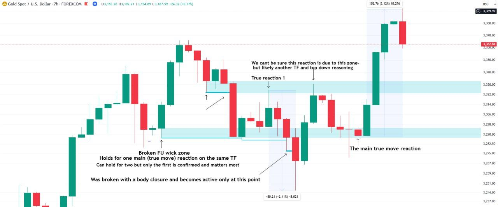

Chart annotations (7hr):

- "Broken FU wick zone / Holds for one main (true move) reaction on the same TF / Can hold for two but only the first is confirmed and matters most"
- "Was broken with a body closure and becomes active only at this point"
- "True reaction 1"
- "We can't be sure this reaction is due to this zone- but likely another TF and top down reasoning"
- "The main true move reaction"

### Broken HCS zone

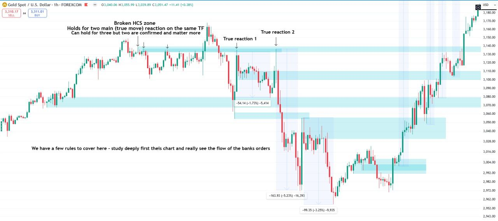

Chart annotations (1hr):

- "Broken HCS zone / Holds for two main (true move) reaction on the same TF / Can hold for three but two are confirmed and matter more"
- "True reaction 1", "True reaction 2"
- "We have a few rules to cover here - study deeply first this chart and really see the flow of the banks orders"
- Measure boxes on the moves: -54.14 (-1.73%), -163.93 (-5.23%), -99.35 (-3.25%).

### HCS zone rules

The same 1hr data, with his three rules for HCS zones.

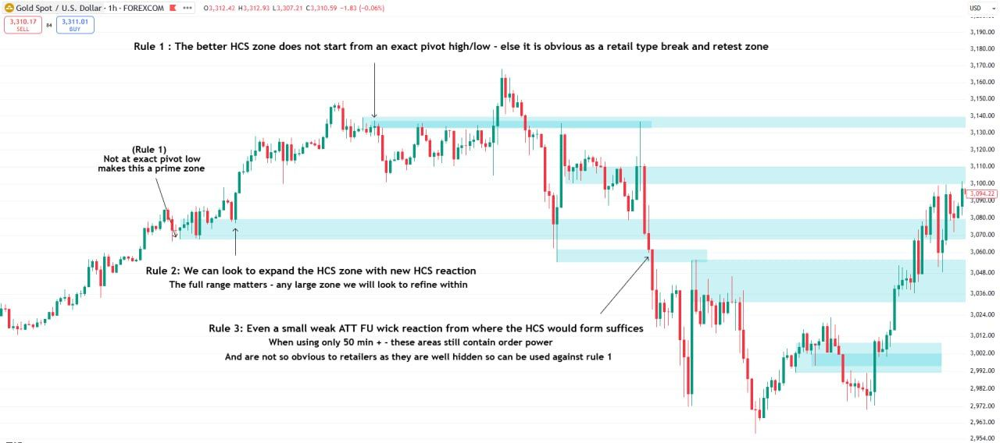

Chart annotations (1hr):

- "Rule 1 : The better HCS zone does not start from an exact pivot high/low - else it is obvious as a retail type break and retest zone"
- "(Rule 1) Not at exact pivot low makes this a prime zone"
- "Rule 2: We can look to expand the HCS zone with new HCS reaction / The full range matters - any large zone we will look to refine within"
- "Rule 3: Even a small weak ATT FU wick reaction from where the HCS would form suffices / When using only 50 min + - these areas still contain order power / And are not so obvious to retailers as they are well hidden so can be used against rule 1"

### Body-in-wick orderblock

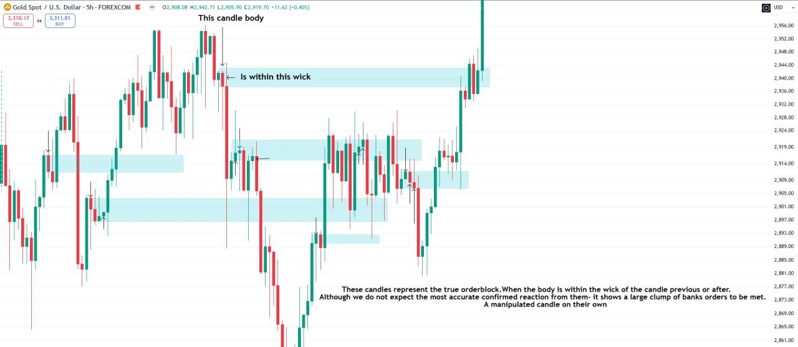

Chart annotations (5hr):

- "This candle body" / "Is within this wick"
- "These candles represent the true orderblock.When the body is within the wick of the candle previous or after. / Although we do not expect the most accurate confirmed reaction from them- it shows a large clump of banks orders to be met. / A manipulated candle on their own"

Body-in-wick zones are optional while learning: "Do not use body in wick zones if they confuse." (Week 1 notes). He gives no expiry count for this type.

### Weakest ATT FU zone (failed FU)

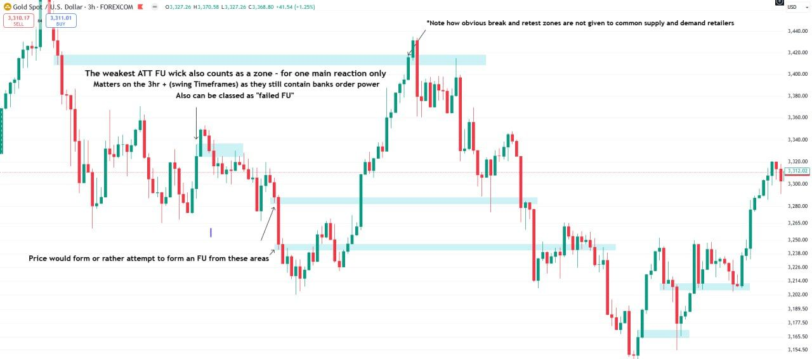

Chart annotations (3hr):

- "The weakest ATT FU wick also counts as a zone - for one main reaction only / Matters on the 3hr + (swing Timeframes) as they still contain banks order power / Also can be classed as "failed FU""
- "Price would form or rather attempt to form an FU from these areas"
- "*Note how obvious break and retest zones are not given to common supply and demand retailers"

"Weakest ATT FU" and "failed FU" are his two names for the same zone. It is covered in depth [below](#the-weakest-att-fu-in-depth).

## The rules

> We have a few rules to be noted:
>
> • The zone is only activated after its low (for bullish FU) or high (for bearish FU) closes with body break
>
> • We can expand our zones to include relevant close new manipulation. Understanding the full true range of banks orders.
>
> • We refine within HTF large zones. For example a 200 pip 11hr zone - price will react from further refinement overlap zone within- generally within a 20 to 50 pip range. "Refined"
>
> • True untested zones will always be naturally spaced by default. For each upholds its own level of price away from the last zone

The Q&A added the following.

### Priority and refinement

*From the Week 1 Q&A.* Asked what to pay attention to when several zones overlap:

> Two rules:
>
> 1) Prioritise the order of strength (HCS zones, broken FU wick zone- and body in wick/failed FU zones are secondary for additional refinement)
>
> 2) Note the complete zone of manipulation, but mark the most refined area , upon top down analysis prioritising the stronger area
>
> If a zone is too close to another , something is amiss in your zone refinement. You will expand your zone to include the full area, and find the refined area- equally spaced from the next zone (same process, expand and refine in top down)

#### More refinement rules (Week 3)

From the annotations on his Week 3 zone walkthrough ([Liquidity · Step 1](/mrc-tasks/reference/liquidity/#step-1-zones-12hr-to-50-min)):

- **Extend rather than add.** "Instead of drawing a new zone we can extend the 12hr to include this refinement" ([7hr](/mrc-tasks/reference/liquidity/#7hr-extend-rather-than-draw-a-new-zone)).
- **Limit overlaps.** "Dont have too many overlaps (max 4, ideally 3) / Especially when we are on the HTF with much more important ITF refinement yet to go" ([7hr](/mrc-tasks/reference/liquidity/#7hr-overlaps-and-fading)).
- **Its own timeframe first.** A zone "matters most for its aligned TF reaction" ([7hr](/mrc-tasks/reference/liquidity/#7hr-overlaps-and-fading)).
- **Remove or hide parent zones once refined.** "Lets remove this zone for visibility now that refinement is drawn" and "Can also remove this one or remove visibility not to show on minutes TF" ([50 min](/mrc-tasks/reference/liquidity/#50-min-remove-the-parent-zones)).
- **Body in wick on 4hr is extreme refinement.** "More likley used live time if we didnt have any other notable zone in the area" ([4hr](/mrc-tasks/reference/liquidity/#4hr-adjustment-and-extreme-refinement)).
- **Fewer zones on 1hr/50 min.** "We mark a few - but dont overdo refinement" ([50 min](/mrc-tasks/reference/liquidity/#50-min-dont-overdo-refinement)).
- **Zone counts vary.** "Some timeframes will have more zones than others -all depends on placement" ([3hr](/mrc-tasks/reference/liquidity/#3hr-refine-further)).

### When a zone becomes active

*From the Week 1 Q&A.* A student marked a zone at the point where it "becomes active":

> Correct marking. If respected via a new wick reaction and not a body closure then keep on going until the subsequent new wick is broken with a body closure

A student asked why a zone on his 3hr session chart ("Not broken yet - not active", [Week 1 Task 2, exercise 2](/mrc-tasks/tasks/weeks/1/task-2/assignment/#3hr)) was not broken:

> See previous explanation. The first break of was respected with a new wick. That wick was not yet broken with a body closure below.

### Which part of the wick

*From the Week 1 Q&A.* On his 14hr chart ([Week 1 Task 1, exercise 1](/mrc-tasks/tasks/weeks/1/task-1/assignment/#14hr)) one zone is labelled "Just free part" and another "All the wick". A student asked which method is correct:

> The first zone is based on the broken HCS and the latter only the broken FU wick zone.

> The refined area is from where the HCS reaction takes place

## The weakest ATT FU in depth

*From the Week 1 Q&A.* A student could not see an FU in the zone labelled "Untested - mechanical marking" on his 7hr session chart ([Week 1 Task 2, exercise 2](/mrc-tasks/tasks/weeks/1/task-2/assignment/#7hr)). He answered with two charts and these notes:

> .  Only used on the 3hr + TF , and expires after one reaction. You will have a limited usage of this zone.
>
> . Beginners can ignore this / body in wick orderblocks. Know they add to refinement. Practise the other types first- the purpose is to refine the zones that start true moves and its precision , predicted advantage to your favour

First, true FU wicks for comparison:

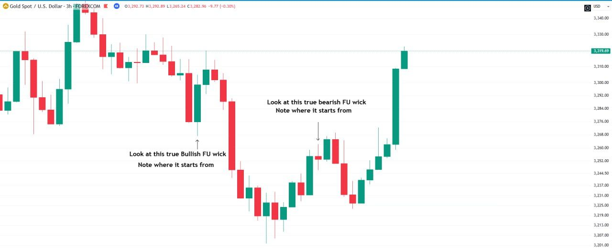

Chart annotations (3hr):

- "Look at this true Bullish FU wick / Note where it starts from"
- "Look at this true bearish FU wick / Note where it starts from"

Then the same data with the weakest ATT FU wicks marked:

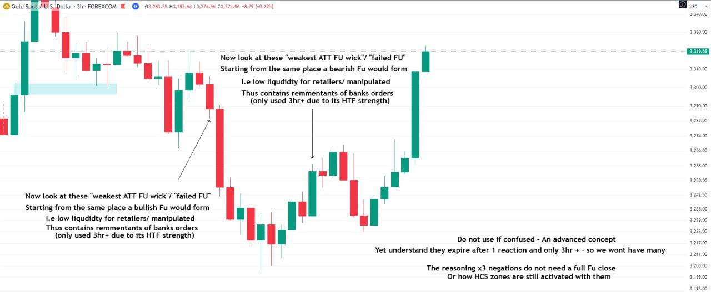

Chart annotations (3hr):

- "Now look at these "weakest ATT FU wick"/ "failed FU" / Starting from the same place a bullish FU would form / I.e low liquidity for retailers/ manipulated / Thus contains remnants of banks orders / (only used 3hr+ due to its HTF strength)" (the same note is given for the bearish case)
- "Do not use if confused - An advanced concept / Yet understand they expire after 1 reaction and only 3hr + - so we wont have many"
- "The reasoning x3 negations do not need a full FU close / Or how HCS zones are still activated with them"

The x3 negation is defined in [Terminology · x3](/mrc-tasks/reference/terminology/#x3).

## Three levels of use

> There are three methods to use zones. On the HTF, the 7/10/15 min, and the 1 min:

### HTF

> As we want to see the main flow of orders and then use TFS, TS and liquidity to make our decision for entries alongside the banks - the HTF zone suffices. The bulk of the banks true orders that make up price. Everyday price will react from these zones, and we can purely mechanically mark them out for a predicted confirmed reaction , without any other aspect in bias

### 7/10/15 min

> The 7/10/15 zones are used in conjunction with our 7/10/15 min TS. To affirm the true areas - yet TFS,TS and liquidity take priority first. From these zones down we merely see the full picture more clear and follow the banks intentions at the macro level. Not much used to anticipate, but confirm true POI and refine HTF zones:

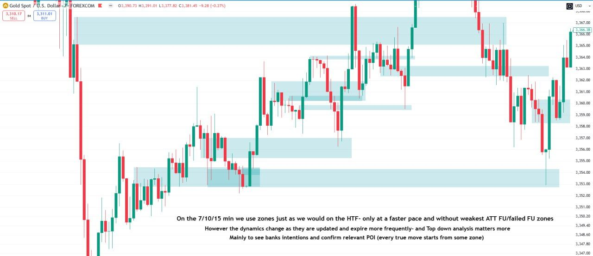

Chart annotations (7 min):

- "On the 7/10/15 min we use zones just as we would on the HTF- only at a faster pace and without weakest ATT FU/failed FU zones / However the dynamics change as they are updated and expire more frequently- and Top down analysis matters more / Mainly to see banks intentions and confirm relevant POI (every true move starts from some zone)"

TS and TFS are defined in [Task 3 · The rules](/mrc-tasks/tasks/3/assignment/#the-rules) and [Task 3 · Timeframe strength](/mrc-tasks/tasks/3/assignment/#timeframe-strength---definition). The full TFS framework is in [Timeframe Strength (TFS)](/mrc-tasks/reference/timeframe-strength/).

### 1 min

> Finally on the LTF , namely the 1 min, after all previous full refinement - we locate the exact placement of the moment where banks true orders are present , awaiting final entry decision. Either a retest or break and retest or the strong FU zone - banks final decision and orders to manipulate price:

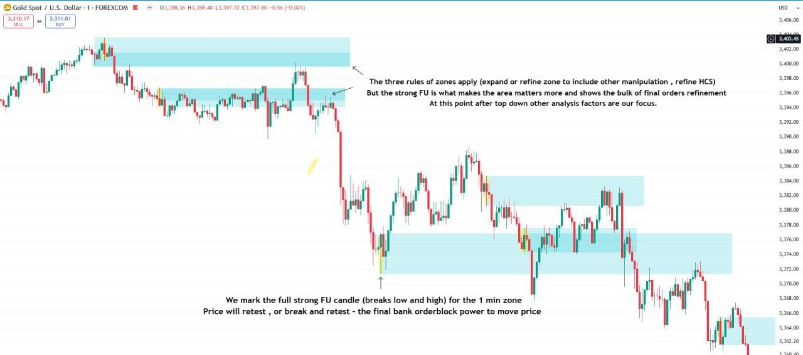

Chart annotations (1 min):

- "The three rules of zones apply (expand or refine zone to include other manipulation , refine HCS) / But the strong FU is what makes the area matters more and shows the bulk of final orders refinement / At this point after top down other analysis factors are our focus."
- "We mark the full strong FU candle (breaks low and high) for the 1 min zone / Price will retest , or break and retest - the final bank orderblock power to move price"

## HTF marking sequence

The header on the first charts of his HTF demonstration (in full in [Week 1 Task 1, exercise 1](/mrc-tasks/tasks/weeks/1/task-1/assignment/#worked-example-exercise-1-htf)):

- "The optimal sequence to mark HTF main zones would be from : 4D-daily-18hr-15/14 hr-12hr -11hr-7hr-5hr-4hr-3hr-1hr-50 min"
- "Only marking HCS zones on 1hr/50 min"
- "Start from 18hr and make your way down refining each true move reaction starting from zone"
- "(can skip to 11hr if managing too many TF is difficult- here we view the complete picture)"

## Reactions and expiry

### What counts as a reaction

*From the Week 1 Q&A.* Asked how to define or decide a reaction, and whether there is a criterion:

> Price holds for a significant reaction on that same timeframe. Generally over 3 closed candles
>
> Consider the move in relation to the size and strength of the zone.
>
> I.e if price moves for a 30 pip move from a 3hr HCS zone - that barely makes a dent.
>
> From this base you can apply rationale thought.

His chart for the same answer:

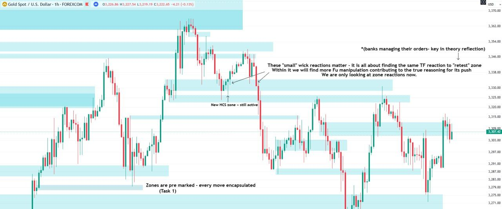

Chart annotations (1hr):

- "These "small" wick reactions matter - it is all about finding the same TF reaction to "retest" zone / Within it we will find more FU manipulation contributing to the true reasoning for its push / We are only looking at zone reactions now."
- "*(banks managing their orders- key in theory reflection)"
- "New HCS zone = still active"
- "Zones are pre marked - every move encapsulated (Task 1)"

*The two go together: the chart is about the same-timeframe wick that "retests" the zone, and the written answer is about whether the move that follows is significant.*

### Expiry

*From the Week 1 Q&A.* Asked whether only untested zones are marked, and whether tested and untested zones differ in strength:

> If the zone has been met for its subsequent reaction (HCS zone for 2 on the same TF or broken FU wick for 1 reaction) - then it is expired and no longer considered.

The type rules above give the same counts: broken FU wick zone, one main reaction ("Can hold for two but only the first is confirmed and matters most"); broken HCS zone, two; weakest ATT FU, one, 3hr+ only. The expiry of body-in-wick zones is not specified.

## Practice: what do you see?

An optional exercise he set in the Q&A. Mark the chart yourself first, then open his answer.

> What do you see in the above chart? (only 1 timeframe- fun practice exercise)

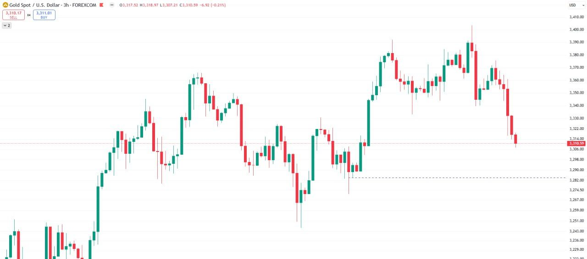

His answer (3hr)

"Our refinement advantage ^"

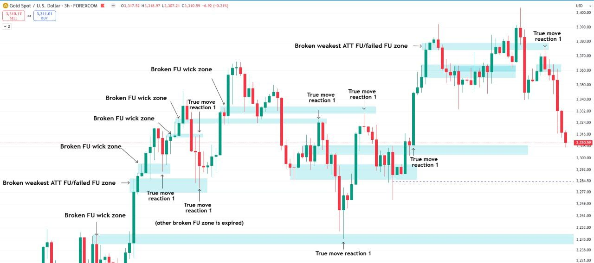

Chart annotations (3hr):

- "Broken FU wick zone" (five times)
- "Broken weakest ATT FU/failed FU zone" (twice)
- "True move reaction 1" (at each zone's reaction)
- "(other broken FU zone is expired)"

"Pay attention to the rule mentioned (broken HCS/ FU wick priority- Body in wick refinement)"

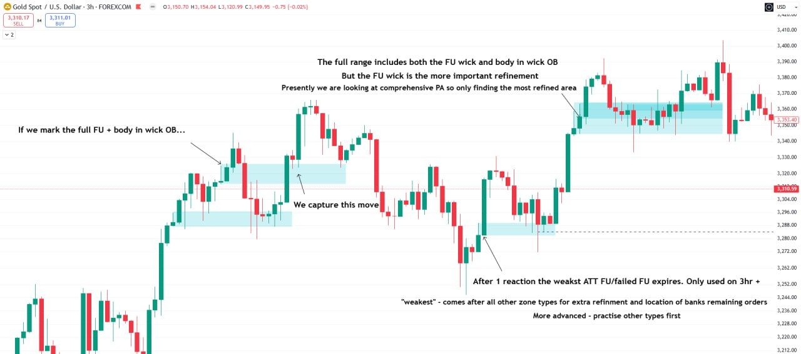

Chart annotations (3hr):

- "If we mark the full FU + body in wick OB..." / "We capture this move"
- "The full range includes both the FU wick and body in wick OB / But the FU wick is the more important refinement / Presently we are looking at comprehensive PA so only finding the most refined area"
- "After 1 reaction the weakest ATT FU/failed FU expires. Only used on 3hr +"
- ""weakest" - comes after all other zone types for extra refinement and location of banks remaining orders / More advanced - practise other types first"

> And again this time on the 10 min:

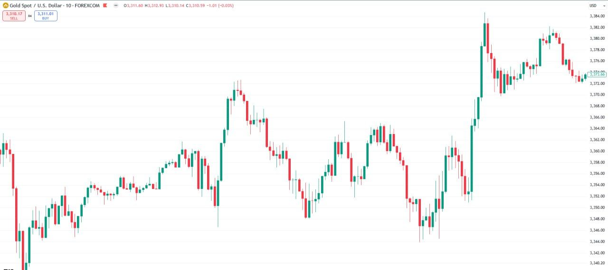

His answer (10 min)

"Fractal defined - we see the organization in what others perceive as chaos: / Following the exact flow of banks true orders in each moment , mechanically , for our first precise reaction RR advantage"

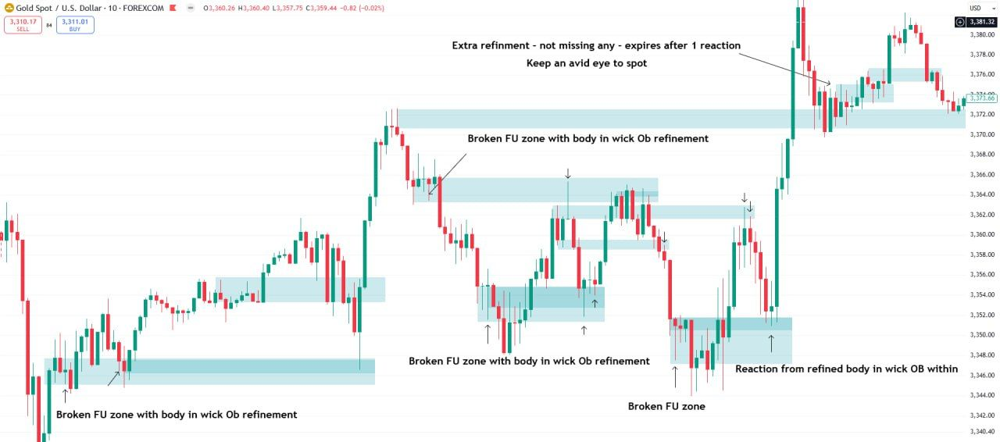

Chart annotations (10 min):

- "Broken FU zone with body in wick OB refinement" (three times)
- "Broken FU zone"
- "Reaction from refined body in wick OB within"
- "Extra refinement - not missing any - expires after 1 reaction / Keep an avid eye to spot" (on a small zone near the top right; its type is not labelled)

## Live-time application

> When it comes to live-time final application, we will have more zone clarity than task 1 (marking many months of data vs preparation for 1 session) – each zone holds only for its own TF reaction, else we refine within/other zones lower.
>
> For example, one cannot simply mark out an 11hr zone and expect a reaction in the session. It is too vague. Price will react accordingly to its 11hr time-lapse (reaction can occur multiple days later). Hence, we will refine various zones all the way down to 50 min (which is the sweet spot to spot banks’ true intraday/swing intentions) and lower (scalp – but not main orders holding up price).
>
> .The more HTF zone we react from (with same TF reaction), the more powerful we can expect the move to be (later explored with TFS).
>
> .The refined zones within HTF zones take priority (main power institutional levels located).
>
> .Pay attention to all reactions (zoom in) or you will miss the correct expiry of the zone
>
> .We are not looking to predict price with zones (no RR certainty) – rather, find those refined areas of assured reaction, in the moment, alongside corresponding TFS/liquidity/TS power.

"Task 1" here is [Week 1 Task 1](/mrc-tasks/tasks/weeks/1/task-1/assignment/). TFS is covered in [Task 3 · Timeframe strength and the HTF true stop](/mrc-tasks/tasks/3/assignment/#2--timeframe-strength-and-the-htf-true-stop).

*Week 2: "When we have matching TFS with the same TF zone - the strongest true move potential/power POI". See [Timeframe Strength · TFS and zones](/mrc-tasks/reference/timeframe-strength/#tfs-and-zones).*

## Full zone mark-up for a NY session

Posted to close the topic, straight after [Week 1 Task 3](/mrc-tasks/tasks/weeks/1/task-3/assignment/):

> We finish for the topic with the full zone mark up process for today's NY session (and every session after):
>
> .Final clarity rule : Expand zones to include close manipulation, refine within HTF zones and as we go lower they fade ( as the zone is mostly active for the reaction with its subsequent TFS and we still look for refinement within larger HTF areas ).
>
> Study in detail the text annotations of the following charts

*He never defines "fade". Two Week 3 annotations suggest it means reducing a zone's visual prominence or visibility on the chart: "At least fade visability of larger HTF zones" and "remove visibility not to show on minutes TF" ([Liquidity · 7hr](/mrc-tasks/reference/liquidity/#7hr-overlaps-and-fading), [50 min](/mrc-tasks/reference/liquidity/#50-min-remove-the-parent-zones)). This is a reading of his charts, not his definition.*

### 1 · 11hr

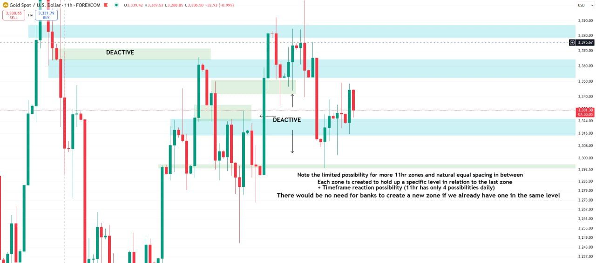

Chart annotations (11hr):

- "DEACTIVE" (on two zones)
- "Note the limited possibility for more 11hr zones and natural equal spacing in between / Each zone is created to hold up a specific level in relation to the last zone / + Timeframe reaction possibility (11hr has only 4 possibilities daily) / There would be no need for banks to create a new zone if we already have one in the same level"

### 2 · 5hr

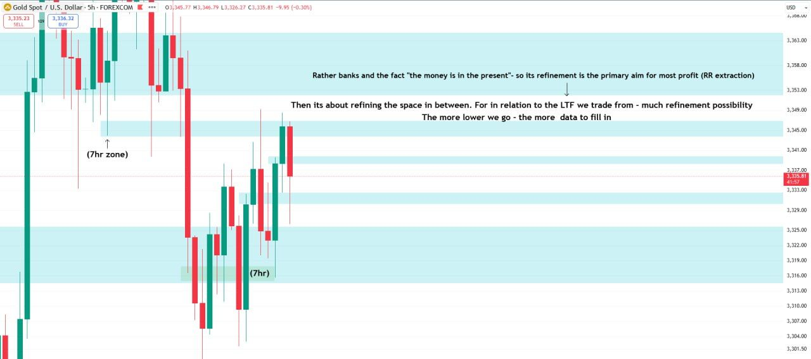

Chart annotations (5hr):

- "(7hr zone)", "(7hr)"
- "Rather banks and the fact "the money is in the present"- so its refinement is the primary aim for most profit (RR extraction) / Then its about refining the space in between. For in relation to the LTF we trade from - much refinement possibility / The more lower we go - the more data to fill in"

### 3 · 3hr

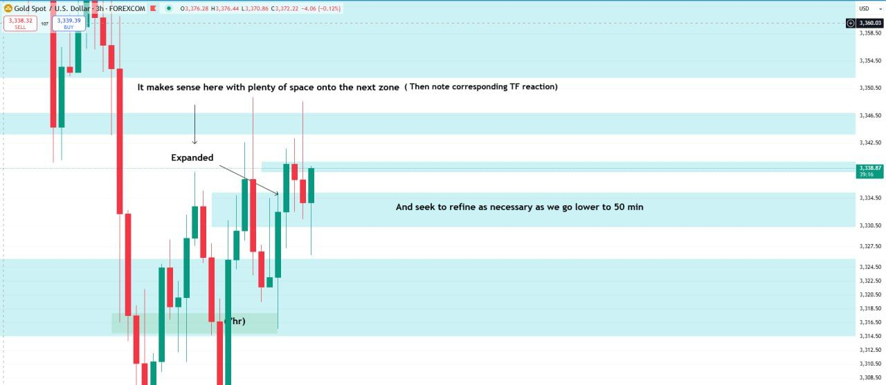

Chart annotations (3hr):

- "It makes sense here with plenty of space onto the next zone ( Then note corresponding TF reaction)"
- "Expanded"
- "And seek to refine as necessary as we go lower to 50 min"
- "(7hr)"

### 4 · 1hr

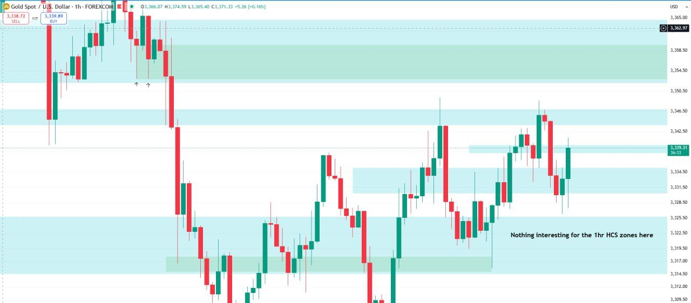

Chart annotations (1hr):

- "Nothing interesting for the 1hr HCS zones here"

### 5 · 50 min

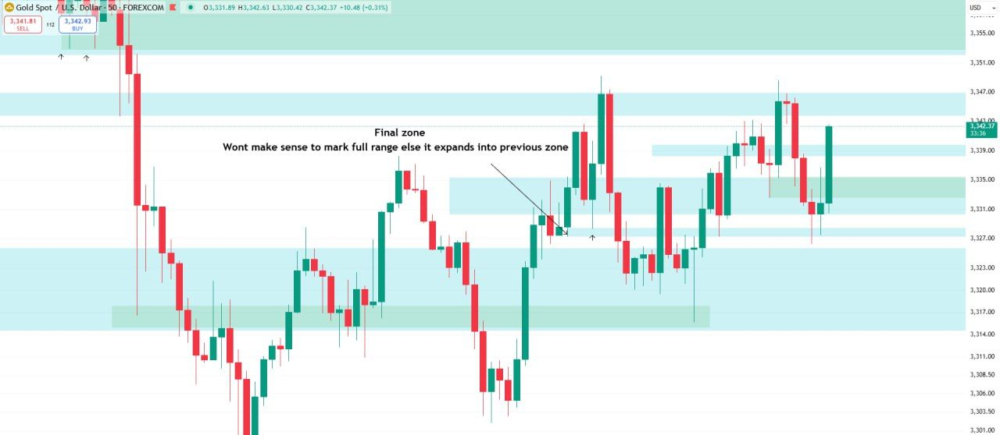

Chart annotations (50 min):

- "Final zone / Wont make sense to mark full range else it expands into previous zone"

### 6 · 5 min, post-session review

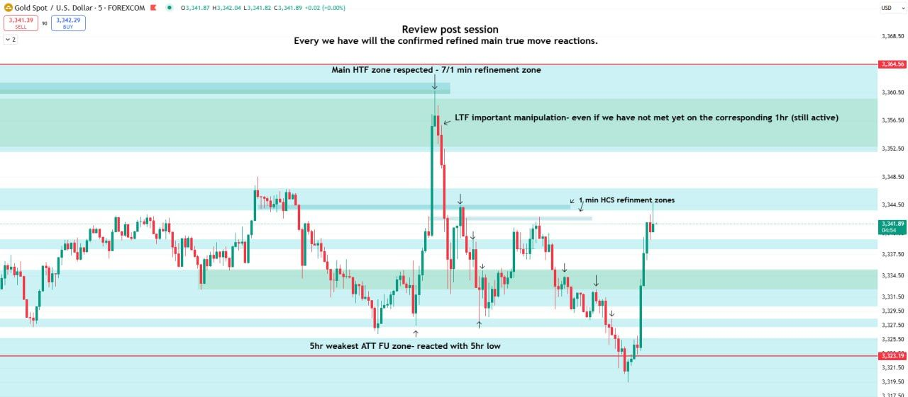

Chart annotations (5 min):

- "Review post session / Every we have will the confirmed refined main true move reactions." (as written)
- "Main HTF zone respected - 7/1 min refinement zone"
- "LTF important manipulation- even if we have not met yet on the corresponding 1hr (still active)"
- "1 min HCS refinement zones"
- "5hr weakest ATT FU zone- reacted with 5hr low"

## Where zones sit in the analysis

Zones locate where moves start; the other analysis factors decide entries. His own statements, side by side:

- "Every entry will fall into these zones. All true moves occur from them" (introducing his HTF demonstration).
- On the 7/10/15 min: "yet TFS,TS and liquidity take priority first".
- "We are not looking to predict price with zones (no RR certainty)" ([Live-time application](#live-time-application)).
- "But context is everything - no sole confirmation is ever enough on its own" (1 min chart in [Week 1 Task 3](/mrc-tasks/tasks/weeks/1/task-3/assignment/#refining-the-ltf-hcs-zone)).
- [Rules of analysis, rule 9](/mrc-tasks/reference/rules-of-analysis/#9-zones): "Zones are secondary confirmations, similar to an HCS POI—their reactions make the true move."

A zone reaction used inside a full analysis: "4hr HCS Zone reaction - secondary confluence that makes up POI" in the [3,000 low worked example](/mrc-tasks/reference/worked-example-3000-reversal/). Final entries from "a refined HCS or negation POI": [rule 10](/mrc-tasks/reference/rules-of-analysis/#10-final-entries).

---

Related: [Week 1: Zones](/mrc-tasks/tasks/weeks/1/) · [Timeframe Strength (TFS)](/mrc-tasks/reference/timeframe-strength/) · [Liquidity](/mrc-tasks/reference/liquidity/) · [Terminology](/mrc-tasks/reference/terminology/) · [Practical Rules of Analysis & Extraction](/mrc-tasks/reference/rules-of-analysis/) · [Worked Example: Backtest Sequence at the 3,000 Low](/mrc-tasks/reference/worked-example-3000-reversal/) · [Task 3 - RR, Timeframe Strength & Timing](/mrc-tasks/tasks/3/assignment/) · [Fundamentals: USD, the Banks & Gold](/mrc-tasks/misc/fundamentals-usd-banks-and-gold/)
