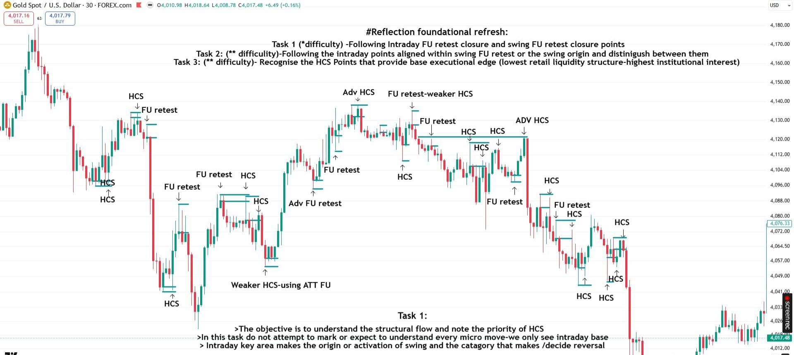

*Part of [Segment 1](/mrc-tasks/tasks/segments/1/) of Mr Casino's [Segments](/mrc-tasks/tasks/segments/). Task 1-3 here are Segment 1's own Tasks (his labels), separate from [standalone Tasks 1-3](/mrc-tasks/) and the [Week Tasks](/mrc-tasks/tasks/weeks/). "Then: 10 days of top-down repetition" is an editorial heading for the second line of his "Task:" block; "Extension task for revision" is his own heading. The framework these charts teach is also gathered on [The Top-Down Extraction Cycle](/mrc-tasks/reference/top-down-extraction-cycle/).*

## The segment focus

He opened the programme with "#reflection - The next chapter":

"Introducing with a 3×3 task segment - the bootcamp will be delivered over the next 3 weekends (if nessesary, thr next more encrypted than this one, but a fresh start for all it intends to serve) We highlight the comprehensive top-down processes at its different levels of advancement (swing to final entry - assured profitable edge)."

*"3×3" is not explained in the source.*

"This segment focus:"

- "To refresh the basics of swing premium areas (the potential beginning of a new cycle) and their intraday build-up/activation to determine true direction, identify the primary reversal POIs, and recognise areas of more natural displacement and higher holding potential."
- "Observing HCS refinement power - the retest of a true stop - a level above the ordinary FU retest - the first gist of entry (refinement and confirmation) and from which, after entry, model refinement applies (full swing participation calculation)."
- "Using the above swing + intraday for direction and using the same method on scalp + LTF to understand how to take a final entry, in alignment with correct HTF flow. Do not expect to get swing direction perfect, but enough to spot correct areas and entry potential (using HCS in lieu of entry model - auto area of lessened retail participation and high institutional probability - aligned enough within swing POI /according to its category its relevant pip displacement until appropriate negation)."

Terms: [FU](/mrc-tasks/reference/terminology/#fu), [HCS](/mrc-tasks/reference/terminology/#hcs), [TS](/mrc-tasks/tasks/3/assignment/#the-rules) (true stop). "According to its category" refers to the timeframe categories ([TFS · The five TFS categories](/mrc-tasks/reference/timeframe-strength/#the-five-tfs-categories)). On entry models, see [Rules of analysis § 11](/mrc-tasks/reference/rules-of-analysis/#11-do-not-get-caught-up-in-entry-models).

## The work

> Task:
>
> .10 days of data repetition of each - without too much depth, but pure markings. Estimated time taken: 1-3 hours each ×3 (deliberately take longer and soak it in).
>
> .Then 10 days of pure top down repetition with full focus on swing pivot areas (including scalp + LTF). Do not rush - these will be your case studies to rehearse. Your primary aim is to locate areas of extraction with sensible high RR, not perfect holding until the opposite. That comes next.

"Each" refers to his three Tasks below (Task 1, Task 2 and Task 3, defined on his three charts), and "×3" to the three of them. The top-down repetition comes **after** Tasks 1-3 ("Then").

*"1-3 hours each ×3" is kept as written: the source does not say whether that is per Task in total or per day.*

His three Task definitions are written at the top of all three charts, under the title "#Reflection foundational refresh:". Each chart then adds its own Task's notes at the bottom.

## At a glance

| | His wording | Requirement | His chart | Order |
|---|---|---|---|---|
| **Task 1** | "Task 1 (\*difficulty) -Following Intraday FU retest closure and swing FU retest closure points" | 10 days of pure markings | [30 min](#task-1--intraday-and-swing-fu-retest-closures) | First block, with Tasks 2-3 |
| **Task 2** | "Task 2: (\*\* difficulty)-Following the intraday points aligned within swing FU retest or the swing origin and distinigush between them" | 10 days of pure markings | [4hr](#task-2--intraday-points-within-swing-fu-retest-or-origin) | First block |
| **Task 3** | "Task 3: (\*\* difficulty)- Recognise the HCS Points that provide base executional edge (lowest retail liquidity structure-highest institutional interest)" | 10 days of pure markings | [30 min](#task-3--hcs-points-base-executional-edge) | First block |
| **Then: top-down repetition** | "Then 10 days of pure top down repetition with full focus on swing pivot areas (including scalp + LTF)" | 10 days | Swing down to scalp + LTF | After Tasks 1-3 |
| **Extension task for revision** | Two bullets ([below](#extension-task-for-revision)) | *Optional, no count* | | For revision |

- **Time:** "Estimated time taken: 1-3 hours each ×3 (deliberately take longer and soak it in)".
- **Deadline:** *none given.*
- **Instrument:** *not specified by the mentor.* His charts are all XAUUSD.

## Task 1 · Intraday and swing FU retest closures

"Task 1 (\*difficulty) -Following Intraday FU retest closure and swing FU retest closure points"

**Requirement:** "10 days of data repetition of each - without too much depth, but pure markings."

Chart annotations (30 min, XAUUSD):

- Title and the three Task lines at the top: "#Reflection foundational refresh:" (as in the [table above](#at-a-glance)).
- Every reaction point marked with a short level and an arrow, labelled (left to right, approximately): "HCS" / "HCS" (double, at a low), "HCS" + "FU retest" (at a high), "FU retest", "HCS" (low), "FU retest" + "HCS" (high), "HCS", "Weaker HCS-using ATT FU" (low), "Adv FU retest", "FU retest", "Adv HCS" (top), "FU retest-weaker HCS", "HCS" (low), "FU retest" (long horizontal line), "HCS", "HCS", "HCS", "ADV HCS", "FU retest" (low), "HCS", "FU retest", "HCS", "HCS", "HCS", "HCS".
- Bottom text, "Task 1:":
  - "The objective is to understand the structural flow and note the priority of HCS"
  - "In this task do not attempt to mark or expect to understand every micro move-we only see intraday base"
  - "Intraday key area makes the origin or activation of swing and the catagory that makes /decide reversal"

The chart marks the intraday FU retest and HCS points across a multi-day range: the "intraday base", not every micro move.

*The grades "Adv HCS", "Adv FU retest", "weaker HCS" and "Weaker HCS-using ATT FU" are his chart labels. They are not defined in the source.* ([ATT FU](/mrc-tasks/reference/terminology/#attempted-fu) is defined in Terminology.)

## Task 2 · Intraday points within swing: FU retest or origin

"Task 2: (\*\* difficulty)-Following the intraday points aligned within swing FU retest or the swing origin and distinigush between them"

**Requirement:** "10 days of data repetition of each - without too much depth, but pure markings."

Chart annotations (4hr, XAUUSD):

- "FU retest" (a high, left), "FU retest" (middle), "HCS" (a low, arrow up), "Forming point" (at the low's wick, with a line drawn from it), "3hr HCS" (top), "HCS" (a lower high), "FU retest" (a low, arrow up), "FU retest" (a lower high, right).
- Bottom text, "Task 2:":
  - "The decision making is less on swing but where direction quality is found and parameters start"
  - "As it forms with intraday closure (origin)-or after it is closed and intraday after (activation)"
- Two arrows point up at that last line: "Negated sooner" (under "(origin)") and "More to negate" (under "(activation)").

The distinction Task 2 asks for: an intraday point can be the swing's **origin** ("As it forms with intraday closure", "Negated sooner") or its **activation** ("after it is closed and intraday after", "More to negate"). These two return in Segment 3 as tradable points ([Segment 3 · The three tradable points](/mrc-tasks/tasks/segments/3/assignment/#the-three-tradable-points)).

## Task 3 · HCS points: base executional edge

"Task 3: (\*\* difficulty)- Recognise the HCS Points that provide base executional edge (lowest retail liquidity structure-highest institutional interest)"

**Requirement:** "10 days of data repetition of each - without too much depth, but pure markings."

Chart annotations (30 min, XAUUSD):

- Boxes marking swing POIs with the intraday point inside each: "FU retest swing / HCS intraday" (top left), "FU retest swing / HCS intraday" (middle left), "HCS Intraday / HCS swing" (low), "HCS swing / Intraday HCS" (top), "Swing HCS / Intraday HCS" (right, high), "Swing HCS / Intraday FU retest" (right, low), "FU retest swing / HCS intraday" (right).
- Centre text:
  - "All the intraday in between still have a continuation purpose"
  - "First understand the active swing and then its minimum negation"
  - "The most ripe area for extraction" (arrow up to the central box)
  - "No need to hold till opposite swing but swift quality extraction"
- Bottom text, "Task 3:":
  - "Note the relevant Intraday POI in relevant swing POI-You are able to discover reversal refinement for new management/swing entry"
  - "HCS is Inferred as entry model - it auto includes Liquidity manipulation and refinement point for reaction/TS retest"
  - "Think how the same can be applied to scalp and LTF. FU retest initial premium area-HCS confirmation and executional refinement"

Each swing POI holds an intraday point. The FU retest is the initial premium area, and the HCS is the confirmation and executional refinement. HCS is "Inferred as entry model". More on HCS: [Terminology · HCS](/mrc-tasks/reference/terminology/#hcs) and [The Top-Down Extraction Cycle · HCS as the refinement](/mrc-tasks/reference/top-down-extraction-cycle/#hcs-as-the-refinement).

## Then: 10 days of top-down repetition

After Tasks 1-3: "Then 10 days of pure top down repetition with full focus on swing pivot areas (including scalp + LTF)."

- "Do not rush - these will be your case studies to rehearse."
- "Your primary aim is to locate areas of extraction with sensible high RR, not perfect holding until the opposite. That comes next."

Task 3's chart already points the same way: "Think how the same can be applied to scalp and LTF."

## Extension task for revision

> Extension task for revision:
>
> .Explore how waiting for the full top-down cycle to complete enables longer holds through volatility.
>
> .Start to categorise between the highest timeframe swings - each needing at least half to negate..\*

**Optional:** an extension for revision, with no count. It is not part of the 10-day requirements.

*"each needing at least half to negate" does not say half of what. The trailing "..\*" has no matching footnote anywhere in the source.*

## Next segment

"Next segment focus: Negation" → [Segment 2](/mrc-tasks/tasks/segments/2/).

*Segment 2 is headed by TS build rather than negation. It states "Key: TS build incorporates liquidity and negation". Both are kept as he wrote them.*

---

Related: [The Top-Down Extraction Cycle](/mrc-tasks/reference/top-down-extraction-cycle/) · [Terminology: HCS](/mrc-tasks/reference/terminology/#hcs), [Attempted FU](/mrc-tasks/reference/terminology/#attempted-fu) · [Timeframe Strength (TFS)](/mrc-tasks/reference/timeframe-strength/) · [Rules of analysis § 11](/mrc-tasks/reference/rules-of-analysis/#11-do-not-get-caught-up-in-entry-models) · [Segment 2](/mrc-tasks/tasks/segments/2/assignment/)
