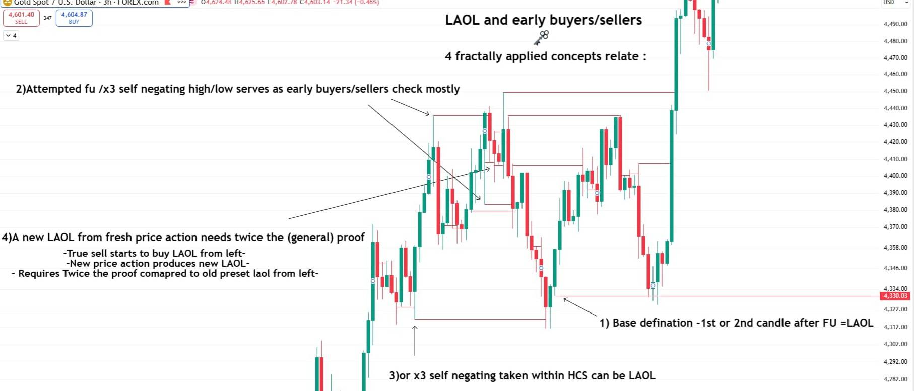
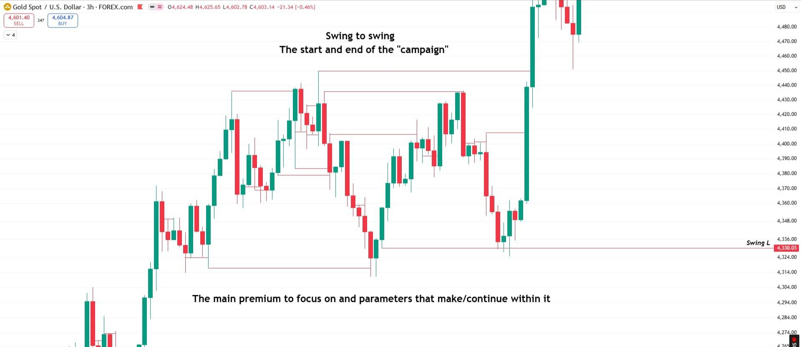
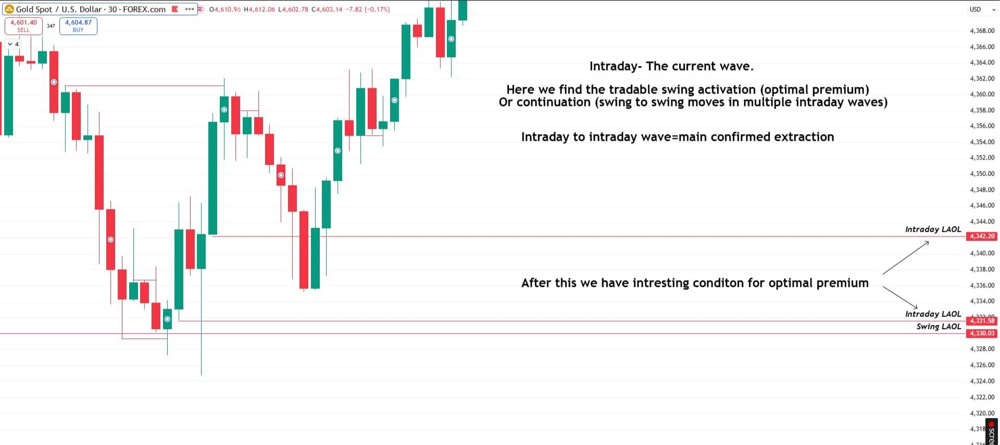
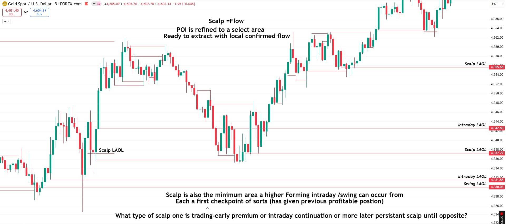
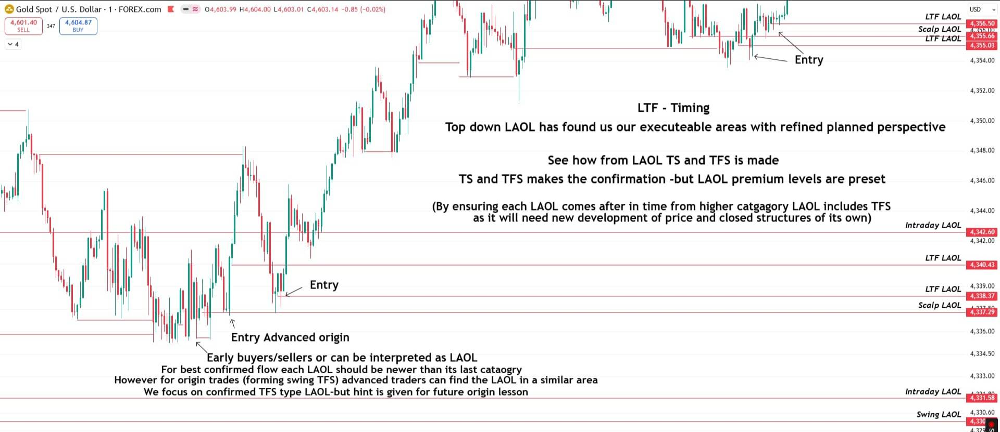
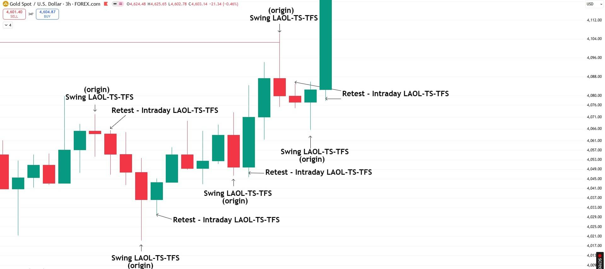
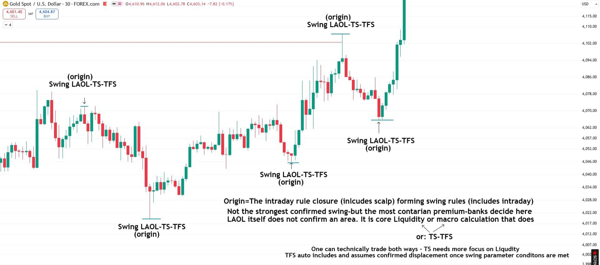
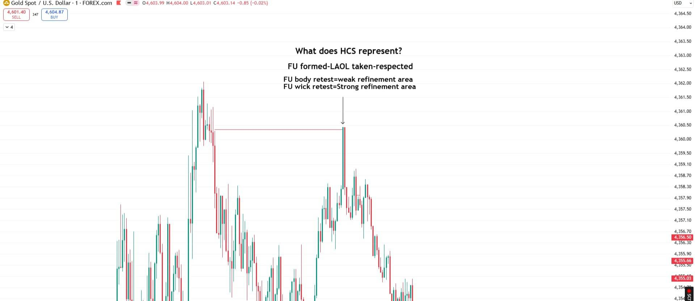

*Part of [Segment 3](/mrc-tasks/tasks/segments/3/) of Mr Casino's [Segments](/mrc-tasks/tasks/segments/). He heads each of the three assignments here only "Task". "Task A", "Task B" and "Task C" are editorial labels, in his order. Tasks A and B are the practical work; Task C comes after them. The framework is also gathered on [The Top-Down Extraction Cycle](/mrc-tasks/reference/top-down-extraction-cycle/).*

## Where Segments 1 and 2 left off

"Segment 1 was set for observing true directional flow through swing and intraday points." ([Segment 1](/mrc-tasks/tasks/segments/1/assignment/))

"Segment 2 was set for observing our refined scalp POI and LTF entry through top down TS build." ([Segment 2](/mrc-tasks/tasks/segments/2/assignment/))

"Segment 3: Bringing it all together in  action"

## At a glance

| | Task A | Task B | Task C |
|---|---|---|---|
| His wording | "30 repetitions of the cycle onto LTF final entry using only LAOL and some early buyers/sellers understanding (as extra filter where needed)." | "10 repetitions of each separately: Origin / Swing Intraday Activation / Intraday Continuation" | "Explore the theory of trading LAOL alone vs. LAOL + TS vs. LAOL + TS + TFS The advantages and disadvantages of each." |
| Count | **30 repetitions** | **10 repetitions of each, separately** (three counts of 10) | *No set count:* an essay or discussion |
| Tools | Only LAOL, plus early buyers/sellers as an extra filter where needed | The three tradable points | LAOL, TS, TFS |
| His model | [The cycle, top down](#the-cycle-top-down) (3hr → 30 min → 5 min → 1 min) | [The three tradable points](#the-three-tradable-points) (3hr, 30 min) | |
| Order | Practical, first | Practical, first | **After A and B**: "More important Practical examples of previous 2 must be done first and are more important." |
| Deadline | *None given.* | *None given.* | *None given.* |
| Instrument | *Not specified by the mentor.* His charts are XAUUSD. | | |

The style advice and the "P.s." ([Choosing a style](#choosing-a-style)) are guidance and optional advanced practice, not counted work.

## LAOL and early buyers/sellers

"Explained first through the most raw component of the fractal cycle - the LAOL (and its early buyers/sellers offshoot):"

Chart annotations (3hr, XAUUSD):

- "LAOL and early buyers/sellers" (with a key symbol under the title)
- "4 fractally applied concepts relate :"
  1. "Base defination -1st or 2nd candle after FU =LAOL" (arrow to a low around 4,330.03)
  2. "Attempted fu /x3 self negating high/low serves as early buyers/sellers check mostly" (arrows to two highs/lows in the range)
  3. "or x3 self negating taken within HCS can be LAOL" (arrow to a low line)
  4. "A new LAOL from fresh price action needs twice the (general) proof"
- "-True sell starts to buy LAOL from left-"
- "-New price action produces new LAOL-"
- "- Requires Twice the proof comapred to old preset laol from left-"

Terms: [LAOL](/mrc-tasks/reference/terminology/#laol), [Attempted FU](/mrc-tasks/reference/terminology/#attempted-fu), [self-negating x3](/mrc-tasks/reference/terminology/#x3). *"Early buyers/sellers" is only described by this chart and the 1 min chart below ("Early buyers/sellers or can be interpreted as LAOL"); the source gives no fuller definition.*

## The cycle, top down

One bullish move (from the swing low around 4,330.03), shown from 3hr down to 1 min. The LAOL of each level is carried down as a price-tagged line.

### Swing campaign (3hr)

Chart annotations (3hr, same chart, clean):

- "Swing to swing"
- "The start and end of the "campaign""
- "The main premium to focus on and parameters that make/continue within it"
- A line labelled "Swing L" at 4,330.03.

### Intraday wave (30 min)

Chart annotations (30 min): lines "Intraday LAOL" 4,342.20, "Intraday LAOL" 4,331.58, "Swing LAOL" 4,330.03.

- "Intraday- The current wave."
- "Here we find the tradable swing activation (optimal premium)"
- "Or continuation (swing to swing moves in multiple intraday waves)"
- "Intraday to intraday wave=main confirmed extraction"
- "After this we have intresting conditon for optimal premium" (arrows to the two intraday LAOLs)

### Scalp flow (5 min)

Chart annotations (5 min): lines "Scalp LAOL" 4,355.66, "Intraday LAOL" 4,342.60, "Scalp LAOL" 4,337.29, "Intraday LAOL" 4,331.58, "Swing LAOL" 4,330.03; a "Scalp LAOL" label on the left.

- "Scalp =Flow"
- "POI is refined to a select area"
- "Ready to extract with local confirmed flow"
- "Scalp is also the minimum area a higher Forming intraday /swing can occur from"
- "Each a first checkpoint of sorts (has given previous profitable postion)"
- "↑ What type of scalp one is trading-early premium or intraday continuation or more later persistant scalp until opposite?"

### LTF timing (1 min)

Chart annotations (1 min): lines "LTF LAOL" 4,356.50, "Scalp LAOL" 4,355.66, "LTF LAOL" 4,355.03, "Intraday LAOL" 4,342.60, "LTF LAOL" 4,340.43, "LTF LAOL" 4,338.37, "Scalp LAOL" 4,337.29, "Intraday LAOL" 4,331.58, "Swing LAOL" (around 4,330). Two "Entry" arrows (one around 4,338.4 after the scalp LAOL, one at the top right around 4,355) and "Entry Advanced origin" (arrow to around 4,337).

- "LTF - Timing"
- "Top down LAOL has found us our executeable areas with refined planned perspective"
- "See how from LAOL TS and TFS is made"
- "TS and TFS makes the confirmation -but LAOL premium levels are preset"
- "(By ensuring each LAOL comes after in time from higher catgagory LAOL includes TFS as it will need new development of price and closed structures of its own)"
- Bottom:
  - "Early buyers/sellers or can be interpreted as LAOL"
  - "For best confirmed flow each LAOL should be newer than its last cataogry"
  - "However for origin trades (forming swing TFS) advanced traders can find the LAOL in a similar area"
  - "We focus on confirmed TFS type LAOL-but hint is given for future origin lesson"

The rule on this chart: for the best confirmed flow, each lower-category LAOL forms later in time than the LAOL of the category above it. Origin trades are the exception, left for a "future origin lesson".

### The cycle

"Swing Campaign - Intraday Wave - Scalp Flow - LTF Timing. The top down fractal extraction cycle. Emphasis once again on how it all relates first to swing parameters - the main strongest premium to premium focus."

**"Hierarchy is not to be ignored - it plays the most immense role in true RR quality extraction."**

## Task A · 30 repetitions of the cycle

> Task:  30 repetitions of the cycle onto LTF final entry using only LAOL and some early buyers/sellers understanding (as extra filter where needed).

His model is the walk-through above: swing campaign → intraday wave → scalp flow → LTF timing, down to the final entry.

## The three tradable points

"Origin - Swing Intraday Activation - Intraday Continuation"

"The main tradable points of the top down cycle."

Chart annotations (3hr, an earlier swing): alternating labels, "(origin) Swing LAOL-TS-TFS" at highs and lows, and "Retest - Intraday LAOL-TS-TFS" at the retests that follow (four origins, four retests). Each swing origin is followed by its intraday retest.

Chart annotations (30 min, the same swing): four "(origin) Swing LAOL-TS-TFS" marks.

- "Origin=The intraday rule closure (inlcudes scalp) forming swing rules (includes intraday)"
- "Not the strongest confirmed swing-but the most contarian premium-banks decide here"
- "LAOL itself does not confirm an area. It is core Liquidity or macro calculation that does"
- "or: TS-TFS" (arrows from "core Liquidity" and "macro calculation")
- "One can technically trade both ways - TS needs more focus on Liqudity"
- "TFS auto includes and assumes confirmed displacement once swing parameter conditons are met"

*"Macro calculation" is not defined in the source.* [Core liquidity](/mrc-tasks/reference/terminology/#core-liquidity) is defined in Terminology.

| Tradable point | His description |
|---|---|
| **Origin** | "Earliest premium and highest RR but also lesser confirmation and requires the most extra confluence check." |
| **Swing Intraday Activation** | "The calmest extraction moment and most technically sound." |
| **Intraday Continuation** | "New wave to wave until new swing is established - it is the most repeatable per session (sometimes multiple times) / full scale extraction. Yet requires the most management and special care to developing opposite swing." |

Origin and activation were first shown in [Segment 1 · Task 2](/mrc-tasks/tasks/segments/1/assignment/#task-2--intraday-points-within-swing-fu-retest-or-origin) ("Negated sooner" / "More to negate").

## Task B · 10 repetitions of each

> Task
>
> 10 repetitions of each separately:
>
> Origin 
> Swing Intraday Activation 
> Intraday Continuation

Three separate counts of 10: Origin, Swing Intraday Activation and Intraday Continuation.

## Choosing a style

Guidance, not counted work:

- "For traders struggling with psychology it is recommended to choose one of the three as your trading style."
- "Or advanced - use all three but be aware of the different premiums advantages/disadvantages - and make prior planning for risk plan for each or total swing cycle."

Optional advanced practice, not counted: "P.s: Zones (50 min/1hr HCS - 3hr normal or HCS) can also create their own LAOL/ find the imperfect origin reasoning (advanced practice)" ([Zones](/mrc-tasks/reference/zones/)).

## What does HCS represent?

Chart annotations (1 min, the top right of the same session as the LTF timing chart): a line from a prior high's FU to a later spike that retests it exactly (around 4,360.4), arrow down.

- "What does HCS represent?"
- "FU formed-LAOL taken-respected"
- "FU body retest=weak refinement area"
- "FU wick retest=Strong refinement area"

More on HCS: [Terminology · HCS](/mrc-tasks/reference/terminology/#hcs).

## Task C · LAOL vs LAOL + TS vs LAOL + TS + TFS

> Task: Explore the theory of trading
>
> LAOL alone
>
> vs.
>
> LAOL + TS
>
> vs.
>
> LAOL + TS + TFS
>
> The advantages and disadvantages of each.
>
> Additional pioneer task essay/discussion-we will explore further in future (locked) final advanced segement. More important Practical examples of previous 2 must be done first and are more important.

**Do Tasks A and B first.** Task C is an additional essay or discussion, with no count.

*His 30 min origin chart [above](#the-three-tradable-points) already compares TS and TFS ("One can technically trade both ways - TS needs more focus on Liqudity" / "TFS auto includes and assumes confirmed displacement once swing parameter conditons are met").*

## Still to come

- A "future (locked) final advanced segement", where Task C will be explored further. Segment 2 had called the third part "our third and final week - to be privately shared". Both are kept as he wrote them; nothing more is known about the advanced segment.
- A "future origin lesson" (1 min chart: "hint is given for future origin lesson").

---

Related: [The Top-Down Extraction Cycle](/mrc-tasks/reference/top-down-extraction-cycle/) · [Terminology: LAOL](/mrc-tasks/reference/terminology/#laol), [HCS](/mrc-tasks/reference/terminology/#hcs), [x3](/mrc-tasks/reference/terminology/#x3), [Attempted FU](/mrc-tasks/reference/terminology/#attempted-fu) · [Liquidity · The last area of liquidity](/mrc-tasks/reference/liquidity/#the-last-area-of-liquidity) · [Timeframe Strength (TFS)](/mrc-tasks/reference/timeframe-strength/) · [Zones](/mrc-tasks/reference/zones/) · [Segment 1](/mrc-tasks/tasks/segments/1/assignment/) · [Segment 2](/mrc-tasks/tasks/segments/2/assignment/)
