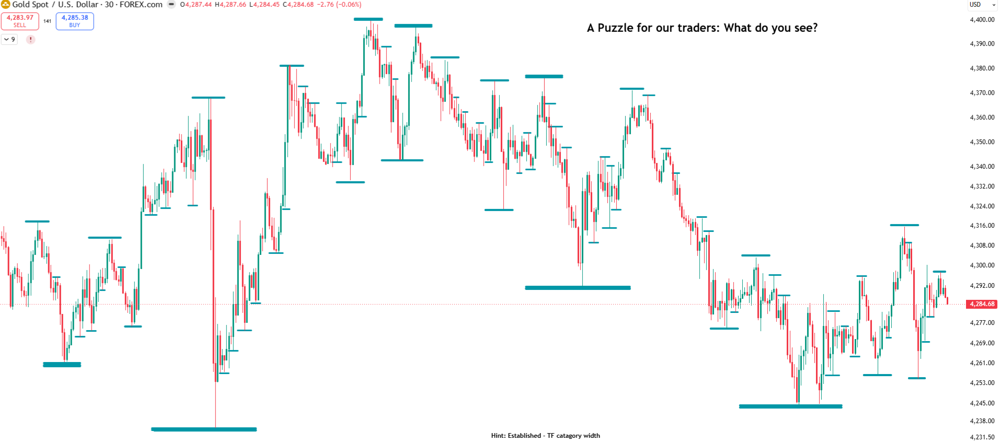

*After [Segment 3](/mrc-tasks/tasks/segments/3/) of Mr Casino's [Segments](/mrc-tasks/tasks/segments/). He does not number this assignment or call it a Segment; "Recap & Puzzle" is the site's label. No deadline and no count were given.*

## Where this fits

He introduces the assignment like this:

"We have covered combinations and manipulation pattern recognition in previous segments and bootcamp- a firm foundational knowledge for anyone who has studied diligently. As much as is publicly allowed to be released, yet protecting from leaks. Without spelling out every mechanical interaction flow. There is a reason the most condensed information is written in charts - it takes effort to extract- it speaks to genuine learners. Yet these reflection tasks were made so by the end of it, those genuine learners have all the tools to attain elite profitability via a step by step structure. Now the final explicit stages to bridge onto proper implementation."

"These reflection tasks" and "previous segments and bootcamp" appear to mean [Segments 1-3](/mrc-tasks/tasks/segments/) (the bootcamp opened under "#reflection - The next chapter"), but he does not name them. "Combinations" is not defined here.

## The puzzle

Chart annotations (XAUUSD, 30 min):
- Title: "A Puzzle for our traders: What do you see?"
- "Hint: Established - TF catagory width"
- Teal horizontal lines at the swing highs and lows. No arrows or other labels.

"What do you see in this chart? It speaks the language of true direction. One must understand the point and flow mentioned without extra input or hesitation by now - we have covered much pertaining to this explicitly to answer your questions. At least 80% should be understood if you have been following properly until now."

**The mentor's answer has not been supplied in this source.** The hint is his; no answer, solved markings or interpretation of the lines are published here. "Established" and "TF category" are terms from [Timeframe Strength](/mrc-tasks/reference/timeframe-strength/#the-five-tfs-categories).

## The task

"So the task thus:"

> Recap the last 3 sessions shared in ⁠🪙xauusd-main-focus🪙  and these last 3 segments of ⁠☯reflection☯  and make notes in a compiled document, with your own charts. Focus only only on the TFS/swing/intraday aspect- not liquidity or zones or even LTF execution yet. Then redo the puzzle gist with your own markings to the best of ability

"I do search for some particular answers which have been hinted to enough - Let us test and build on some comprehension and focus level now (precision trading skill requirement)."

"3 examples will be chosen to go over together-from least to best (to learn from even if one is wrong). And like so will advance through the stages of implementation step by step - from your own implementation first- on a collective end stage level."

## At a glance

His sequence, in his order:

| Step | What | His words |
|---|---|---|
| 1 | Recap the last 3 sessions shared in the xauusd-main-focus channel | "Recap the last 3 sessions shared in 🪙xauusd-main-focus🪙" |
| 2 | Recap the last 3 segments of reflection | "and these last 3 segments of ☯reflection☯" |
| 3 | Compile notes into one document, with your own charts | "make notes in a compiled document, with your own charts" |
| 4 | Focus only on the TFS / swing / intraday aspect | "Focus only only on the TFS/swing/intraday aspect" |
| 5 | Leave out liquidity, zones and LTF execution at this stage | "not liquidity or zones or even LTF execution yet" |
| 6 | **Then** redo the puzzle with your own markings | "Then redo the puzzle gist with your own markings to the best of ability" |

- **Standard:** "At least 80% should be understood if you have been following properly until now."
- **Deadline:** none stated. **Count:** none beyond one compiled document and the puzzle.
- **Afterwards:** he chooses 3 examples to go over together, "from least to best (to learn from even if one is wrong)".

## What to recap

**The last 3 segments of reflection.** This appears to refer to Segments 1-3, but the source does not explicitly identify them by route or title. Only these three carry TFS / swing / intraday teaching:
- [Segment 1: Direction Through Swing & Intraday Points](/mrc-tasks/tasks/segments/1/assignment/) ("observing true directional flow through swing and intraday points")
- [Segment 2: Scalp Premium Flow & TS Build](/mrc-tasks/tasks/segments/2/assignment/)
- [Segment 3: Bringing It All Together in Action](/mrc-tasks/tasks/segments/3/assignment/)

Recap only their direction layer: liquidity, zones and LTF execution are left out "yet", although Segments 2 and 3 teach them.

**The last 3 xauusd-main-focus sessions.** These three sessions are **not yet in this knowledge base**. Nothing from them is summarised or reconstructed here, so this page does not cover the whole source of the recap.

For TFS terms: [Timeframe Strength](/mrc-tasks/reference/timeframe-strength/) (the five categories, established vs forming). For Segments 1-3 in one place: [The Top-Down Extraction Cycle](/mrc-tasks/reference/top-down-extraction-cycle/).

## Unresolved

- "Redo the puzzle gist": most likely the puzzle chart itself, marked up by you; it could also mean the same idea on your own chart. Kept as he wrote it.
- Which 3 xauusd-main-focus sessions are meant, and their content (not in this knowledge base).
- "Combinations" (in "combinations and manipulation pattern recognition"): not defined.
- "The point and flow mentioned": not restated here.
- The puzzle's answer and the "particular answers" he looks for: not given.
- "A collective end stage level": not explained.

## Still to come

- His answer to the puzzle, and the 3 examples reviewed together.
- The next "stages of implementation", which he says follow "step by step".
- Not the same as the "future (locked) final advanced segement" Segment 3 points to ([Still to come](/mrc-tasks/tasks/segments/3/assignment/#still-to-come)); nothing links the two.

---

Related: [Segment 1](/mrc-tasks/tasks/segments/1/assignment/) · [Segment 2](/mrc-tasks/tasks/segments/2/assignment/) · [Segment 3](/mrc-tasks/tasks/segments/3/assignment/) · [Timeframe Strength (TFS)](/mrc-tasks/reference/timeframe-strength/) · [The Top-Down Extraction Cycle](/mrc-tasks/reference/top-down-extraction-cycle/) · [Earning the Advanced Stage](/mrc-tasks/misc/earning-the-advanced-stage/)
