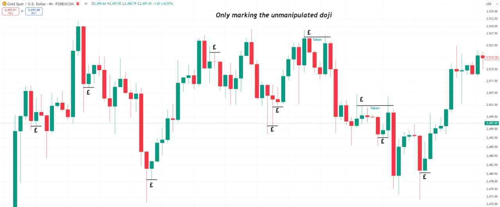
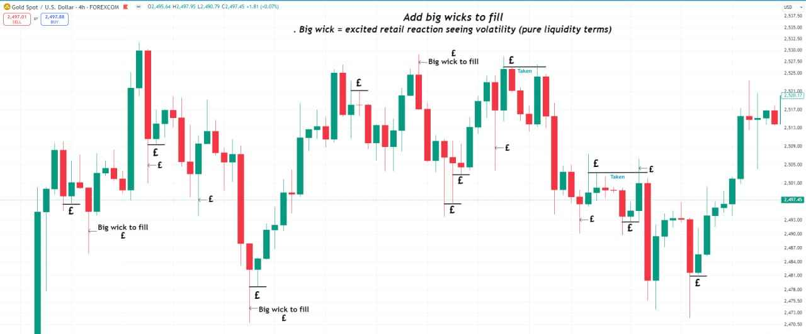
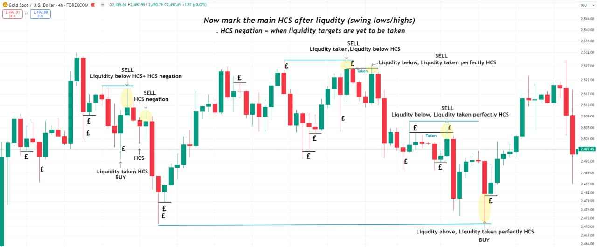
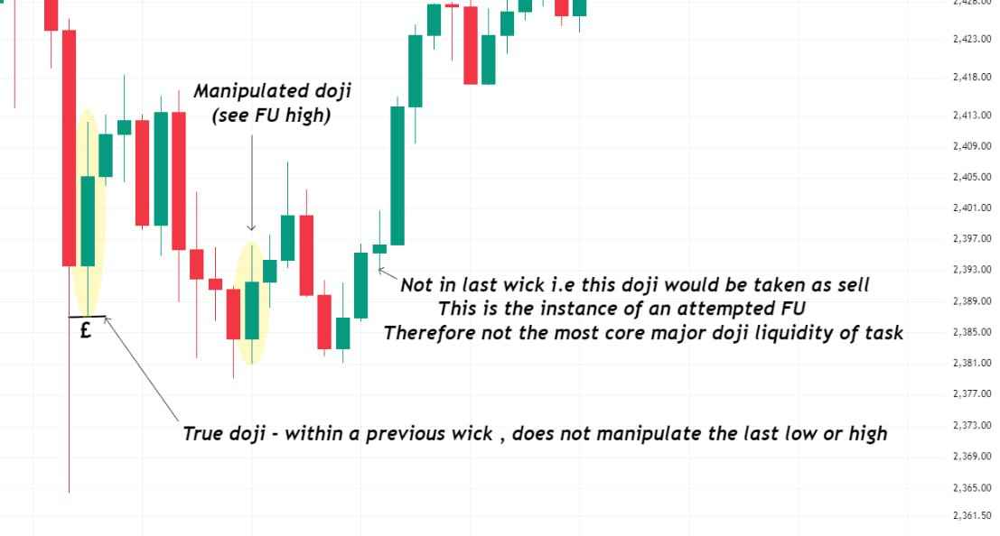

## Overview

In this first collective backtesting assignment we go over the most major liquidity.

Explanations will be given in bullet point explicit fashion - concise rules to follow.

We know Liquidity to be the base of all market decisions. All other concepts explain the algebra for its final macro calculation embedded in truth.

Yet oftentimes it is most commonly misinterpreted as it is the first step in the exposing of market manipulation - most come with previous bias upon misinformation in doubts. Hence it is the first area to clear.

There are many types, we will categorise further as we go on. "Major liquidity" is the term we use for the main overpowering HTF targets - around its manipulation the main daily true moves are resolved.

A doji can be met partially only when major liquidity of opposite overpowers. In such cases new HCS/doji manipulation is observed.

## The 30-chart task

Produce 30 charts (10x3) on the 4hr timeframe in the following manner:

1) Mark all the major doji purely on the 4hr timeframe. The doji we Mark is separate from the attempted FU - a subject of later discussion.

Must be within a previous wick and a non FU high or low. The most major form of liquidity (HTF, pure doji).

2) Mark the large wicks that are yet to be "filled". I.e an area of large momentum that would entice retailers (albeit with the poorest RR - their BE trade potential considered).

A special note to those areas where we have coinciding liquidity.

3) Observe the flow of price action major targets using HCS + HCS negations alone.

Major Liquidity taken or overpowering major liquidity to target - will be the base reasoning.

This is only looking at that one timeframe HCS + major liquidity (true stop + swing targets).

Each step = 1 chart. 3 charts on one 4hr example (roughly 1 month data). Produce 10 examples this way - 30 charts total.

It is specifically mentioned for one must learn to store data that serves as a proof of efforts. The methods and focused thought given in your backtests will also be observed.

No need (but no harm done either) to share your charts but for discussion - will be checked privately upon completion.

## For personal advanced studies

Extra depth, not part of the 30-chart count:

Mark out the 1hr similarly, giving an extra attention to the 4hr HCS which is of more power (TFS). And then the 15 min. Repeat many times.

Explore the reasonings why the major liquidity held in the moment, or captioning on its extreme liquidity grab (last area of liquidity entry).

Make your backtesting suited for your preference. Write upon charts or store data electronically - more charts, less notes - you aim to build your working memory and ability to recognise recurring themes. The mind must enjoy the process. You know yourselves best. Be creative in your approach and take pride in your works.

## Process notes

React with a 👀 when seen and a ✅ when complete. Will randomly check (one only cheats self by missing) and point out adjustments.

Keep discussions to #understanding-manipulation, as not to disturb the daily flow of trading - know all that is needed for the task is in this message. The more questions one asks (acceptable only for those new, and of the advanced level) generally only weakens ones self resolve and undermines ability to learn. Your power is now mainly in your hours of backtesting (stored chart data to prove).

## Update - before Task 2

For yesterday's task:

1) Mark every unmanipulated doji/notable big wick/HCS taking care not to miss any.
2) Do not restrict or concern yourselves to the minimum 30 screenshots but produce even more. The efforts are what matter firstly.
3) Be free in your markings - there is no pressure but upon yourself to learn for your own benefits. Deadlines are only the minimum pace one should be going.

We will showcase final corrections on Friday upon task completion.

A congratulations to all those who completed the task. Be proud of your efforts thus far. However 30 backtest examples on 1 timeframe is not too strenuous a task. Task 1 was an exercise purely based on mechanicals (doji, big wicks, HCS - all patterns, not a combined final liquidity calculation). Perhaps for some unaccustomed to the repetitions, the strain on the working memory is getting used to. This first task requires little thinking - it is always an exercise that will power your foundation. So do not be shy mastering it until instinct.

**Before moving onto Task 2 - 100 such repetitions should be done.**

Over the weekends and until the completion of Task 2, we will strengthen on this foundation. It is not possible to check everyone's charts, but there is no real need with the clear strict definitions given (still will be randomly checking in DMs). Instead attention will be drawn towards the variations and key usages - building from the lower to higher levels of understanding.

---

See also: [Rationality & Backtesting Discipline](/mrc-tasks/misc/rationality-and-backtesting-discipline/) - his foundational note posted between this task and Task 2.
