## Overview

Task 2 is based on the concepts first solidified through your repetitions (30 of the task and 100 minimum now). The unmanipulated doji (liquidity), the big wick to fill (liquidity), the HCS (true stop). Three concepts. Ingrained in a deep truth. From it so many branches of refinement emerge.

This time the task is resolved around the answering of this question. A rhetorical one you must ask yourself and engage with:

**Why does major liquidity hold in the moment?**

It may seem counter intuitive but you are now past the stage of doubting if liquidity is targeted or not, confirming the manipulation for yourself in the first task (from which much of true direction and HTF POI are found with a positive RR accuracy).

Now you are to learn further specifics of how banks set their trap to extract on the constant moving 1 min level as they do (and all other manipulation is based around that - manipulation is always based on the perceived liquidity of the current moment).

How many dojis/big wicks will hold overall? Less than 20% certainly. And that 20% is carefully positioned amongst great manipulation, the retail traders who are lucky to win and gain confidence are to lose it later / their liquidity accounted for. Some necessary false impression is needed to continue the retail misinformation.

The above 2 paragraphs relate to a deeper theory and understanding. Again the backtesting repetition is most important, some may have language barriers but able to comprehend manipulation easier due to societal advantages. Some may need a jump-start to break the veils. Do re-read. A task will be related to this later.

This is the first introduction to top down analysis. In the previous task there was missing data using one timeframe - now you combine to find full details.

## The task

Pick your 4hr key scenario of interest (choose the best examples from Task 1). You want to understand the exact placement of why major liquidity held - until it was taken. Using none other than the 3 concepts (doji, big wick to fill, HCS). This time you apply more thinking - your charts filled with more words in explanation showcasing the manipulation sequence:

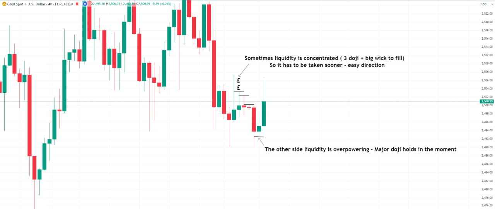

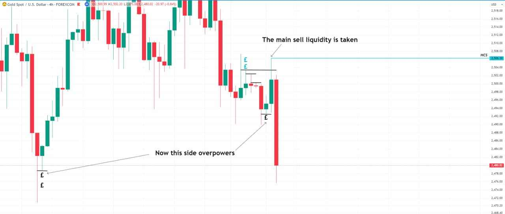

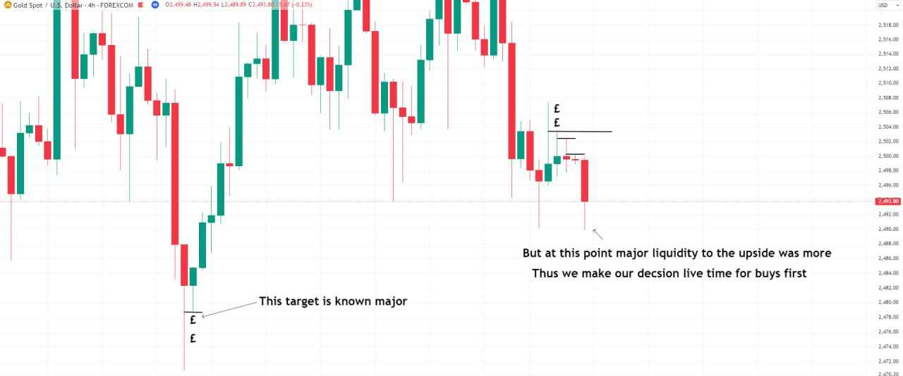

It requires more thinking and perhaps some mind strain (embrace it and your growing focus), but still falls into the step of mechanicals under clear parameters:

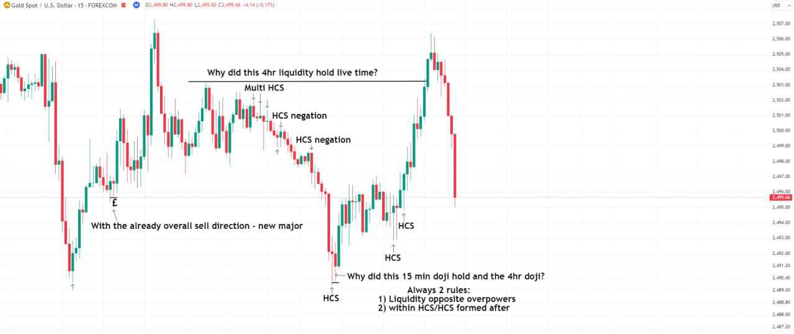

Based on the TF, the smaller or larger will the retail stop be and thus that is a first basic rationality to calculate when liquidity becomes major:

*(A retailer entering after 4hr doji = 30-50 pip SL - therefore holding for 50 pips or so is still limited 1:2 RR given. But a 1 min doji gives far more RR potential to the retailer, its manipulation value more greater and frequent.)*

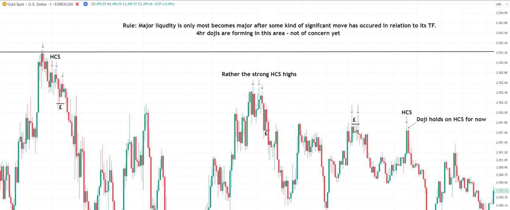

Above a few new rules were given. We will revise in the days to come, for now task 2 is to produce 10 such examples (after 100 repetitions of Task 1). The 4hr - 15 min - 1 min. If one is comfortable add the 1hr and 5 min - but that is not necessary at this stage.

**Deadline: next Friday, 20/09/24.** Feel free to create your own thread.

## For personal advanced learning

Ideally one should complete 30 such examples by the deadline given (2 days for 100 examples of Task 1, 5 days of an average of 8 examples a day of Task 2, broken down into 3 x 90 minute sessions a day). This is not incumbent but the standard expected (one cannot force radical life changes immediately - but this should be the level for a swifter mastery, for your own success).

After the minimum 10 examples and you establish your thought processes, less writing on charts is needed - denote via arrows only, via only one word (liquidity, HCS). Repeat many times to master your working memory.

Will keep it to 100 total repetitions of Task 1 for this time (one can manage more effectively marking fewer words).

Keep the 1 min simple like so - do not get lost in the data past the obvious, stay within your own liquidity understanding. One screenshot encompassing the basic facts will suffice. (This links to the 1 min topdown confluence image above.)

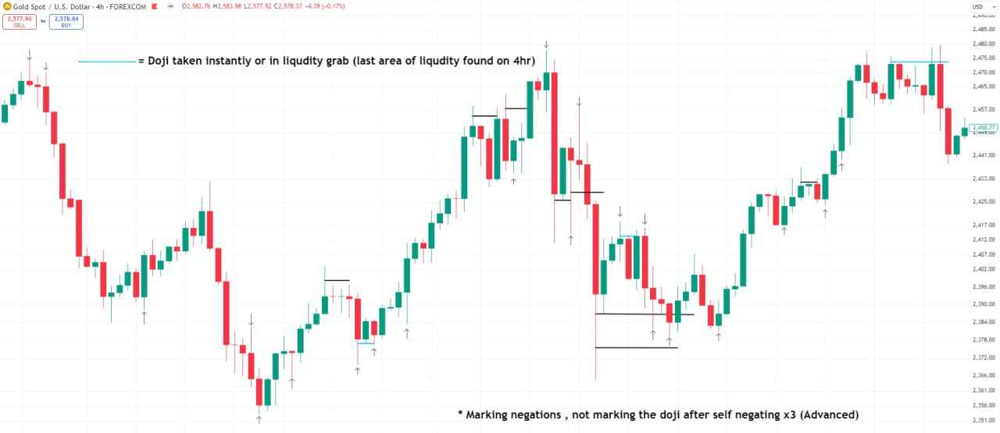

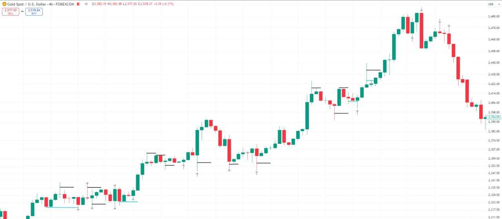

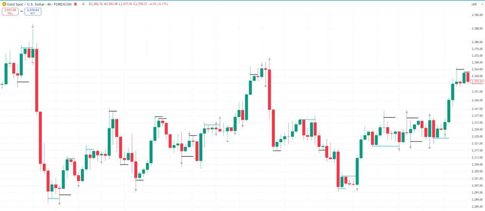

The survival of the fittest. Not so many completed the previous tasks, it seems. But all those who did - know every minute spent adds to your ever-rising profit potential. The only way to break boundaries. The only currency that matters in the route to mastery: correct utilization of time for spending in focused learning.

Provided you have accumulated data to show for it, no distractions whilst working, engraved repetitions in memory - we refresh on this important part.

## Foundations to solidify

Of course it is necessary to establish a firm foundation before moving forward - and so we will cover now the deeper branches of this same task before moving forward.

The main objectives to solidify:

1) A firm concrete belief in the manipulation of common retail liquidity (all non high level banks). It is certainly not easy or available by common means to compete in a multi trillion $ market - the real world stage.

2) The ability to comprehend a top down analysis based on truth. Using 3 concepts only: "major liquidity" in the form of unmanipulated doji, big wicks to fill, and the "low liquidity move" in the form of HCS + negations (and that only via comprehension of FU, i.e. the only true candle "pattern" that matters - the fixed sign of true orders and with it basic liquidity manipulation).

3) An acute understanding of RR - the base of modern money. Think of the markets (especially gold) as the banks' playground - their "printing machine." They profit greatly (by controlling the world supply of money) but are also responsible for keeping the system afloat amongst opposition, so they also have limitations. Thus the real (main) currency is the RR provided in the fixing of the markets - that money which is under the radar for them to bank personal profits. They would not give it so easily. They face restrictions trading in the multiple billions and responsibilities but do not anticipate that their trail could be followed. But followed it is by many (other country governments included) - with the power of hyper-competitive high-frequency trading algorithms, based on machine learning. And we fall in that bracket but via a manual process - although it is still a mystery if our RR potential is unique only to our system.

Nonetheless, the main point is - you are amongst fierce opposition. Many have gists of combining previous retail habits and this is an error that undermines RR advantage. Know the markets in its true form.

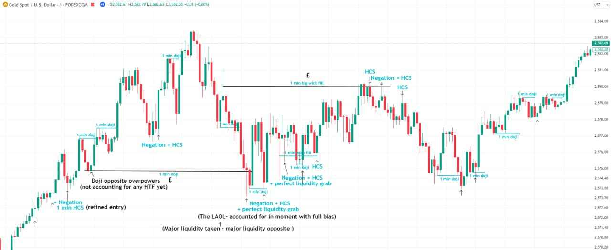

## Extension - new assignment (1 min only)

To mark out 10 such charts purely on the 1 min. Really try to understand the flow of price action from your own eyes - see how price is attracted to liquidity and forms HCS + negations to refine potential entries (1-5 pip SL). You have to mark out all your reasoning considering the flow of liquidity (determine at base which side is stronger, by default, in the signs shown).

**For personal learning:** 10 charts really isn't much - do 30 more without text annotations this time (extra task, personal learning).

## Full multi-timeframe breakdown (worked example)

Look at the 4hr solely (and remember we are still not looking at odd TF). A picture starts to formulate. Each arrow, whilst marking the full candle, represents the refined area we would look to enter (HTF HCS/negation forming):

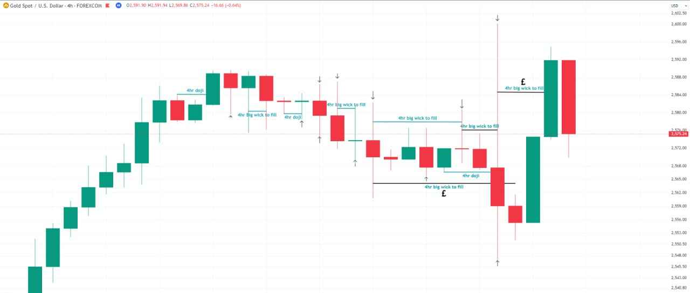

**Now on the 1hr.** More refinement and RR opportunities, plus aligned confidence. Blue = liquidity was taken almost instantly (the reasoning for the reversal in the next few candles - 80% of occurrences). Black = liquidity left behind for the future - the areas to note especially why it was so (in a significant negation/HCS, overpowered by liquidity opposite):

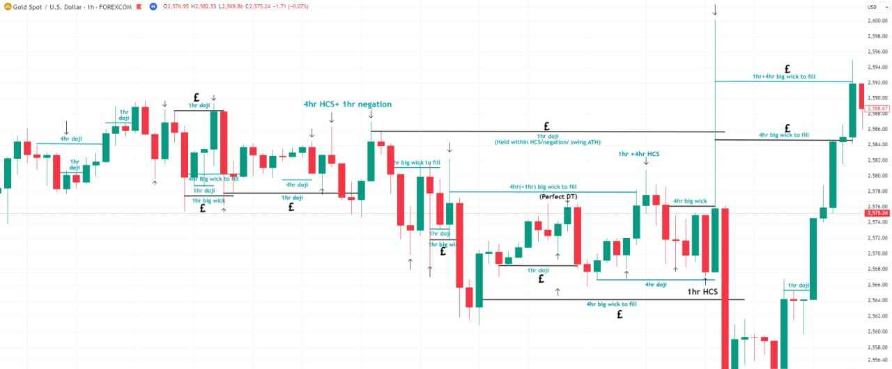

**On the 15 min.** Any refinement past the 15 min is where the real RR and full potential is found - entries on the 15 min solely will never give that same result. However, the base for every main entry is to enter at a 15 min manipulated low/high. The more HTF alignment the better, but sometimes we will be entering after exact swing highs/lows and so 15 min will suffice.

A rule can be formulated: take the markets in a 15 min increment. You do not need to be in every move but extract your consistent % compound.

Combining down to the 1-15 min? Now we are in the real playground:

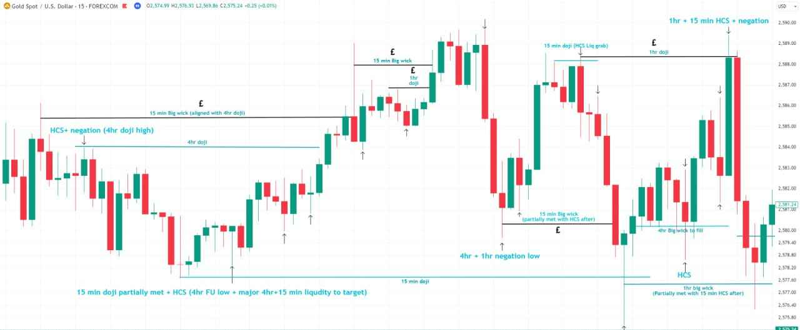

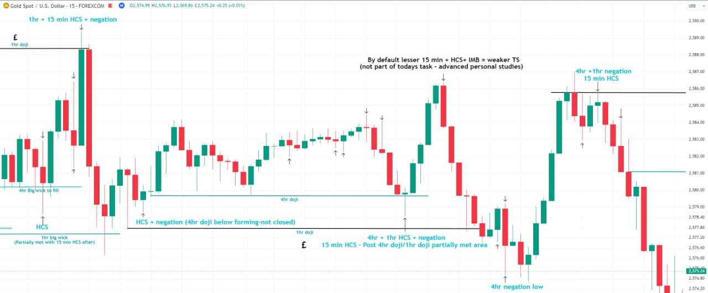

**The 5 min.** Looking for entries at the 5 min lows/highs on the minimum 15 min + HTF alignment. Note why some liquidity holds in the moment - all with a perfectly calculated reasoning (liquidity opposite overpowers, most of its RR potential already manipulated):

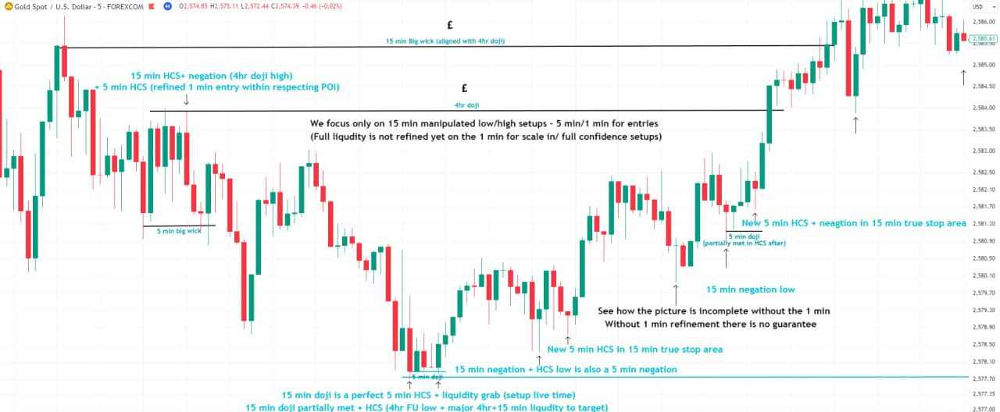

**The 1 min.** Self-explanatory - you must see the RR advantages yourself. We go more in depth on the 1 min at a later date:

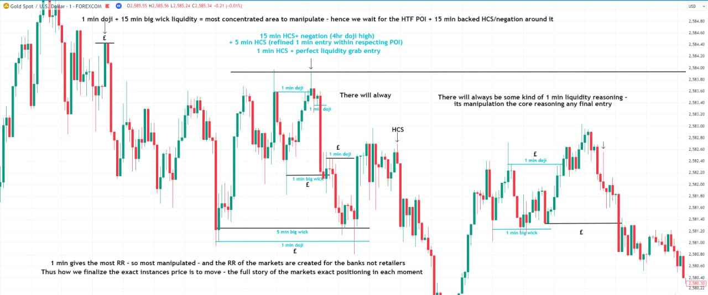

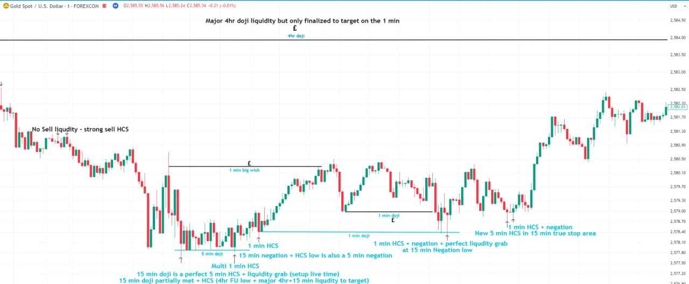

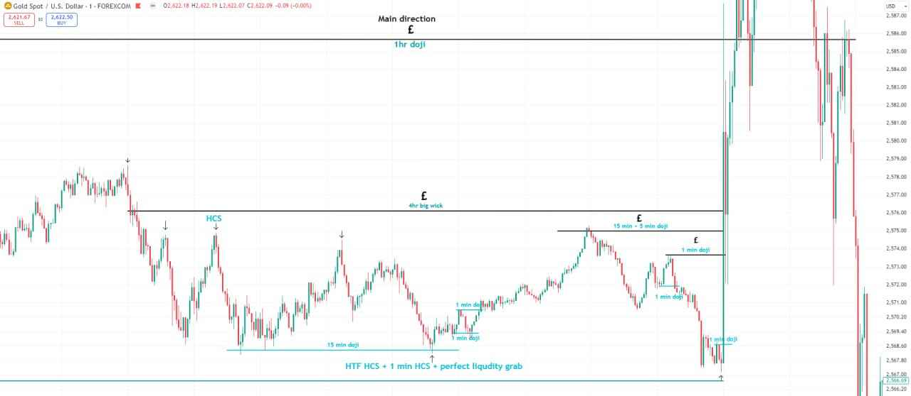

## Extension - new assignment (full breakdown)

Complete only one example as shown above - a full 4hr to 1 min breakdown showing full reasoning and refined entries.

And then one more example - this time starting from the 1 min to 4hr.

**Deadline: next Friday** - upon which Task 3 will be set (an extremely elongated period for such a small task, but there are other important aspects to highlight before that period). If any confusion, retrace your steps to more repetition of the previous, purely mechanical marking tasks.

---

Related: [Task 1 - Major Liquidity](/mrc-tasks/tasks/1/assignment/) (the 3 concepts this task builds on, plus its corrections) and [Rationality & Backtesting Discipline](/mrc-tasks/misc/rationality-and-backtesting-discipline/).
