## Overview

Task 3 will be broken into 3 subsections:

1) We speak on the compound effect of RR extraction. Something that is outwardly simple, yet complex - as it challenges to a large degree all one has previously been taught about money. Its barriers have to be broken with the rational proven truths.

2) Timeframe strength - the finding of POI (HTF True stop) for selective entries based on aligned established closures.

3) Key timing. The specific hours that present sure pip potential - never will these hours go by without presenting some good opportunity (some hours on the daily cycle have higher liquidity by default).

**This is the final task before assessment of all - to choose those ready for the advanced stage.**

## At a glance

| | Deliverable | Requirement |
|---|---|---|
| **3.1** | [Passage on Risk to Reward](#task-31---the-rr-passage) | "To produce a 100 word passage on the true nature of Risk to Reward (approximate - in the 10 word threshold)" |
| **3.2** | [15 min - 1hr - 3hr marking](#task-32---15-min---1hr---3hr) | "To complete 100 repetitions like so. 15 min - 1hr - 3hr." "It is a purely mechanical task that requires no additional text explanation." |
| **3.3** | [11hr + swing refinement](#task-33---11hr--swing-refinement) | "To complete 30 repetitions refining exact 11hr + swing points until that final refined entry (11hr / daily - 3hr - 1hr - established 15 min TS - 1 min entry)" |
| Timing | [Key timing](#3--key-timing) | No numbered deliverable: "Become familiar with the daily cycle and its role in extraction." |

**Deadline: Friday the 18th. 2 weeks from now.** After the deadline, "a final 2 week window" was given to catch up before selection for the advanced stages (see [After the deadline](#after-the-deadline)).

*"Task 3.2" and "task 3.3" are Mr Casino's own labels. "3.1" is added here for consistency - he calls it "the first part of Task 3".*

Sections: [1 · Risk to reward and the % compound](#1--risk-to-reward-and-the--compound) · [2 · Timeframe strength and the HTF true stop](#2--timeframe-strength-and-the-htf-true-stop) · [3 · Key timing](#3--key-timing) · [Deadline](#deadline) · [After the deadline](#after-the-deadline)

## 1 · Risk to reward and the % compound

### What RR exposes

The concept of risk to reward in the markets exposes one to the true nature of the financial world:

- **Leverage.** How money is leveraged (your $1 deposit is x100, x500, x2000 in power).
- **Earning potential.** The ability to earn money at the touch of a button, in all hours of most days. Not the ability to earn a mere wage, but a fortune - those around you are so unaware. Just a 0.03 lot size for 200 pips daily is $60 - the average daily earning. What about 0.3 ($600) 3 lots ($6000)? 30 ($60000)? 300 ($600000)?

  Many traders do not spend time in due processing of these life changing facts. They are overwhelmed subconsciously without realising it. They do not make the resolve to match their efforts to its full comprehension.
- **The % compound effect.** What is the % compound effect? The example you are perhaps familiar with:

  A 20% daily growth from a $200 account for 40 days = $200k approximately.

  20% = a 1% risk for 20 RR extraction 
  20% = a 3% risk for 7 RR extraction

  ^ experiment with the equation to get mind flowing. **Never forget at core, before pip potential - trading is about % compound and that all dependent on RR extracted.**

### The components of RR - win rate

Now let's break down the components of RR. It is not only about a small stop loss (although that is the main aspect - only from it the market's manipulation and true perspective followed) - but all the factors that fall under probabilities:

Most notable - **win rate**. The more wins one has in a row, the more the possibility to compound % via utilizing last profits.

### 60% at 1:100 or 90% at 1:20?

Do pay attention for we touch upon now perhaps the most important in trading theory. It is vastly misconstrued by many.

Let us ask a rhetorical question to each individual:

**Would you choose a 60% win rate but for a 1:100 RR on each trade. Or would you choose a 90% win rate for a 1:20 RR per trade?**

Think about what presents more potential in terms of % compound (assuming one can risk more than 1%, and utilizing previous profits of trades - both of which apply to us).

The answer in terms of the highest % compound (highest possible result) would be the 90% win rate with the 1:20 RR. Over the 1:100 RR per trade?

Indeed so. **For it is more efficient to calculate more risk (leverage) into fewer higher probable entries utilizing previous profits.** (Study this passage)

I.e your 1:20 RR, is in fact more than 20 RR. If you risk 3% (and can do so more comfortably due to the better win rate) you attain the same as a 60 RR (%) result.

And when you win one trade, the next trade you have at your disposal all your last profits to add to your risk. A 3% risk ($6) for 60 RR (%) on $200 = $320. The next trade you now have $120 in profits to risk - 20 times bigger than your first $6 risk. Assuming you risk it all, the return on your next "1:20" trade now has the possibility to be 60 % x20 = the same as 1200 RR (%)

Of course a 1:20 RR or 1:100 RR with 60/90% win rates (with BE) - are already unique examples to us. But to highlight the power of quality - where the true compound profits lie. **The best risk to reward already includes the best quality win rate in its definition.**

### What to take from it

These above passages may be slightly confusing to some, but it is your duty to make yourself understand. See RR for what it is. **Know you only need to extract a fraction (20 RR average, split over a streak of trades, sometimes using more than 1% risk).** Amongst all the potential it is not much. **What is most important is your daily consistency.** Even if you miss many moves / achieve the bare minimum RR. That leads to all else in % compound. That is what allows you to overcome your subconscious wiring and focus your efforts where it matters - giving full respect to what RR truly is. That is your ultimate goal.

### Backtest before you trade

Do not allow yourself to be distracted by anything else. **There is no rush to trade if not for the highest quality but rush to backtest before you trade you must.** Your mind is only updated according to the result of your efforts in backtesting. Delve deep into studies. Why would you not for the immense result? **Anything but quality studies of hours for planned trades = failure in probabilities = less RR extracted = less profits.** Environmental factors leading to self sabotage the first to overcome.

Today the foundations were laid down - perhaps not the most easy read but one extracts the required information according to comprehension skill.

### Task 3.1 - the RR passage

> And that is the first part of Task 3:
>
> **To produce a 100 word passage on the true nature of Risk to Reward (approximate - in the 10 word threshold)**
>
> A few talking points to get you started - why does RR matter so much when we have leverage? How we have an exceeding RR odd in our favour of which one only has to extract a small consistent portion? How the rational mind would never seek to rush or trade on impulse or lesser quality knowing of % compound?

See also [Rationality & Backtesting Discipline](/mrc-tasks/misc/rationality-and-backtesting-discipline/) on the rational mind and the discipline of backtesting.

## 2 · Timeframe strength and the HTF true stop

### We refresh - where Tasks 1 and 2 leave you

We refresh. Your 1min - 4hr backtest should look similar:

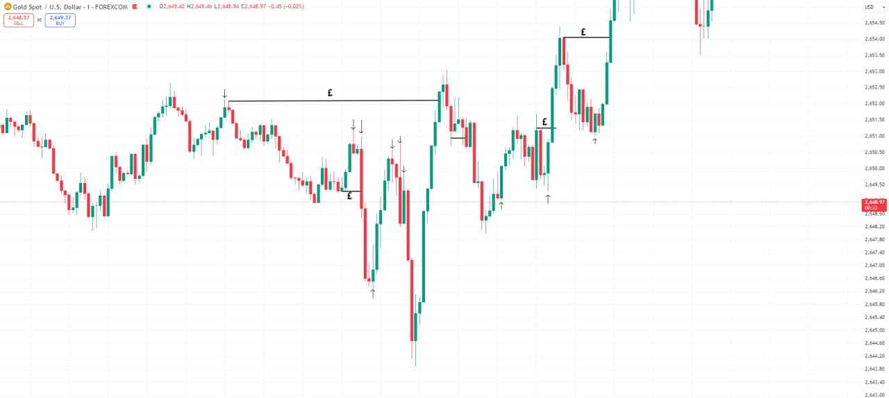

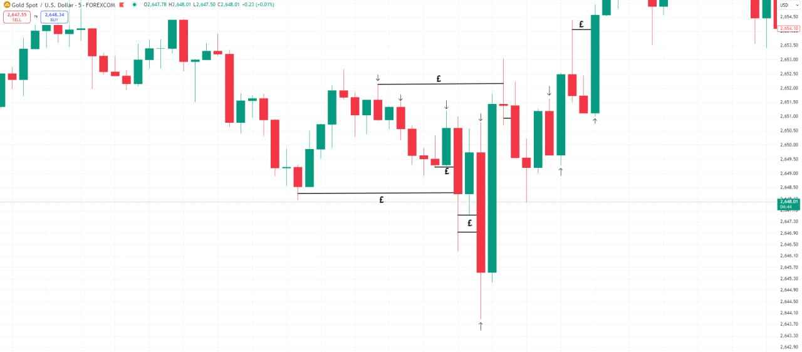

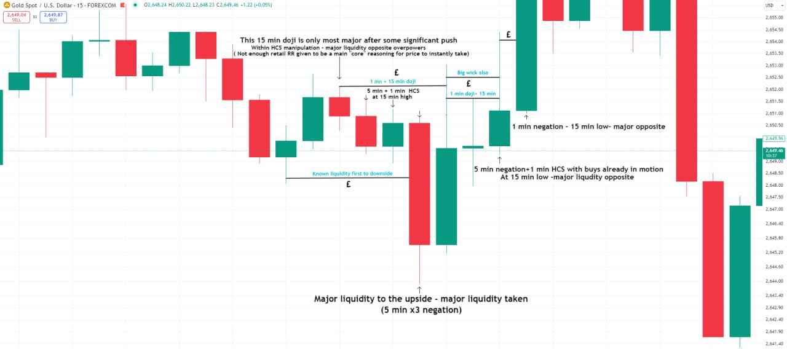

Chart annotations (15 min):

- "This 15 min doji is only most major after some significant push - Within HCS manipulation - major liquidity opposite overpowers (Not enough retail RR given to be a main 'core' reasoning for price to instantly take)"
- "1 min + 15 min doji" · "5 min + 1 min HCS at 15 min high"
- "Known liquidity first to downside"
- "Big wick also" · "1 min doji + 15 min"
- "Major liquidity to the upside - major liquidity taken (5 min x3 negation)"
- "5 min negation + 1 min HCS with buys already in motion At 15 min low - major liquidity opposite"
- "1 min negation - 15 min low - major opposite"

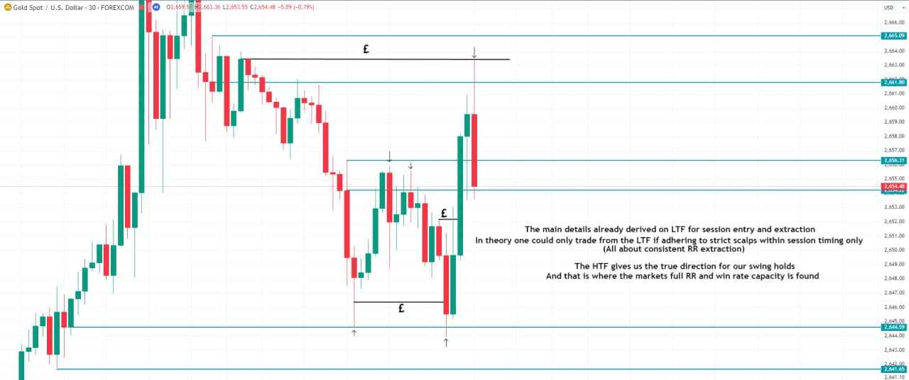

Chart annotation (30 min): "The main details already derived on LTF for session entry and extraction. In theory one could only trade from the LTF if adhering to strict scalps within session timing only (All about consistent RR extraction). **The HTF gives us the true direction for our swing holds, and that is where the market's full RR and win rate capacity is found.**"

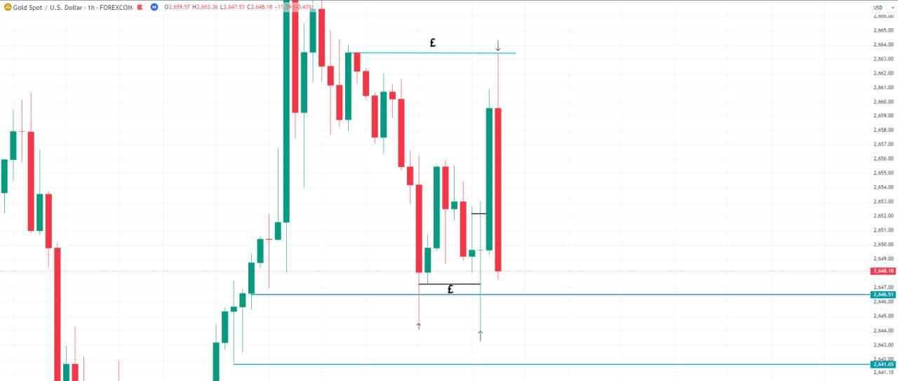

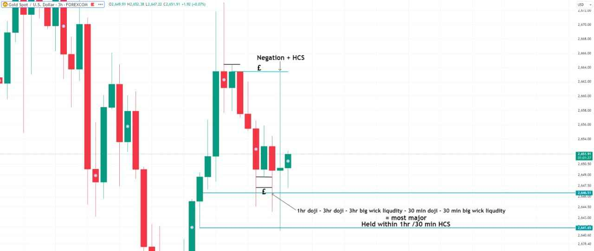

Chart annotations (3hr): "Negation + HCS" at the high. At the low: "1hr doji - 3hr doji - 3hr big wick liquidity - 30 min doji - 30 min big wick liquidity = most major. Held within 1hr / 30 min HCS".

**Task 1** - Believing and seeing so for yourself the manipulation of liquidity. Purely mechanical - seeing the true flow of price action.

**Task 2** - The low liquidity move vs high liquidity move. You know some liquidity is overpowered by the other direction, holding amongst HCS + negation manipulation. You make the final decision in each moment based on the liquidity calculation of timeframes - you already see the general direction.

But how to act with confidence and know for certain the areas to look for a confirmed highly probable refined entry? The first part of the answer lies in timeframe strength. (We will not discuss its theory here but practical application)

### Timeframe strength - definition

Timeframe strength - **"when price establishes a confirmed prevalent direction"**. Every refined entry is to be backed by a 10/15 min + confirmation as such.

*(Written on the 15 min chart in the worked example below - the only explicit definition given.)*

### The rules

These are the only rules that are set for now that will become more clear upon Task completion:

1. With timeframe strength is linked the higher timeframe true stop. The HTF HCS / negation forming (potential HTF TS - POI) or established (confirmed HTF true stop). **Only once we have a higher timeframe true stop potential (10 min + scalp, 1hr + intraday, 3hr + swing) we refine lower.**
2. **Every entry and main direction is found only with consideration of the minimum 10 min + HCS/Negation potential** (average minimum scalp true stop that can be aligned with further intraday/swing).
3. **No 10 min + HCS / negation backing = no trade.** Established in most cases, sometimes taken as forming. It is not possible to get lost in the LTF clutter (one step lower than the scalp potential - is macro second TF RR manipulation via AI - we can only compete to our manual capability which starts from true scalp potential) with each of your entries resolved around 10 min minimum average time window.
4. **Only on the 3hr + will we pay attention to confirmed FU closures that indicate a prevalent direction, on the lower timeframes we are only concerned with HCS + negation.**
5. **A negation can be counted two candles after an FU** (if the first candle after doesn't make a complete FU wick but reacts - ATT FU).

| True stop on | Trade type |
|---|---|
| 10 min + | scalp (the minimum backing for any entry) |
| 1hr + | intraday |
| 3hr + | swing (confirmed FU closures start to count) |
| 11hr + | "A main Swing possibility to consider holding for multiple days" (from the 11hr chart below) |

The swing TFS ladder, from the 3hr chart below: "(3hr - 5hr - 7hr - 11hr TFS)".

*Note on "forming" vs "established": rule 3 says "Established in most cases, sometimes taken as forming", while the task aid below says "Minimum 10 min + TS Established is mandatory (not as forms - TFS is too weak)". In the worked examples (11hr to 1 min, below) the higher timeframes are still "forming" while the 15 min TS is already "established". Read together: the 10 min + backing itself must be established; the higher timeframe structure above it may still be forming.*

### 15 min → 1hr → 3hr (worked example)

We are only using standard timeframes for now. **Mark the 15 min established HCS or negation with a potential true stop at its high/low.**

Observe how price moves after its closure and how one would benefit with entry live time.

**See how the other side true stop is not broken until the opposite HCS/negation TS forms.**

*(Quantified in the [task aid](#task-aid---clarifications-on-timeframe-strength) below: "80% of times".)*

**(do not miss any - this is a rough copy)**

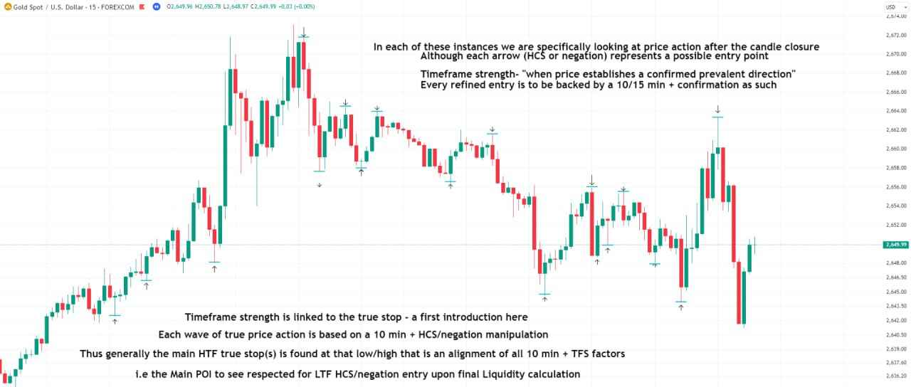

Chart annotations (15 min):

- "In each of these instances we are specifically looking at price action after the candle closure. Although each arrow (HCS or negation) represents a possible entry point"
- "Timeframe strength - 'when price establishes a confirmed prevalent direction'. Every refined entry is to be backed by a 10/15 min + confirmation as such"
- "Timeframe strength is linked to the true stop - a first introduction here. Each wave of true price action is based on a 10 min + HCS/negation manipulation. Thus generally the main HTF true stop(s) is found at that low/high that is an alignment of all 10 min + TFS factors. i.e. the Main POI to see respected for LTF HCS/negation entry upon final Liquidity calculation"

Now go up to the 1hr. **Look at those 15 min established TS that correspond in the 1hr HCS/negation proximity.**

Those that did - present a greater weight in price impact.

Observe how we are able to enter at these exact 1hr HCS/negation low - still with an established 15 min TS.

See the many opportunities already presented on this intraday level.

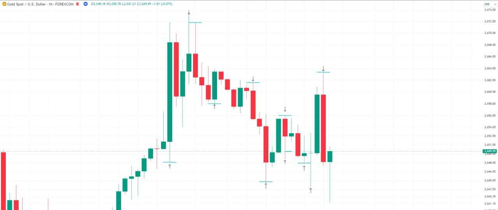

Now go to the 3hr.

That entry upon the 15 min confirmed TS within the 1hr HCS/negation and now 3hr + FU forming now has more swing potential. This will already be expected in full liquidity calculation.

**Once the 1hr + 3hr has closed (established TS) one can hold at breakeven for an expected more powerful push to latter liquidity targets** - and while it forms still a stronger true swing potential.

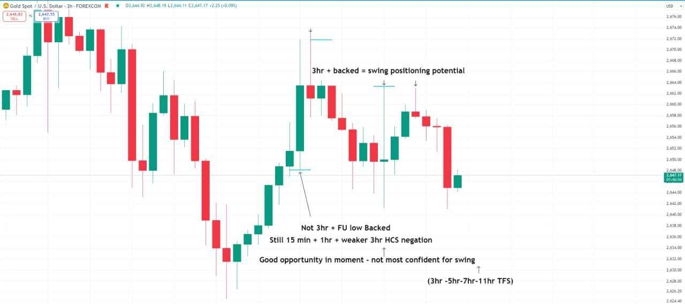

Chart annotations (3hr):

- "3hr + backed = swing positioning potential"
- At the earlier low: "Not 3hr + FU low backed. Still 15 min + 1hr + weaker 3hr HCS negation. Good opportunity in moment - not most confident for swing"
- "(3hr - 5hr - 7hr - 11hr TFS)"

### Task 3.2 - 15 min - 1hr - 3hr

> Task 3.2:
>
> **To complete 100 repetitions like so. 15 min - 1hr - 3hr.**
>
> **It is a purely mechanical task that requires no additional text explanation.**

Standard timeframes only, marked as in the three charts above.

### 11hr → 1 min swing breakdown (worked example)

And then a breakdown of each swing low, until 15 min confirmed TS, and a 1 min HCS + negation confirmed entry in its region.

**11hr is better than daily for this task but if one does not have access to odd TF, daily can be used:**

*Note: the refinement below (3hr to 1 min) follows a swing high (a sell); the 11hr chart marks both swing highs and lows.*

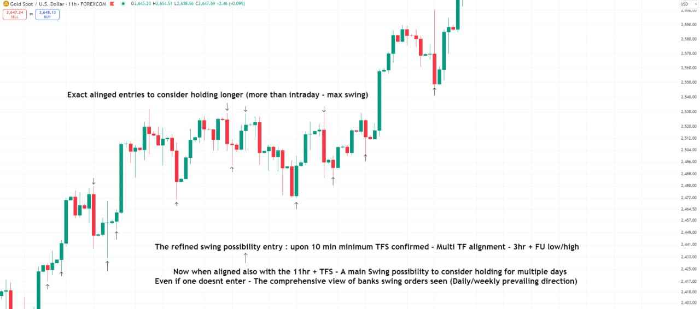

Chart annotations (11hr):

- "Exact aligned entries to consider holding longer (more than intraday - max swing)"
- "The refined swing possibility entry: upon 10 min minimum TFS confirmed - Multi TF alignment - 3hr + FU low/high"
- "Now when aligned also with the 11hr + TFS - A main Swing possibility to consider holding for multiple days. Even if one doesn't enter - The comprehensive view of banks swing orders seen (Daily/weekly prevailing direction)"

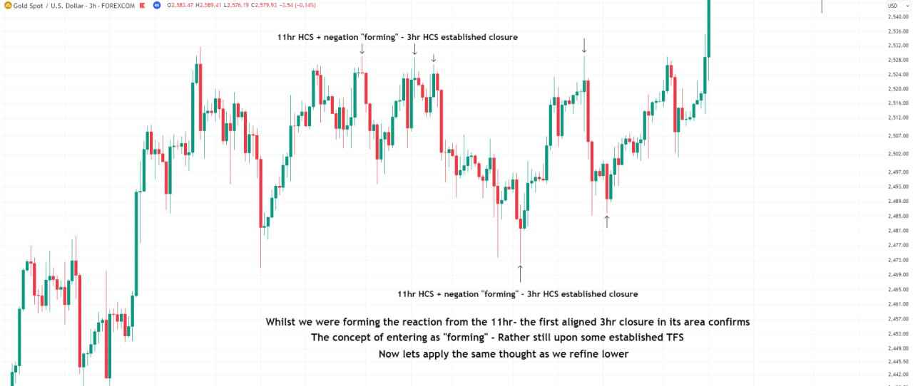

Chart annotations (3hr):

- At the high and at the low: "11hr HCS + negation 'forming' - 3hr HCS established closure"
- "Whilst we were forming the reaction from the 11hr - the first aligned 3hr closure in its area confirms. **The concept of entering as 'forming' - Rather still upon some established TFS.** Now let's apply the same thought as we refine lower"

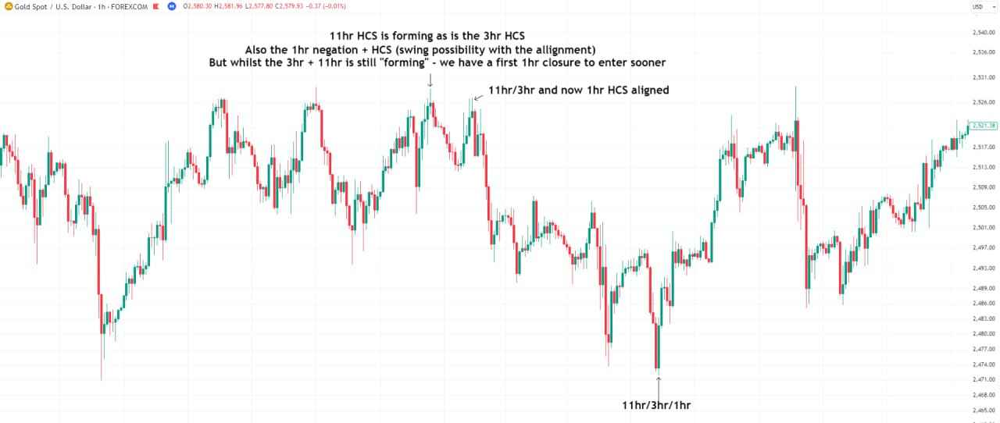

Chart annotations (1hr):

- "11hr HCS is forming as is the 3hr HCS. Also the 1hr negation + HCS (swing possibility with the alignment). **But whilst the 3hr + 11hr is still 'forming' - we have a first 1hr closure to enter sooner**"
- "11hr/3hr and now 1hr HCS aligned"
- At the low: "11hr/3hr/1hr"

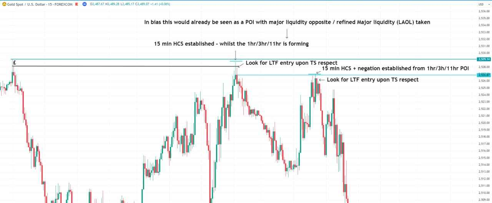

Chart annotations (15 min):

- "In bias this would already be seen as a POI with major liquidity opposite / refined Major liquidity (LAOL) taken"
- "15 min HCS established - whilst the 1hr/3hr/11hr is forming"
- "Look for LTF entry upon TS respect" (twice)
- "15 min HCS + negation established from 1hr/3h/11hr POI"

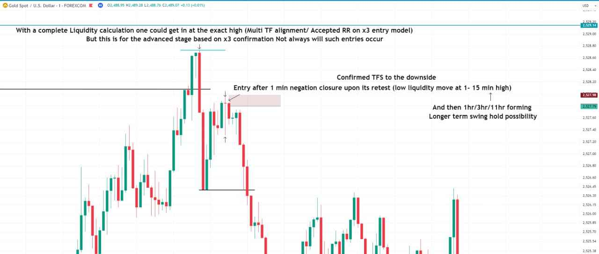

Chart annotations (1 min):

- "With a complete Liquidity calculation one could get in at the exact high (Multi TF alignment / Accepted RR on x3 entry model). **But this is for the advanced stage based on x3 confirmation. Not always will such entries occur**"
- "Entry after 1 min negation closure upon its retest (low liquidity move at 1 - 15 min high)"
- "Confirmed TFS to the downside"
- "And then 1hr/3hr/11hr forming - Longer term swing hold possibility"

### Task 3.3 - 11hr + swing refinement

> And then task 3.3:
>
> **To complete 30 repetitions refining exact 11hr + swing points until that final refined entry (11hr / daily - 3hr - 1hr - established 15 min TS - 1 min entry)**
>
> You are not using any final liquidity calculation but seeing for yourself the formation of the most notable POI for entry and which when respected present a key information of the current strength of direction (you know the exact concentration of banks orders). And based on the prevailing strength which sides are weaker and stronger by default - the true max possibility based on each moment

### Task aid - clarifications on timeframe strength

*Posted later as "Miscellaneous - Task aid", in reply to [the rules](#the-rules) above.*

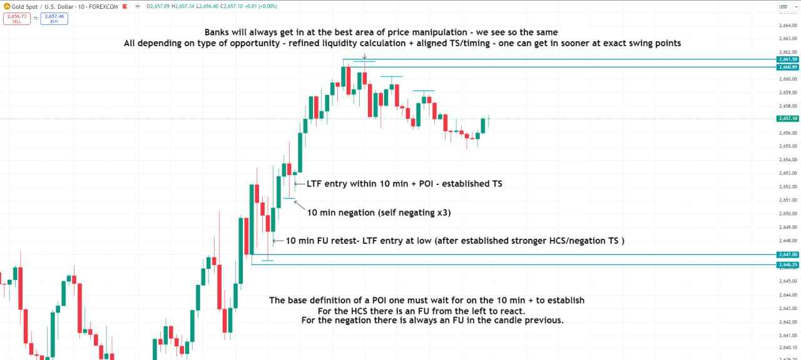

Chart annotations (10 min):

- "Banks will always get in at the best area of price manipulation - we see so the same. All depending on type of opportunity - refined liquidity calculation + aligned TS/timing - one can get in sooner at exact swing points"
- "LTF entry within 10 min + POI - established TS"
- "10 min negation (self negating x3)"
- "10 min FU retest - LTF entry at low (after established stronger HCS/negation TS)"
- **"The base definition of a POI one must wait for on the 10 min + to establish. For the HCS there is an FU from the left to react. For the negation there is always an FU in the candle previous."**

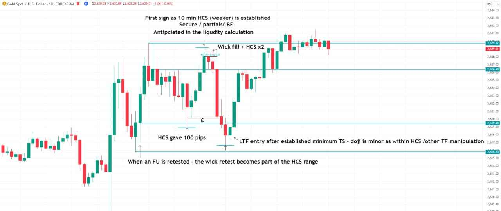

Chart annotations (10 min):

- "First sign as 10 min HCS (weaker) is established. Secure / partials / BE. Anticipated in the liquidity calculation"
- "Wick fill + HCS x2"
- "HCS gave 100 pips"
- "LTF entry after established minimum TS - doji is minor as within HCS / other TF manipulation"
- **"When an FU is retested - the wick retest becomes part of the HCS range"**

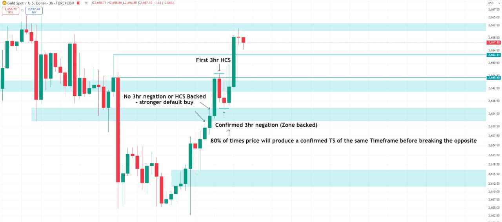

Chart annotations (3hr):

- "First 3hr HCS"
- "No 3hr negation or HCS backed - stronger default buy"
- "Confirmed 3hr negation (Zone backed)"
- **"80% of times price will produce a confirmed TS of the same Timeframe before breaking the opposite"**

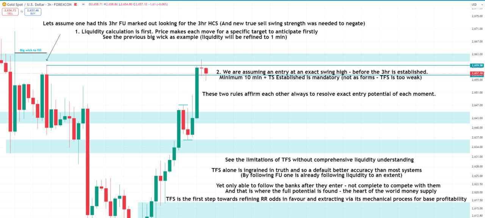

Chart annotations (3hr, same chart):

- "Let's assume one had this 3hr FU marked out looking for the 3hr HCS (And new true sell swing strength was needed to negate)"
- **"1. Liquidity calculation is first.** Price makes each move for a specific target to anticipate firstly. See the previous big wick as example (liquidity will be refined to 1 min)"
- **"2. We are assuming an entry at an exact swing high - before the 3hr is established. Minimum 10 min + TS Established is mandatory (not as forms - TFS is too weak)"**
- **"These two rules affirm each other always to resolve exact entry potential of each moment."**
- "See the limitations of TFS without comprehensive liquidity understanding. TFS alone is ingrained in truth and so a default better accuracy than most systems (By following FU one is already following liquidity to an extent). Yet only able to follow the banks after they enter - not complete to compete with them. And that is where the full potential is found - the heart of the world money supply"
- **"TFS is the first step towards refining RR odds in favour and extracting via its mechanical process for base profitability"**

## 3 · Key timing

Timing in its list of importance:

**UK timing - convert to your own time zone**

| # | UK time | Session |
|---|---|---|
| 1 | **1 - 2 PM** | First hour of NY session - the "golden" hour |
| 2 | **3 - 4 PM** | NY - the new 4hr candle |
| 3 | **7 - 9 AM** | London session |
| 4 | **2 - 3 AM** | Asia session first hour |
| 5 | **4 - 5 AM** | Asia session |
| 6 | **5 - 6 PM** | Final hours for entries |
| 7 | **7 - 8 PM** | Final hours for entries |

**Wary by default:** 8 PM - 1 AM, 10 AM - 1 PM. To a lesser extent 2 - 3 PM (always swing POI exception).

### The hours in order

1) **The first hour of NY session 1 - 2 PM.** Every day, a guaranteed confident, high RR, clear true entry will be found within this time. The "golden" hour of each day it certainly is. More longer term swing positionings will be found in this specific hour than any other. Or at least for the minimum true retracement. **The average 100 pip opportunity over two positions can be expected in this sole 1 hour window.**

2) **3 - 4 PM.** This hour has more value than London timing. After the true entries scaled in NY open and the "cooling" period of 2-3 PM\*, price makes the new 4hr candle, its manipulation one of the reasons making that hour higher in liquidity by nature. An assured higher potential entry can also be found in this timing - its manipulation will be most notable in determining the continuation or reversal - we will already have details from the previous NY liquidity/manipulation build up.

\*Cooling period refers to those hours of lesser true reversal potential / more trending / its manipulation build up will need extra strength / hold previous entries with more probabilistic confidence until next timing.

Lesser in potential by default (compared to NY hours assured 100 pip average) - price still resolves around the build up of these hours:

3) **7-9 AM. London session.** Not as powerful as NY timing - We have two hours for this window one should monitor closely. The assured true entry potential within, yet more advanced as price prepares latter news PA many days.

4) **2 - 3 AM.** Asia session first hour.

5) **4 - 5 AM** - also Asia session.

We follow banks main positioning seen in the LTF true stop within this timing. Main price influence cycles around the banks true orders session to session.

There is no need to trade each of these hours naturally. We have spoken about quality RR extraction previously - % compound. However the RR opportunity is unique in each moment, to be aware and open to all scenarios.

The final hours for entries, the main bias of the day will be now set firmly, the next session some many hours away:

6) **5 - 6 PM**

7) **7-8 PM**

### Hours to be wary of

**8 PM - 1 AM, 10 AM - 1 PM are considered timing to be wary of by default.** To a lesser extent 2 - 3 PM (Always swing POI exception). If price is strong in swing movement, to consider more scale in potential (non timing trends more). Or to hold previous entries through these weaker timing.

### Rules around timing

It is not expected one will see the cycle of timing right away, it is an intricate process to spot all the differentiation for when price will also react on lesser occasion in non timing hours. **But the key guaranteed opportunities for entry will always be present in these hours (the order of importance).**

- **NY timing is the most important** - as most news falls within. The default hours of best potential to focus on.
- Price alternates between the following. **The HTF POI (3hr + aligned TFS/zone/major liquidity) - session timing - news.** Non timing entries will be only upon some heightened swing potential, news impact/build. **Entry criteria is always the same upon the 10 min + established.**
- **Entries in non timing can be expected to be weaker**, to expect the need for deeper HCS retest / extra latter manipulation to hold true.

### Timing in context - the banks

Of course it all comes down to the final unique liquidity calculation in the end. To see price from the exact view of the banks. This is one concept among many - after the reading and belief of true of price action based on its manipulation. You will follow their true mechanical institutional flow better now, under stricter entry parameters.

**Remember you do not need to catch every move i.e. compete with banks in 24/7 market movement to make your wealth**, we are operating on different scope entirely - they have to keep the markets afloat / deem it impossible for their trace of orders worth in the trillions operated by machine learning to be followed for as so (of course some institutional traders know of the liquidity manipulation for some advantage / opening for insider trading) - not from the manual fractal lens for such RR extraction / following of every move.

Perhaps a harder to comprehend passage ^ as some may be here in reflection, but I speak to the minds who show themselves to #reflect - with a future intent that will make better sense.

**To operate now under the timing advantage given. Become familiar with the daily cycle and its role in extraction.**

## Deadline

We speak on timing and final clarification over the weekends. **This is the final task before assessment of all - to choose those ready for the advanced stage.**

Much has been said to get up to date with.

For now I believe you have some more intense backtest tasks that require your full attention.

**Deadline is Friday the 18th. 2 weeks from now** - it is an ample time really. I only push you to apply yourselves at the speed required. **Do the tasks because it brings you benefit - not under the pressure of a deadline only**

## After the deadline

The time period given for task 3 was deliberately less, it was not expected all would meet the deadline (personal circumstances / health / work / education are considered). Congratulations are due to those who did. You show yourselves in capable standards for the highest result. With this established backtesting pace now incorporated into daily routine and a charged working memory - it will be a swift progression far superior.

**Still a final 2 week window will be given to those to catch up to date with tasks, before selection for the advanced stages**

These tasks set the strong foundation. Of course it has not all the elements related to full liquidity calculation / most powerful refinement. You already need to know the basics to mark HCS/negation. You still have to muse over and comprehend the depth of manipulation for yourself (Rational thought will always lead you to the truth - take care of previous environmental / societal bias).

**The summary of these tasks are you to see with confidence the base true perception of the markets: the low liquidity move vs the high liquidity move** (FU manipulation and its branches, aligned TFS, timing/market cycle - to enter/account for in manipulation vs dojis, big wick to fill, weak TFS - to target/account for in manipulation).

*The parenthetical above appears to split the foundation into two groups:*

| To enter / account for in manipulation | To target / account for in manipulation |
|---|---|
| FU manipulation and its branches | dojis |
| aligned TFS | big wick to fill |
| timing/market cycle | weak TFS |

**Simply by mere repetitions of these tasks can one achieve a high level profitability with the true precision advantage**, and your own correct learning with backtesting application of all other contents shared. **You do not need to look for further instruction now but act now on your further independent daily backtesting and confidence from your improving result**

---

Related: [Task 1 - Major Liquidity](/mrc-tasks/tasks/1/assignment/), [Task 2 - Top-Down Analysis](/mrc-tasks/tasks/2/assignment/) (the 4hr - 1 min breakdown this task refreshes) and [Morality, Rationality & the Opposing Side](/mrc-tasks/misc/morality-rationality-and-the-opposing-side/) (the discipline notes given just before Task 3 was set).
