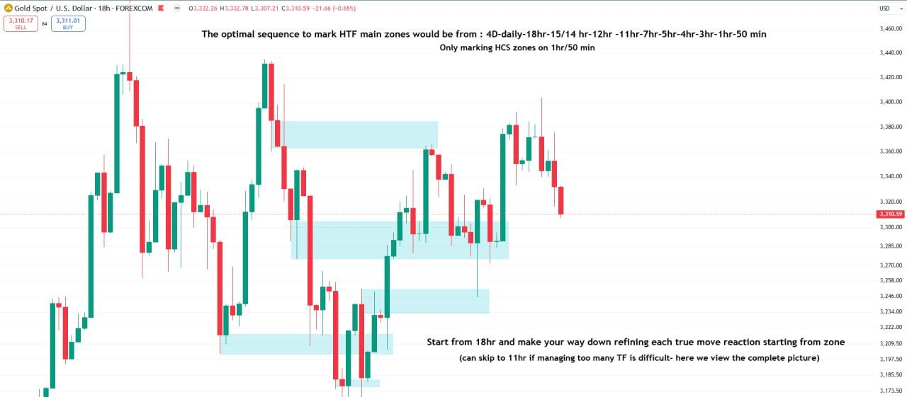
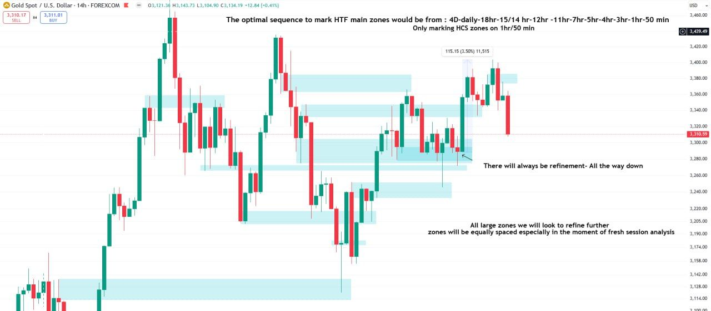
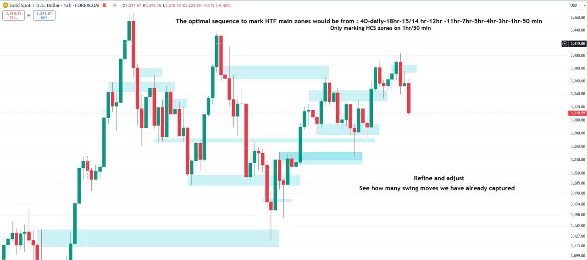
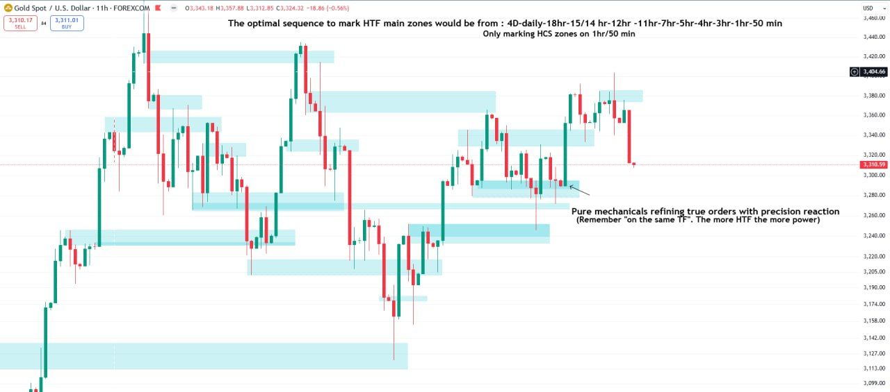
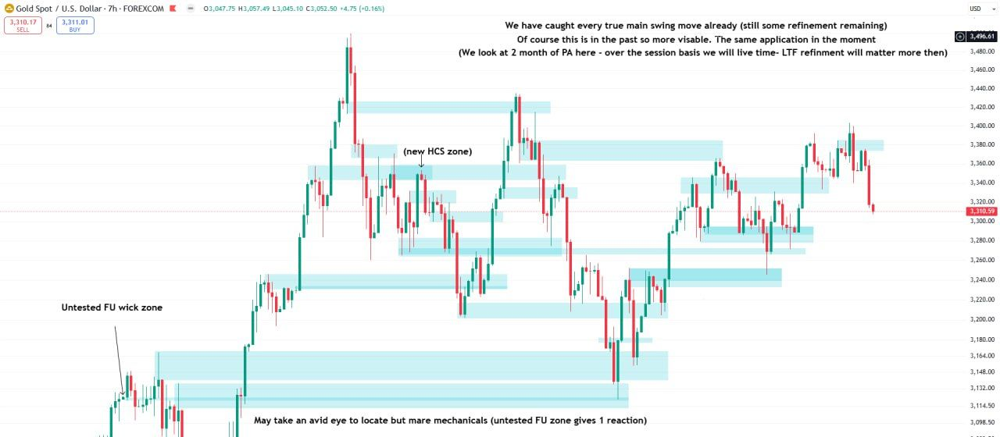
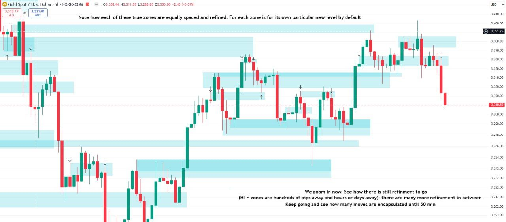
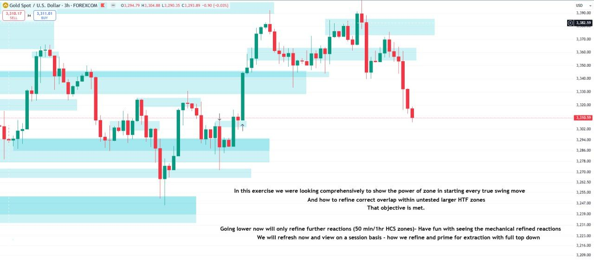

*Part of [Week 1: Zones](/mrc-tasks/tasks/weeks/1/). Study [Zones: Types, Rules & Refinement](/mrc-tasks/reference/zones/) first; this page doesn't re-teach the zone types and rules. This is Week 1's Task 1, not [standalone Task 1](/mrc-tasks/tasks/1/).*

## The task

> Task 1: Complete 2 years of data using HTF zones (11hr-7hr-5hr-4hr-3hr-1hr-50 min). The objective is to capture the zones (with overlap refinement) which start the main true swing moves.

## At a glance

| | Requirement |
|---|---|
| Volume | "2 years of data" |
| Timeframes | "11hr-7hr-5hr-4hr-3hr-1hr-50 min", from HTF down. Optionally start higher, from 18hr (see the [HTF marking sequence](/mrc-tasks/reference/zones/#htf-marking-sequence)). |
| Zone types | All four [zone types](/mrc-tasks/reference/zones/#the-four-zone-types). "Only marking HCS zones on 1hr/50 min". The weakest ATT FU is only used on the 3hr +. Body-in-wick is optional: "Do not use body in wick zones if they confuse." |
| Objective | "capture the zones (with overlap refinement) which start the main true swing moves" |
| What to mark | "Don't mark zones that have not produced a reaction." "Do not mark the zones that are not active and your picture will be much more clear." |
| Method | "Start by focusing on one swing low/high at a time. And refine its reaction from multiple timeframes before moving to the next" |
| Entries, stops, targets | Not asked for. The task is zones only. |
| Sharing | Share your practice in #backtesting-results for review. |
| Pacing | **No set deadline. "Ideally these tasks should take no longer than 2 weeks"** (all three Week 1 Tasks; see [Week 1](/mrc-tasks/tasks/weeks/1/)). |
| Instrument | *Not specified by the mentor.* His examples are all XAUUSD. |
| Standard timeframes | *Not answered.* See [Notes](#notes). |

## How to work through it

His feedback to a student's practice in #backtesting-results:

- "Don't mark zones that have not produced a reaction."
- "You are looking at past data - your goal is to capture what zones started those reactions"
- "So many of these are incorrect and rushed."
- "Start by focusing on one swing low/high at a time. And refine its reaction from multiple timeframes before moving to the next"
- "As you progress you will be able to do multiple at a time."

From the Week 1 Q&A, on a student's 11hr marking with several zones labelled "not active":

- "Do not mark the zones that are not active and your picture will be much more clear. You have caught some good reactions."
- "Note you are marking months of price action. Zooming into the minute timeframes will provide a larger gap between your zones for clarity"

The notes he gave with Tasks 1 and 2:

- "Do not use body in wick zones if they confuse."
- "Make the markings clear to you , even if you omit a few zones"
- "Practice will make perfect. Once you see it you can't unsee it. Now you learn to view the fractal model - following banks orders that make every move via a mechanical approach (based on decoded signs of manipulation)."
- "A lot to take in but it is intended for your deeper studies and the full comprehensive rule based outlook on the topic. We will touch more on it with clarity in review of the tasks."

## Worked example: exercise 1 (HTF)

Before setting the Task he demonstrated it, top-down, on about two months of XAUUSD price action. He introduced it with "Every entry will fall into these zones. All true moves occur from them:" and on the last chart calls it "this exercise". It is his demonstration and the model for this Task, not an extra deliverable.

The 18hr, 14hr, 12hr and 11hr charts carry the same header (the optimal marking sequence). It is transcribed once, under the 18hr.

### 18hr

Chart annotations (18hr):

- "The optimal sequence to mark HTF main zones would be from : 4D-daily-18hr-15/14 hr-12hr -11hr-7hr-5hr-4hr-3hr-1hr-50 min"
- "Only marking HCS zones on 1hr/50 min"
- "Start from 18hr and make your way down refining each true move reaction starting from zone"
- "(can skip to 11hr if managing too many TF is difficult- here we view the complete picture)"

### 14hr

Chart annotations (14hr), under the same header:

- "There will always be refinement- All the way down" (arrow to a darker overlap inside a zone)
- "All large zones we will look to refine further / zones will be equally spaced especially in the moment of fresh session analysis"
- "Just free part" and "All the wick" on two zones. He explained the difference in the Q&A: see [Which part of the wick](/mrc-tasks/reference/zones/#which-part-of-the-wick).
- A measure from the refined zone shows 115.15 (3.50%).

### 12hr

Chart annotations (12hr), under the same header:

- "Refine and adjust / See how many swing moves we have already captured"

### 11hr

Chart annotations (11hr), under the same header:

- "Pure mechanicals refining true orders with precision reaction / (Remember "on the same TF". The more HTF the more power)"

"The more HTF the more power" connects to timeframe strength, taught in [standalone Task 3](/mrc-tasks/tasks/3/assignment/#2--timeframe-strength-and-the-htf-true-stop) (related, not a requirement of this Task).

### 7hr

Chart annotations (7hr):

- "We have caught every true main swing move already (still some refinement remaining) / Of course this is in the past so more visible. The same application in the moment / (We look at 2 month of PA here - over the session basis we will live time- LTF refinement will matter more then)"
- "(new HCS zone)" at a mid-chart high
- "Untested FU wick zone" (bottom left)
- "May take an avid eye to locate but mere mechanicals (untested FU zone gives 1 reaction)"

### 5hr

Chart annotations (5hr):

- "Note how each of these true zones are equally spaced and refined. For each zone is for its own particular new level by default"
- "We zoom in now. See how there is still refinement to go / (HTF zones are hundreds of pips away and hours or days away)- there are many more refinement in between / Keep going and see how many moves are encapsulated until 50 min"
- Arrows mark the reactions.

### 3hr

Chart annotations (3hr):

- "In this exercise we were looking comprehensively to show the power of zone in starting every true swing move / And how to refine correct overlap within untested larger HTF zones / That objective is met. / Going lower now will only refine further reactions (50 min/1hr HCS zones)- Have fun with seeing the mechanical refined reactions / We will refresh now and view on a session basis - how we refine and prime for extraction with full top down"

The session basis that follows is exercise 2, the worked example for [Task 2](/mrc-tasks/tasks/weeks/1/task-2/assignment/#worked-example-exercise-2-session-basis).

## Notes

- *"Don't mark zones that have not produced a reaction" is about marking past data, as in this Task. [Task 2](/mrc-tasks/tasks/weeks/1/task-2/assignment/) marks "the relevant untested HTF zones" before a session, when the reaction is still to come. Each instruction belongs to its own Task.*
- *Standard timeframes: a student asked whether the task can be completed on other timeframes (H12, H4, H3, H2, H1, M30, M15, M5, M1). No answer from the mentor is in the source. Only [Task 3](/mrc-tasks/tasks/weeks/1/task-3/assignment/) gives standard-timeframe substitutes, for its own timeframes.*
- *The instrument is not specified by the mentor. His examples are all XAUUSD.*
- Live application gives more clarity than this Task: "we will have more zone clarity than task 1 (marking many months of data vs preparation for 1 session)". See [Live-time application](/mrc-tasks/reference/zones/#live-time-application).

---

Related: [Zones: Types, Rules & Refinement](/mrc-tasks/reference/zones/) · [Terminology](/mrc-tasks/reference/terminology/) ([FU](/mrc-tasks/reference/terminology/#fu), [HCS](/mrc-tasks/reference/terminology/#hcs), [attempted FU](/mrc-tasks/reference/terminology/#attempted-fu)) · [Standalone Task 3 - RR, Timeframe Strength & Timing](/mrc-tasks/tasks/3/assignment/) · Next: [Week 1 · Task 2](/mrc-tasks/tasks/weeks/1/task-2/assignment/)
