*Part of [Week 1: Zones](/mrc-tasks/tasks/weeks/1/). Study [Zones: Types, Rules & Refinement](/mrc-tasks/reference/zones/) first; this page doesn't re-teach the zone types and rules. This is Week 1's Task 2, not [standalone Task 2](/mrc-tasks/tasks/2/).*

## The task

> Task 2: Complete 10 days of NY price action , marking out the relevant untested HTF zones , without any other analysis factors, and then after viewing the outcome refine 7/10/15 min zones (choose 1 TF) , and 1 min strong FU zones to fill in the gaps / extra refinement

The notes he gave with Tasks 1 and 2:

- "Do not use body in wick zones if they confuse."
- "Make the markings clear to you , even if you omit a few zones"
- "Practice will make perfect. Once you see it you can't unsee it. Now you learn to view the fractal model - following banks orders that make every move via a mechanical approach (based on decoded signs of manipulation)."

## At a glance

| | Requirement |
|---|---|
| Volume | "10 days of NY price action" |
| Step 1 | Mark "the relevant untested HTF zones , without any other analysis factors" |
| Step 2 | "after viewing the outcome" |
| Step 3 | "refine 7/10/15 min zones (choose 1 TF)": one of 7, 10 or 15 min, without weakest ATT FU / failed FU zones ([7/10/15 min level](/mrc-tasks/reference/zones/#71015-min)) |
| Step 4 | "1 min strong FU zones to fill in the gaps / extra refinement". "We mark the full strong FU candle (breaks low and high) for the 1 min zone" ([1 min level](/mrc-tasks/reference/zones/#1-min)) |
| HTF timeframes | *Not restated for this Task.* The worked example below uses 7hr to 50 min. |
| Body-in-wick | Optional: "Do not use body in wick zones if they confuse." |
| Entries, stops, targets | Not asked for. The task is zones only. |
| Sharing | Share your practice in #backtesting-results for review. |
| Pacing | **No set deadline. "Ideally these tasks should take no longer than 2 weeks"** (all three Week 1 Tasks; see [Week 1](/mrc-tasks/tasks/weeks/1/)). |
| Instrument | *Not specified by the mentor.* His examples are all XAUUSD. |
| Standard timeframes | *Not answered.* See [Notes](#notes). |

## The three levels

The Task climbs down the three levels of use (in full: [Three levels of use](/mrc-tasks/reference/zones/#three-levels-of-use)):

- **HTF**: "the HTF zone suffices. The bulk of the banks true orders that make up price."
- **7/10/15 min**: "Not much used to anticipate, but confirm true POI and refine HTF zones"
- **1 min**: "we locate the exact placement of the moment where banks true orders are present , awaiting final entry decision."

## Worked example: exercise 2 (session basis)

His heading in the source is "Session basis (exercise 2):". It follows straight on from [exercise 1](/mrc-tasks/tasks/weeks/1/task-1/assignment/#worked-example-exercise-1-htf) and is the model for this Task: a demonstration, not an extra deliverable. One NY session, in order: the untested HTF zones before the session, then the outcome, then the 7/10 min and 1 min fill-in.

### Before the session: untested HTF zones

#### 1hr: before marking

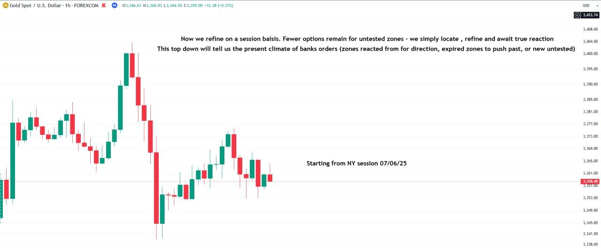

Chart annotations (1hr):

- "Now we refine on a session basis. Fewer options remain for untested zones - we simply locate , refine and await true reaction / This top down will tell us the present climate of banks orders (zones reacted from for direction, expired zones to push past, or new untested)"
- "Starting from NY session 07/06/25"

#### 7hr

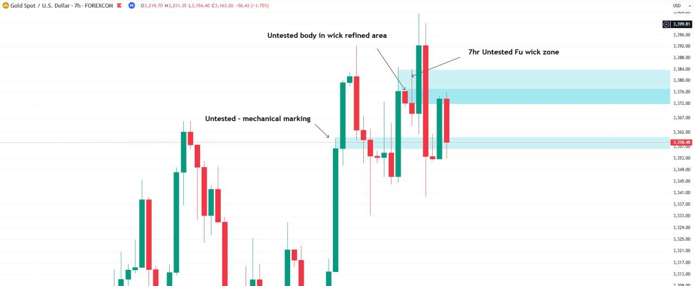

Chart annotations (7hr):

- "Untested body in wick refined area"
- "7hr Untested FU wick zone"
- "Untested - mechanical marking" (a lower zone; a student asked about it in the Q&A, see [The weakest ATT FU in depth](/mrc-tasks/reference/zones/#the-weakest-att-fu-in-depth))

#### 5hr

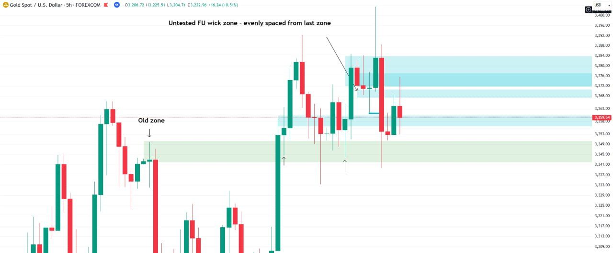

Chart annotations (5hr):

- "Untested FU wick zone - evenly spaced from last zone"
- "Old zone" (lower)

#### 4hr

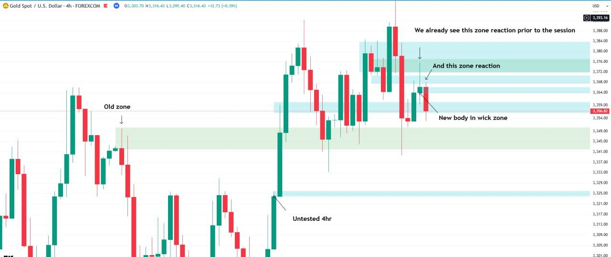

Chart annotations (4hr):

- "We already see this zone reaction prior to the session" / "And this zone reaction"
- "New body in wick zone"
- "Old zone"
- "Untested 4hr" (lower)

#### 3hr

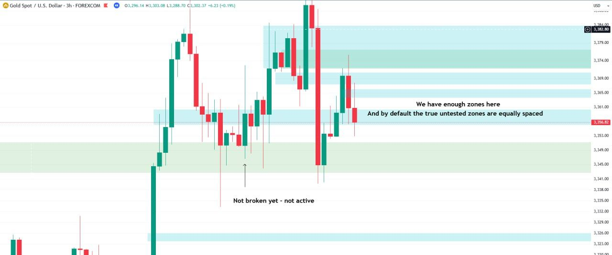

Chart annotations (3hr):

- "We have enough zones here / And by default the true untested zones are equally spaced"
- "Not broken yet - not active" (arrow to a wick inside a zone; see the [clarification](#clarification-when-a-zone-is-active) below)

#### 1hr

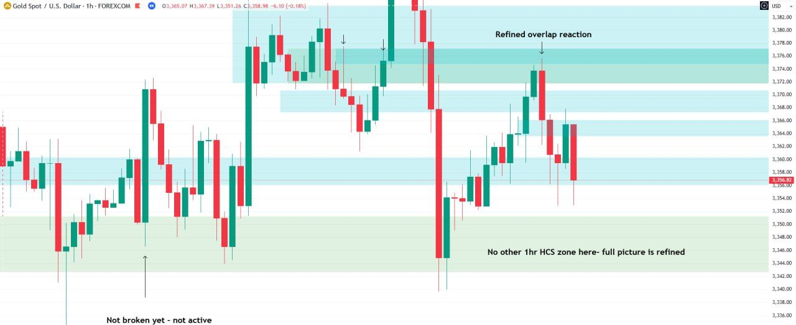

Chart annotations (1hr):

- "Refined overlap reaction"
- "No other 1hr HCS zone here- full picture is refined"
- "Not broken yet - not active"

#### 50 min

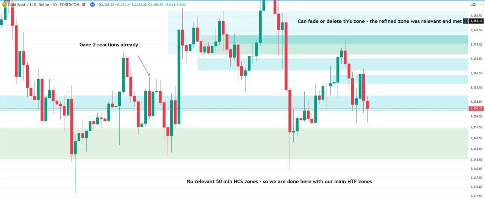

Chart annotations (50 min):

- "Gave 2 reactions already"
- "Can fade or delete this zone - the refined zone was relevant and met"
- "No relevant 50 min HCS zones - so we are done here with our main HTF zones"

### The outcome

#### 4hr: after the session

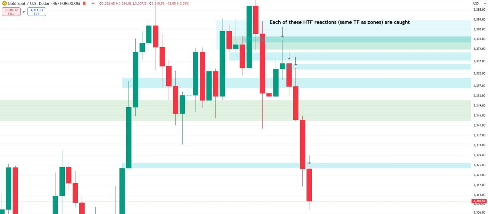

Chart annotations (4hr):

- "Each of these HTF reactions (same TF as zones) are caught"

### Filling in: 7/10/15 min and 1 min

#### 7 min

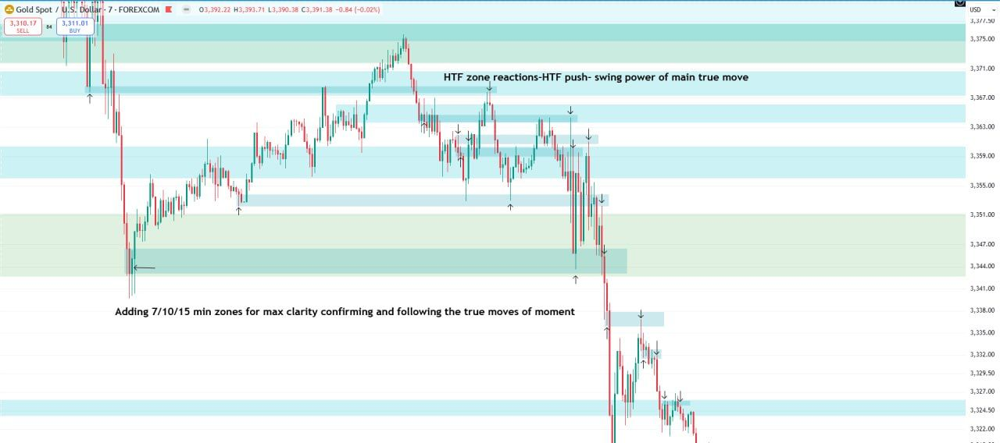

Chart annotations (7 min):

- "HTF zone reactions-HTF push- swing power of main true move"
- "Adding 7/10/15 min zones for max clarity confirming and following the true moves of moment"

#### 1 min

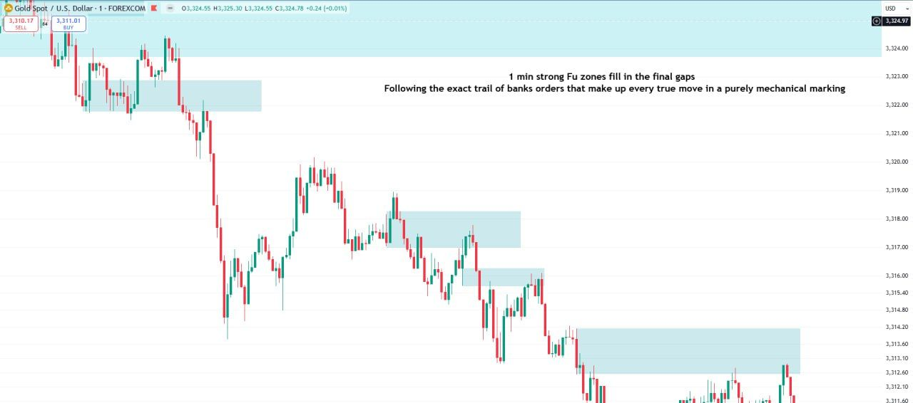

Chart annotations (1 min):

- "1 min strong FU zones fill in the final gaps / Following the exact trail of banks orders that make up every true move in a purely mechanical marking"

#### 10 min: summary

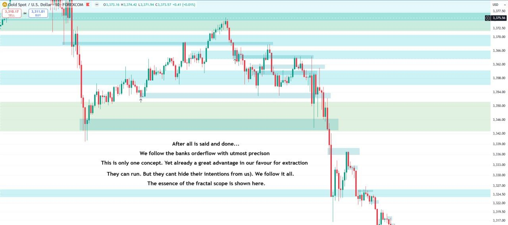

Chart annotations (10 min):

- "After all is said and done... / We follow the banks orderflow with utmost precision / This is only one concept. Yet already a great advantage in our favour for extraction / They can run. But they can't hide their intentions from us). We follow it all. / The essence of the fractal scope is shown here."

*The Task says to choose one of 7/10/15 min. The demonstration shows both the 7 min and, as a closing summary, the 10 min.*

## Clarification: when a zone is active

*From the Week 1 Q&A.* On a student's correctly marked zone:

- "Correct marking. If respected via a new wick reaction and not a body closure then keep on going until the subsequent new wick is broken with a body closure"

On the 3hr chart above ("Not broken yet - not active"), asked why the zone was not broken:

- "See previous explanation. The first break of was respected with a new wick. That wick was not yet broken with a body closure below."

A zone that has given its reactions is expired: "If the zone has been met for its subsequent reaction (HCS zone for 2 on the same TF or broken FU wick for 1 reaction) - then it is expired and no longer considered." More in [Reactions and expiry](/mrc-tasks/reference/zones/#reactions-and-expiry).

## Notes

- *"Marking out the relevant untested HTF zones" is pre-session marking, when the reaction is still to come. [Task 1](/mrc-tasks/tasks/weeks/1/task-1/assignment/)'s "Don't mark zones that have not produced a reaction" is about marking past data. Each instruction belongs to its own Task.*
- *Standard timeframes: a student asked whether the tasks can be completed on other timeframes (H12, H4, H3, H2, H1, M30, M15, M5, M1). No answer from the mentor is in the source. Only [Task 3](/mrc-tasks/tasks/weeks/1/task-3/assignment/) gives standard-timeframe substitutes, for its own timeframes.*
- *The instrument is not specified by the mentor. His examples are all XAUUSD.*
- The full zone mark-up he later posted for a live NY session is in [Zones · Full zone mark-up for a NY session](/mrc-tasks/reference/zones/#full-zone-mark-up-for-a-ny-session).

---

Related: [Zones: Types, Rules & Refinement](/mrc-tasks/reference/zones/) · [Standalone Task 3 · Key timing](/mrc-tasks/tasks/3/assignment/#3--key-timing) (NY session hours) · [Standalone Task 2 - Top-Down Analysis](/mrc-tasks/tasks/2/assignment/) (an earlier, separate top-down assignment) · [Rules of analysis](/mrc-tasks/reference/rules-of-analysis/) ([3 · 10/15 min TS](/mrc-tasks/reference/rules-of-analysis/#3-wait-for-the-established-1015-min-ts), [9 · Zones](/mrc-tasks/reference/rules-of-analysis/#9-zones)) · Previous: [Week 1 · Task 1](/mrc-tasks/tasks/weeks/1/task-1/assignment/) · Next: [Week 1 · Task 3](/mrc-tasks/tasks/weeks/1/task-3/assignment/)
