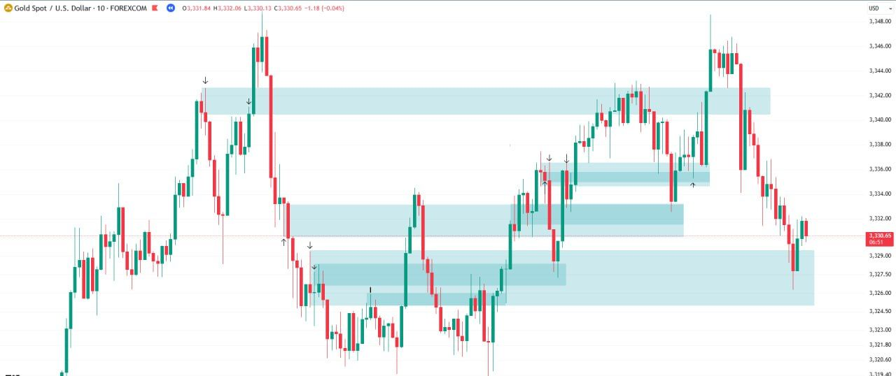
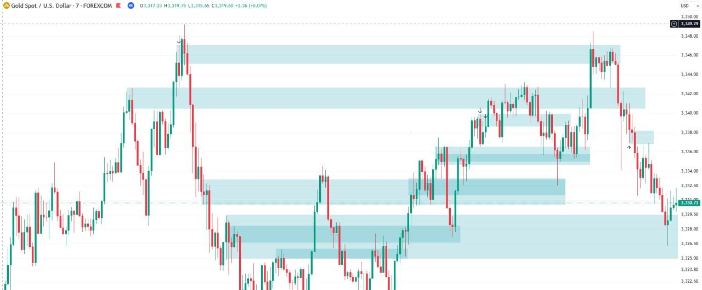
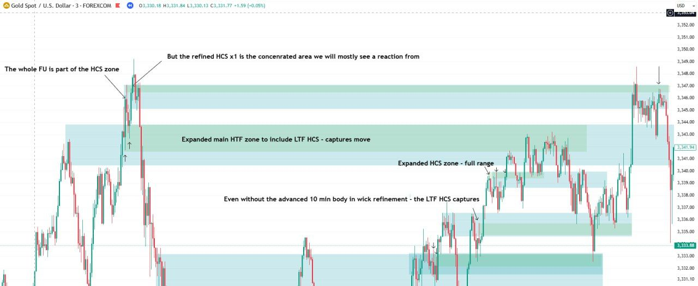
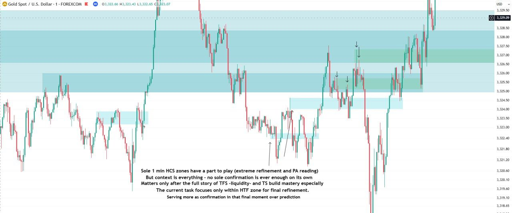

*Part of [Week 1: Zones](/mrc-tasks/tasks/weeks/1/). Study [Zones: Types, Rules & Refinement](/mrc-tasks/reference/zones/) first; this page doesn't re-teach the zone types and rules. This is Week 1's Task 3, not [standalone Task 3](/mrc-tasks/tasks/3/).*

## The task

> Task 3:
>
> Mark zones on the 10 min and 7 min now (all zones but failed ATT FU) and then refine the LTF HCS zone within. Use 15 min, 5 min,3 min,1 min if only access to standard timeframes
>
> Complete examples for 30 sessions , later look comprehensively at refinement from 50 min + HTF zones also.

## At a glance

| | Requirement |
|---|---|
| Volume | "Complete examples for 30 sessions" |
| Sessions | "sessions". *The session type is not specified by the mentor.* His examples are NY sessions. |
| Timeframes | 10 min and 7 min |
| Zone types | "all zones but failed ATT FU" |
| Then | "refine the LTF HCS zone within" |
| Where | "The current task focuses only within HTF zone for final refinement." (1 min chart below) |
| Form | "additional refinement on the same timeframe- still task 1 form" |
| Standard timeframes | "Use 15 min, 5 min,3 min,1 min if only access to standard timeframes" |
| Later | "later look comprehensively at refinement from 50 min + HTF zones also". A later step, not part of the 30-session requirement. |
| Pacing | **No set deadline. "Ideally these tasks should take no longer than 2 weeks"** (all three Week 1 Tasks; see [Pacing](#pacing)). |
| Instrument | *Not specified by the mentor.* His examples are all XAUUSD. |

## The 10 and 7 min charts (no annotations)

"The 10/7 min charts present some more advanced markings (additional refinement on the same timeframe- still task 1 form) . However still upon the same mechanical rules , and easier to spot (as the move has already occurred). They are shared without text annotation- for you to muse over and come back to for reference."

*No text annotations, by design. Study them and come back to them.*

## Refining the LTF HCS zone

### 3 min

Chart annotations (3 min):

- "The whole FU is part of the HCS zone"
- "But the refined HCS x1 is the concentrated area we will mostly see a reaction from"
- "Expanded main HTF zone to include LTF HCS - captures move"
- "Expanded HCS zone - full range"
- "Even without the advanced 10 min body in wick refinement - the LTF HCS captures"

### 1 min

Chart annotations (1 min):

- "Sole 1 min HCS zones have a part to play (extreme refinement and PA reading) / But context is everything - no sole confirmation is ever enough on its own / Matters only after the full story of TFS -liquidity- and TS build mastery especially / The current task focuses only within HTF zone for final refinement. / Serving more as confirmation in that final moment over prediction"

TFS and TS are taught in [standalone Task 3](/mrc-tasks/tasks/3/assignment/) ([the rules](/mrc-tasks/tasks/3/assignment/#the-rules), [timeframe strength](/mrc-tasks/tasks/3/assignment/#timeframe-strength---definition)).

## Pacing

**"There is no set deadline for now (It is intensive after all and I do not wish to make one rush sacrificing quality) but you will fall behind in the next segment without adequate practice. Ideally these tasks should take no longer than 2 weeks."**

*Posted with this Task, but it refers to "these tasks", so it applies to all three Week 1 Tasks.*

## Then: the full mark-up for every session

Straight after this Task he posted "the full zone mark up process for today's NY session (and every session after)", with his final clarity rule and six annotated charts: [Zones · Full zone mark-up for a NY session](/mrc-tasks/reference/zones/#full-zone-mark-up-for-a-ny-session).

---

Related: [Zones: Types, Rules & Refinement](/mrc-tasks/reference/zones/) · [Terminology · HCS](/mrc-tasks/reference/terminology/#hcs) · [Standalone Task 3 - RR, Timeframe Strength & Timing](/mrc-tasks/tasks/3/assignment/) · [Rules of analysis · 10 Final entries](/mrc-tasks/reference/rules-of-analysis/#10-final-entries) · Previous: [Week 1 · Task 2](/mrc-tasks/tasks/weeks/1/task-2/assignment/)
