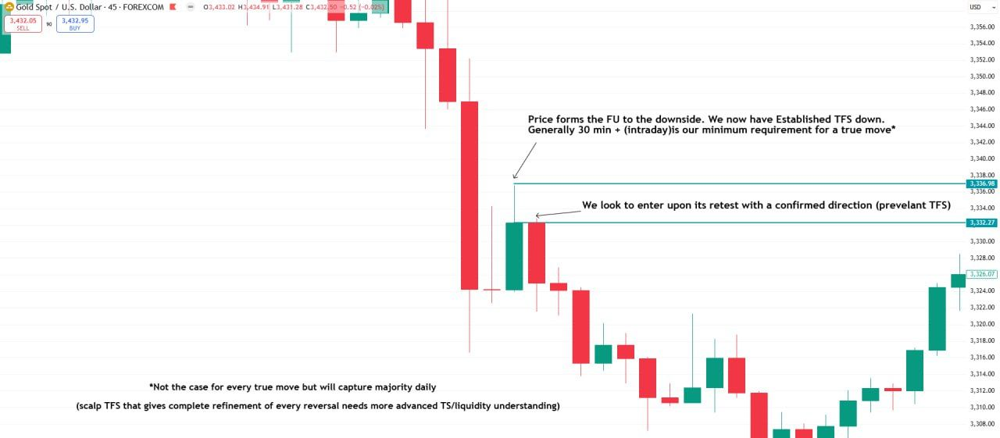
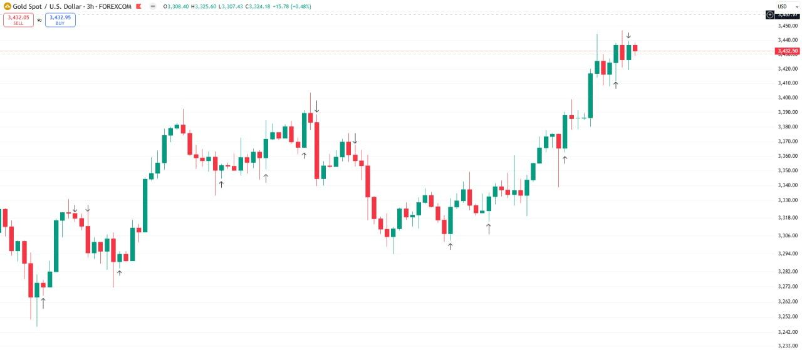
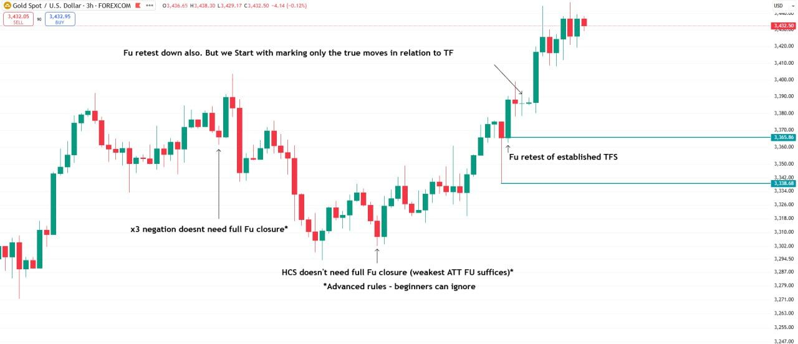
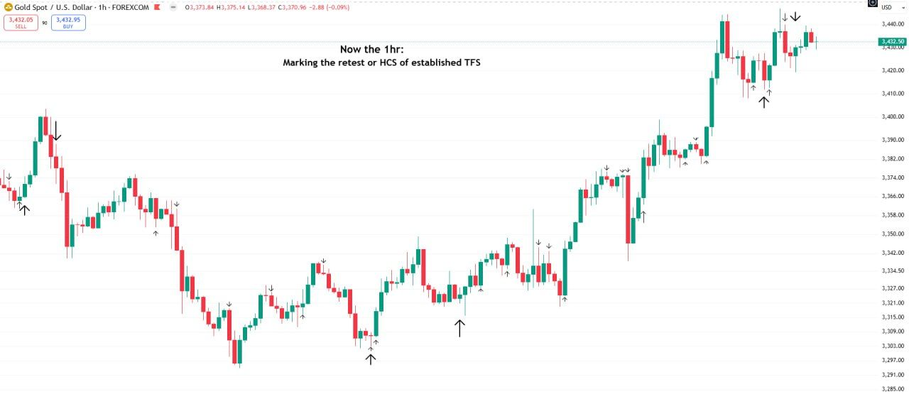
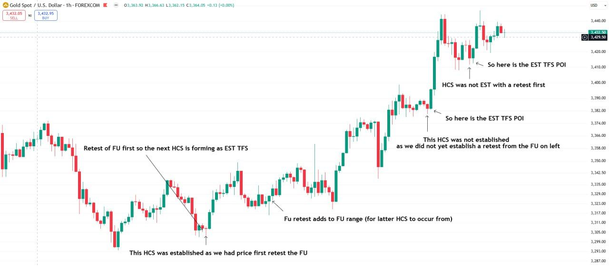
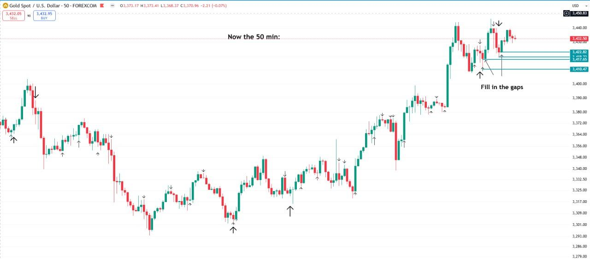
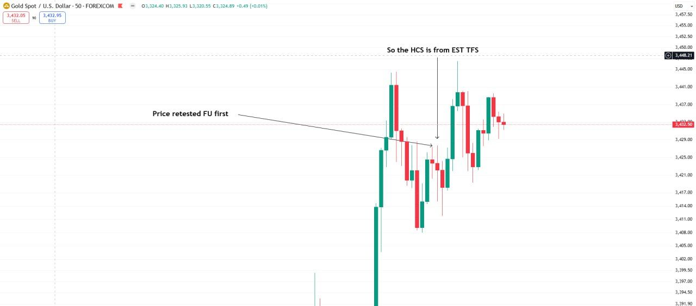
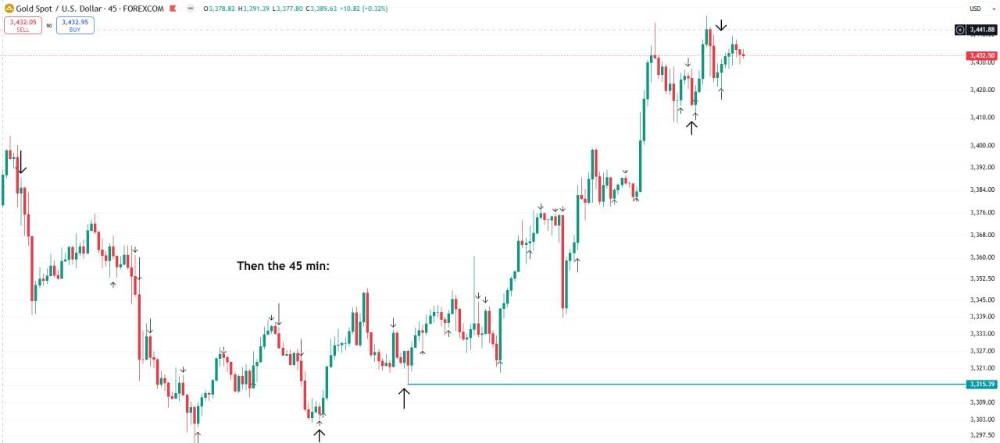
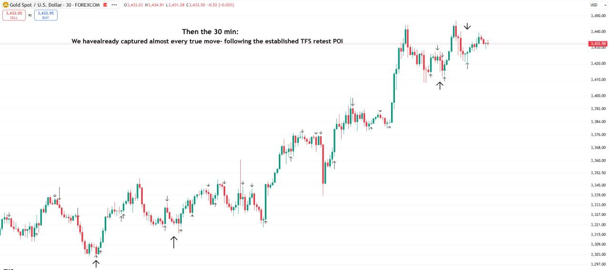
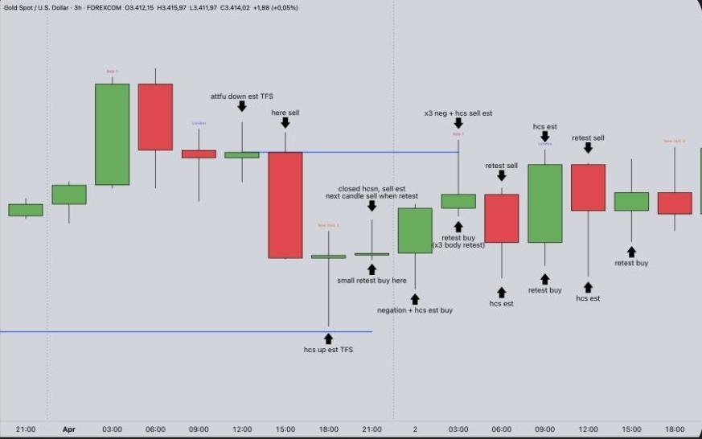

*Part of [Week 2: Timeframe Strength](/mrc-tasks/tasks/weeks/2/). Study the shared Week 2 teaching first: [Study before the Tasks](/mrc-tasks/tasks/weeks/2/#study-before-the-tasks) on the Week page (theory, the five categories, established vs forming, Q&A answers and a live worked example; expanded in [Timeframe Strength (TFS)](/mrc-tasks/reference/timeframe-strength/)). This page doesn't repeat it. This is Week 2's Task 1, not [standalone Task 1](/mrc-tasks/tasks/1/) or [Week 1's Task 1](/mrc-tasks/tasks/weeks/1/task-1/assignment/).*

## The task

> Task 1:
>
> Focused on the retest of established TFS POI. Mark 2 months of data from 3hr - 30 min. Observe the main entry potential in line with the confirmed prevalent move of the moment.
>
> The rules are given within the chart examples to dissect

Established TFS is "the confirmed prevalent direction" ([Two ways to use TFS](/mrc-tasks/reference/timeframe-strength/#established)).

## At a glance

| | Requirement |
|---|---|
| Volume | "Mark 2 months of data" |
| Timeframes | "from 3hr - 30 min". His charts go 3hr → 1hr → 50 min → 45 min → 30 min. |
| What to mark | The retest of the established TFS POI. On his 1hr: "Marking the retest or HCS of established TFS" |
| Observe | "the main entry potential in line with the confirmed prevalent move of the moment" |
| Rules | "given within the chart examples to dissect" (listed [below](#the-rules-in-the-charts)) |
| Instrument | *Not specified by the mentor.* His examples are all XAUUSD. |
| Standard timeframes | *Not given.* No standard-timeframe alternative to the 50 and 45 min is in the source. |

## The rules in the charts

Each rule is quoted from his charts below:

1. An FU establishes TFS in its direction: "Price forms the FU to the downside. We now have Established TFS down" ([45 min](#45-min-the-concept)).
2. Enter on its retest: "We look to enter upon its retest with a confirmed direction (prevalent TFS)" ([45 min](#45-min-the-concept)).
3. The minimum timeframe for a true move: "Generally 30 min + (intraday) is our minimum requirement for a true move", which will "capture majority daily" ([45 min](#45-min-the-concept)).
4. Mark only the true moves in relation to the timeframe: "Fu retest down also. But we Start with marking only the true moves in relation to TF" ([3hr](#3hr-the-rules)).
5. An HCS counts as established only once the FU was retested first: "This HCS was established as we had price first retest the FU" / "This HCS was not established as we did not yet establish a retest from the FU on left" ([1hr](#1hr-established-vs-not-established-hcs)); "Price retested FU first" → "So the HCS is from EST TFS" ([50 min](#50-min-zoom-price-retested-fu-first)).
6. "Fu retest adds to FU range (for latter HCS to occur from)" ([1hr](#1hr-established-vs-not-established-hcs)).
7. Advanced, "beginners can ignore": "x3 negation doesn't need full Fu closure" and "HCS doesn't need full Fu closure (weakest ATT FU suffices)" ([3hr](#3hr-the-rules)).
8. Work down the timeframes to "Fill in the gaps" ([50 min](#50-min-fill-in-the-gaps)). By 30 min "almost every true move" is captured ([30 min](#30-min)).

Retests don't have to meet the FU wick exactly: see [How close is a retest?](#how-close-is-a-retest) below.

## Worked example: top-down 3hr to 30 min

His examples, in the order posted: first the concept on a 45 min chart, then the marking top-down from 3hr to 30 min over the same period.

### 45 min: the concept

Chart annotations (45 min):

- "Price forms the FU to the downside. We now have Established TFS down. Generally 30 min + (intraday) is our minimum requirement for a true move*"
- "We look to enter upon its retest with a confirmed direction (prevalent TFS)" (arrow at the next candle)
- "*Not the case for every true move but will capture majority daily / (scalp TFS that gives complete refinement of every reversal needs more advanced TS/liquidity understanding)"

### 3hr: the marking

The 3hr with only the arrows: every established-TFS retest POI over several weeks, up and down. This is what a finished chart for the Task looks like.

### 3hr: the rules

Chart annotations (3hr):

- "Fu retest down also. But we Start with marking only the true moves in relation to TF" (a small candle in the up-leg)
- "Fu retest of established TFS"
- "x3 negation doesn't need full Fu closure*" (a mid-range swing high)
- "HCS doesn't need full Fu closure (weakest ATT FU suffices)*" (a swing low)
- "*Advanced rules - beginners can ignore"

See [x3](/mrc-tasks/reference/terminology/#x3), [HCS](/mrc-tasks/reference/terminology/#hcs) and [the weakest ATT FU](/mrc-tasks/reference/zones/#the-weakest-att-fu-in-depth).

### 1hr: the marking

Chart annotations (1hr):

- "Now the 1hr: / Marking the retest or HCS of established TFS" (large and small arrows)

### 1hr: established vs not established HCS

Chart annotations (1hr):

- "Retest of FU first so the next HCS is forming as EST TFS" and "This HCS was established as we had price first retest the FU" (the low on the left)
- "Fu retest adds to FU range (for latter HCS to occur from)" (middle)
- "This HCS was not established / as we did not yet establish a retest from the FU on left", then "So here is the EST TFS POI" at the next low (right)
- "HCS was not EST with a retest first", then "So here is the EST TFS POI" (top)

A student asked about this chart: see [When an established TFS is nullified](#when-an-established-tfs-is-nullified).

### 50 min: fill in the gaps

Chart annotations (50 min):

- "Now the 50 min:" (arrows as before)
- "Fill in the gaps" (top right, with marked levels)

### 50 min zoom: price retested FU first

Chart annotations (50 min):

- "Price retested FU first" → "So the HCS is from EST TFS"

### 45 min

Chart annotations (45 min):

- "Then the 45 min:" (arrows, and a horizontal level from a marked low)

### 30 min

Chart annotations (30 min):

- "Then the 30 min: / We have already captured almost every true move- following the established TFS retest POI"

## Clarifications

From the Week 2 Q&A, after the Tasks were set.

### When an established TFS is nullified

On the [1hr chart](#1hr-established-vs-not-established-hcs), a student circled the green FU to the left of the "not established" HCS: the next candle retested it, so was that not the retest? His answer:

- "Price first moved away from the original FU POI , and retested the bearish FU consequently."
- "That previous "established" TFS is null now."
- "When price came back to form the HCS I have marked for example , we did not have a new established bullish TFS. Thus we wait for the new closure, and retest."
- "On the other hand the first example here was preceeded with an FU retest (active bullish TFS) and no new established (bearish) TFS opposite."
- "So the next HCS that forms serves a retest of an already established bullish TFS for entry opportunity location (the same way we use FU retest)."
- "Summary: even though it may seem we are taking the HCS as forms , it actually falls into the criteria of established TFS retest"

"The first example here" is the established HCS on the left of the same 1hr chart. The same point is on [Week 2 Task 2's last 30 min chart](/mrc-tasks/tasks/weeks/2/task-2/assignment/#30-min-an-hcs-as-it-forms): "So we can look for buys as this forms - but it falls under EST TFS parameters".

### How close is a retest?

"Price does not always have to meet the exact FU wick. It is ideal yes , but close enough still counts": past the 70% fib of the full FU is a weak retest, touching the FU wick stronger, touching the 50% of the FU wick strongest. In full: [Timeframe Strength · How close is a retest?](/mrc-tasks/reference/timeframe-strength/#how-close-is-a-retest)

### Both sides established

When price has established TFS both ways, "Each side will give us a fixed main direction to look at so there isn't a confusion": buy at the lower bullish FU retest, sell at the upper bearish FU retest. In full: [Timeframe Strength · Both sides established](/mrc-tasks/reference/timeframe-strength/#both-sides-established).

## An example done correctly

A student's 3hr chart, posted in the Q&A. His comment: "An example of the exercise done correctly. (Ignore the x3 body retest part). Observe the flow of buy and sell TFS signals"

Chart labels (3hr, left to right):

- "attfu down est TFS" → "here sell"
- "hcs up est TFS" → "small retest buy here"
- "closed hcsn, sell est / next candle sell when retest"
- "negation + hcs est buy"
- "x3 neg + hcs sell est" / "retest buy (x3 body retest)"
- "retest sell" / "hcs est"
- "hcs est" / "retest buy"
- "retest sell" / "hcs est"
- "retest buy"

*"x3 body retest" is not defined in the material so far; he says to ignore that part.*

## Notes

- *The instrument is not specified by the mentor. His examples are all XAUUSD.*
- *No standard-timeframe alternative is given for the 50 and 45 min charts.*
- *Standalone Task 3 rule 4 limits confirmed FU closures to the 3hr and above, while these examples establish TFS from FU closures down to 45 min and 30 min. The source does not say how the two fit together: see the note in [The established TFS retest](/mrc-tasks/reference/timeframe-strength/#the-established-tfs-retest).*

---

Related: [Timeframe Strength (TFS)](/mrc-tasks/reference/timeframe-strength/) · [Terminology](/mrc-tasks/reference/terminology/) ([FU](/mrc-tasks/reference/terminology/#fu), [HCS](/mrc-tasks/reference/terminology/#hcs), [negation](/mrc-tasks/reference/terminology/#negation), [x3](/mrc-tasks/reference/terminology/#x3), [attempted FU](/mrc-tasks/reference/terminology/#attempted-fu)) · [Zones: Types, Rules & Refinement](/mrc-tasks/reference/zones/) · [Standalone Task 3 - RR, Timeframe Strength & Timing](/mrc-tasks/tasks/3/assignment/) · Next: [Week 2 · Task 2](/mrc-tasks/tasks/weeks/2/task-2/assignment/)
