*Part of [Week 2: Timeframe Strength](/mrc-tasks/tasks/weeks/2/). Study the shared teaching of [Week 2](/mrc-tasks/tasks/weeks/2/#study-before-the-tasks) (TFS) and [Week 1](/mrc-tasks/tasks/weeks/1/#study-before-the-tasks) (zones) first; expanded in [Timeframe Strength (TFS)](/mrc-tasks/reference/timeframe-strength/) and [Zones](/mrc-tasks/reference/zones/). This page doesn't repeat it. This is Week 2's Task 2, not [standalone Task 2](/mrc-tasks/tasks/2/) or [Week 1's Task 2](/mrc-tasks/tasks/weeks/1/task-2/assignment/).*

## The task

> Task 2:
>
> Focused on the complete picture. Zones, and power swing TFS forming (knowing of the exact premiums and potential of the move upon multi TF alignment and stronger manipulation models) , with established TFS for subsequent entry potential.
>
> Mark 30 examples of any swing move (3hr +, add more HTF as comfortable).

He continued, introducing his example:

"Price moves similarly across the LTF. Remember the statement mentioned previously that you are to study. For now, our focus is intraday and above - the general flow of the markets true moves, and how we are positioned correctly to capture them:"

The statement is ["The LTF builds the HTF but HTF commands the LTF"](/mrc-tasks/reference/timeframe-strength/#the-ltf-builds-the-htf-but-htf-commands-the-ltf).

## At a glance

| | Requirement |
|---|---|
| Volume | "Mark 30 examples of any swing move" |
| Timeframes | "3hr +, add more HTF as comfortable". His example goes 18hr → 14hr → 12hr → 11hr → 7hr → 5hr → 4hr → 3hr. |
| Mark | "Zones, and power swing TFS forming ... with established TFS for subsequent entry potential". His chart header: "We will mark zones and established TFS POI- / Note the entry area opportunity and strength of true move" |
| Know | "the exact premiums and potential of the move upon multi TF alignment and stronger manipulation models" |
| Below 3hr | *The written instruction says "3hr +".* His example continues below it: "Complete 1hr/50 min zones and established TFS POI until 30 min" ([1hr](#1hr-complete-to-30-min)). |
| Focus | "intraday and above" |
| Instrument | *Not specified by the mentor.* His examples are all XAUUSD. |
| Standard timeframes | *Not given.* No standard-timeframe alternative to the 18/14/12/11/7/5hr is in the source. |

## What "forming" means here

Forming TFS "Presents the power POI ... - the premium level for that category", and it "must be used in conjcture with some kind of already established prevalent TFS" ([Forming: the power POI](/mrc-tasks/reference/timeframe-strength/#forming-the-power-poi)). The swing category is 3hr - 7hr (250 + pips) and 7hr - 4D + (350 + pips) ([the five categories](/mrc-tasks/reference/timeframe-strength/#the-five-tfs-categories)). "All TFS must have some kind of refined zone reaction. When we have matching TFS with the same TF zone - the strongest true move potential/power POI" ([TFS and zones](/mrc-tasks/reference/timeframe-strength/#tfs-and-zones)).

## Worked example: one swing low, 18hr to 30 min

One bullish swing, marked top-down: a first low, a second low inside the 18hr zone, the established-TFS retest after it (the entry), and the high before. Cyan boxes are zones. The labels **accumulate**: each lower timeframe repeats the higher-timeframe labels and adds its own, so under each chart only the labels new at that timeframe are listed. The full stacks are under the [3hr summary](#3hr-the-swing-category). The top-down order matches Week 1's [HTF marking sequence](/mrc-tasks/reference/zones/#htf-marking-sequence).

The 18hr to 3hr charts carry the same header. It is transcribed once, under the 18hr.

### 18hr

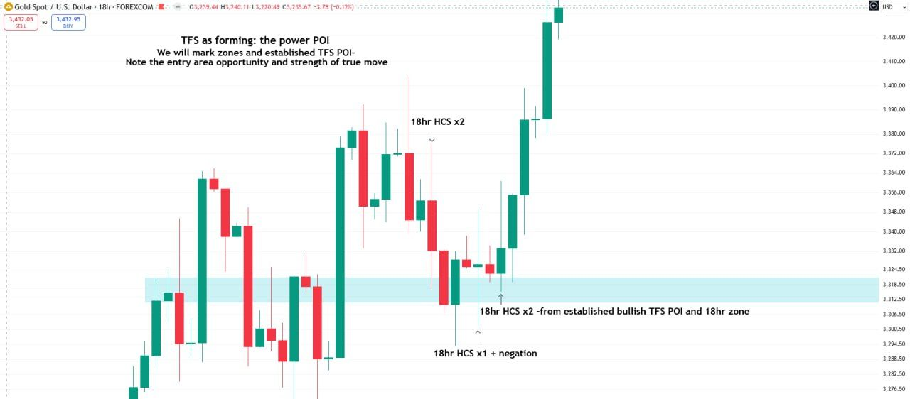

Chart header (18hr to 3hr): "TFS as forming: the power POI / We will mark zones and established TFS POI- / Note the entry area opportunity and strength of true move"

Chart annotations (18hr):

- "18hr HCS x2" (the high)
- "18hr HCS x1 + negation" (the first low)
- "18hr HCS x2 -from established bullish TFS POI and 18hr zone" (the second low, inside the 18hr zone)

### 14hr

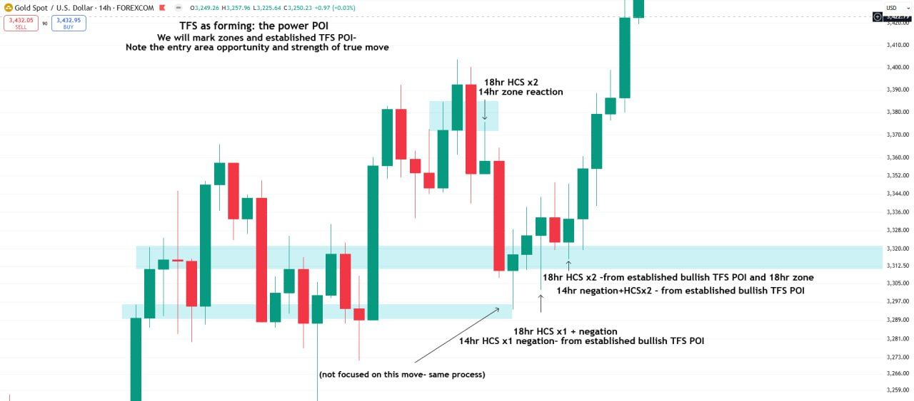

New at 14hr: a second, lower zone and a 14hr zone at the high.

- "14hr zone reaction" (the high)
- "14hr HCS x1 negation- from established bullish TFS POI" (the first low)
- "14hr negation+HCSx2 - from established bullish TFS POI" (the second low)
- "(not focused on this move- same process)" (an earlier leg)

### 12hr

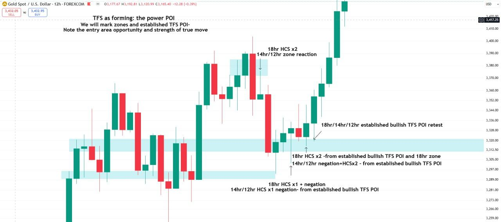

New at 12hr: the labels become "14hr/12hr ...", and the entry is marked:

- "18hr/14hr/12hr established bullish TFS POI retest" (the candle after the second low)

### 11hr

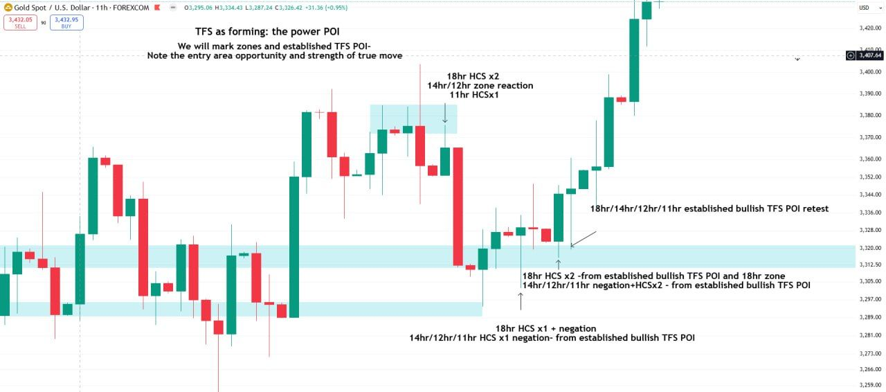

New at 11hr:

- "11hr HCSx1" (the high)
- The retest becomes "18hr/14hr/12hr/11hr established bullish TFS POI retest", and the lows "14hr/12hr/11hr ..."

### 7hr

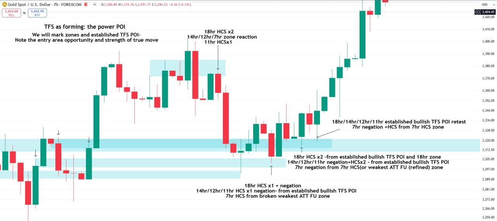

New at 7hr: more zones, including a lower refined one. Down arrows mark the earlier highs.

- "14hr/12hr/7hr zone reaction" (the high)
- "7hr negation +HCS from 7hr HCS zone" (the retest)
- "7hr negation from 7hr HCS(or weakest ATT FU (refined) zone" (the second low)
- "7hr HCS from broken weakest ATT FU zone" (the first low)

See [the weakest ATT FU zone](/mrc-tasks/reference/zones/#weakest-att-fu-zone-failed-fu).

### 5hr

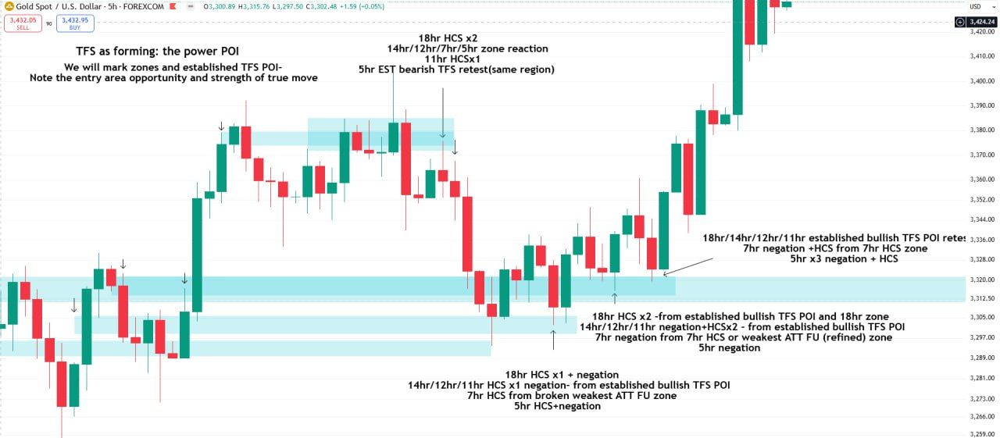

New at 5hr:

- "5hr EST bearish TFS retest(same region)" (the high)
- "5hr x3 negation + HCS" (the retest)
- "5hr negation" (the second low)
- "5hr HCS+negation" (the first low)

### 4hr

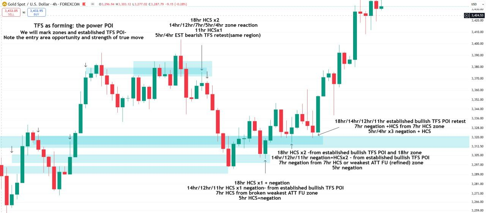

New at 4hr:

- "14hr/12hr/7hr/5hr/4hr zone reaction" and "5hr/4hr EST bearish TFS retest(same region)" (the high)
- "5hr/4hr x3 negation + HCS" (the retest)

### 3hr

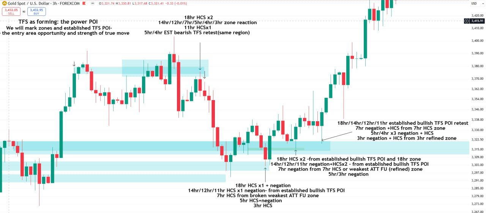

New at 3hr: a thin green refined band inside the main zone.

- "…/4hr/3hr zone reaction" (the high)
- "3hr negation + HCS from 3hr refined zone" (the retest)
- "5hr/3hr negation" (the second low)
- "3hr HCS" (the first low)

### 3hr: the swing category

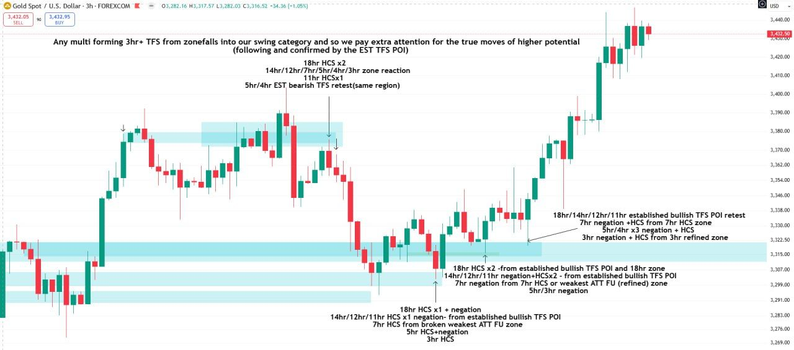

The same chart with a new header, the key sentence of the example:

**"Any multi forming 3hr+ TFS from zone falls into our swing category and so we pay extra attention for the true moves of higher potential / (following and confirmed by the EST TFS POI)"**

The full label stacks, 18hr down to 1hr (the 1hr labels are added on the next chart):

- **The high (bearish reaction):** "18hr HCS x2 / 14hr/12hr/7hr/5hr/4hr/3hr zone reaction / 11hr HCSx1 / 5hr/4hr EST bearish TFS retest(same region) / 1hr negation from refined 1hr HCS zone"
- **The first low:** "18hr HCS x1 + negation / 14hr/12hr/11hr HCS x1 negation- from established bullish TFS POI / 7hr HCS from broken weakest ATT FU zone / 5hr HCS+negation / 3hr HCS / 1hr HCS x1 from established bullish TFS POI"
- **The second low:** "18hr HCS x2 -from established bullish TFS POI and 18hr zone / 14hr/12hr/11hr negation+HCSx2 - from established bullish TFS POI / 7hr negation from 7hr HCS(or weakest ATT FU (refined) zone / 5hr/3hr negation"
- **The retest (the entry):** "18hr/14hr/12hr/11hr established bullish TFS POI retest / 7hr negation +HCS from 7hr HCS zone / 5hr/4hr x3 negation + HCS / 3hr negation + HCS from 3hr refined zone / 1hr negation from refined 1hr HCS zone"

*"HCS x1", "HCS x2" and "HCSx2" are not defined in the material so far.*

### 1hr: complete to 30 min

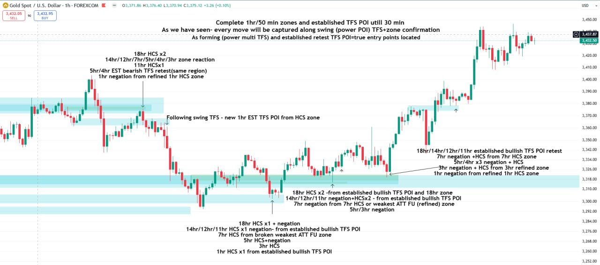

Chart header (1hr):

**"Complete 1hr/50 min zones and established TFS POI until 30 min / As we have seen- every move will be captured along swing (power POI) TFS+zone confirmation / As forming (power multi TFS) and established retest TFS POI=true entry points located"**

New at 1hr:

- "1hr negation from refined 1hr HCS zone" (the high, and again at the retest)
- "Following swing TFS - new 1hr EST TFS POI from HCS zone" (a new mid-level)
- "1hr HCS x1 from established bullish TFS POI" (the first low)

"Only marking HCS zones on 1hr/50 min" ([HTF marking sequence](/mrc-tasks/reference/zones/#htf-marking-sequence)).

### 30 min: live-time retests

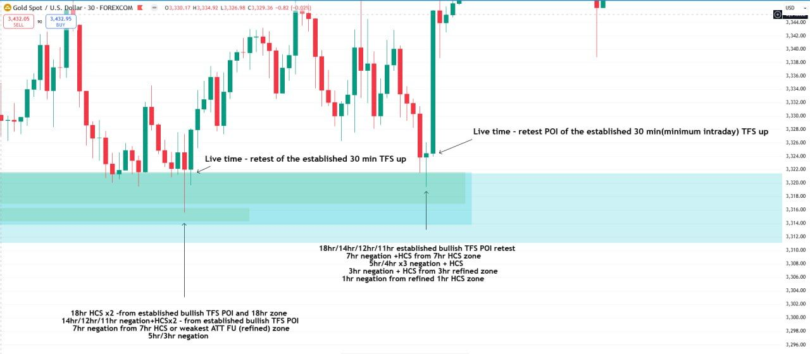

A zoom on the lows, each with the cumulative higher-timeframe labels.

Chart annotations (30 min):

- "Live time - retest of the established 30 min TFS up" (the left low)
- "Live time - retest POI of the established 30 min(minimum intraday) TFS up" (the right low)

### 30 min: an HCS as it forms

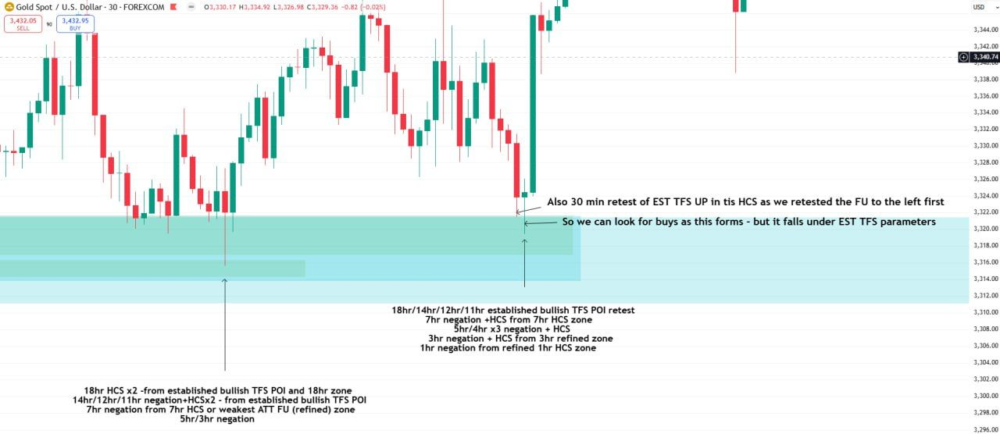

The same chart, re-annotated at the right low.

Chart annotations (30 min):

- "Also 30 min retest of EST TFS UP in this HCS as we retested the FU to the left first / So we can look for buys as this forms - but it falls under EST TFS parameters"

This is the point of the Q&A on [Week 2 Task 1](/mrc-tasks/tasks/weeks/2/task-1/assignment/#when-an-established-tfs-is-nullified): "even though it may seem we are taking the HCS as forms , it actually falls into the criteria of established TFS retest".

## Notes

- *How far below 3hr each example must go is not stated. The written requirement is "3hr +"; his example continues through the 1hr to 30 min.*
- *"HCS x1", "HCS x2" / "HCSx2" and "advanced entry models" are not defined in the material so far.*
- *The instrument is not specified by the mentor. His examples are all XAUUSD.*
- The HTF zone marking this Task builds on is [Week 1 Task 1](/mrc-tasks/tasks/weeks/1/task-1/assignment/).

---

Related: [Timeframe Strength (TFS)](/mrc-tasks/reference/timeframe-strength/) · [Zones: Types, Rules & Refinement](/mrc-tasks/reference/zones/) · [Terminology](/mrc-tasks/reference/terminology/) ([HCS](/mrc-tasks/reference/terminology/#hcs), [negation](/mrc-tasks/reference/terminology/#negation), [x3](/mrc-tasks/reference/terminology/#x3)) · [Week 1 · Task 1: HTF Zones](/mrc-tasks/tasks/weeks/1/task-1/assignment/) · Previous: [Week 2 · Task 1](/mrc-tasks/tasks/weeks/2/task-1/assignment/)
