*Part of [Week 3: Liquidity](/mrc-tasks/tasks/weeks/3/). Study [Liquidity](/mrc-tasks/reference/liquidity/) first for the statements and the liquidity types. His worked example for this assignment is below (also on the Liquidity page). This is Week 3's one assignment, separate from [standalone Tasks 1-3](/mrc-tasks/) and from the Tasks of [Week 1](/mrc-tasks/tasks/weeks/1/) and [Week 2](/mrc-tasks/tasks/weeks/2/).*

## The assignment

> Now backtest intently like so - you now have a comprehensive outlook - on a session basis , or zoom into particular important price areas. Pay attention to the small details. Every answer to analysis can be found in liquidity manipulation (and thus bank true order trace). Don't confuse yourselves but rather tailor to your understanding. As you advance, go to the lower timeframes / increase in intensity of refinement
>
> This should now be the base of how you backtest. For minimum repetition go over 30 sessions (30 min + so easier), and 10 specific price points on the LTF (choose 2 TF below 15 min)

*He did not number or name the parts. "Part A" (the 30 sessions) and "Part B" (the 10 LTF price points) are editorial labels for the two separately counted components of that last sentence; both are required.*

## At a glance

| | Part A: sessions | Part B: LTF price points |
|---|---|---|
| Exact wording | "go over 30 sessions (30 min + so easier)" | "10 specific price points on the LTF (choose 2 TF below 15 min)" |
| Count | 30 sessions ("For minimum repetition") | 10 price points ("For minimum repetition") |
| Timeframes | 30 min and above. His example marks zones from 12hr to 50 min, then TFS and liquidity on 30 and 45 min. | Two timeframes below 15 min, your choice. His example goes to 10 min and 1 min. |
| What to mark | Zones, then TFS, then liquidity: "this comprehensive outlook of zones, TFS and liquidity". The basic liquidity is big wicks to fill and unmanipulated dojis. | The same method on the lower timeframes: "The same applies for LTF TFS and liquidty (and LTF zones) - with extra refinement". "zoom into particular important price areas. Pay attention to the small details." |
| Method | "like so": his [worked example](#part-a-his-example-30-min-and-above) | The same, see his [10 min](#10-min-which-side-is-more-major) and [1 min](#1-min-the-banks-execution) charts |
| Progression | "As you advance, go to the lower timeframes / increase in intensity of refinement" | |
| Deadline | *None given.* | *None given.* |
| Instrument | *Not specified by the mentor.* His examples are all XAUUSD. | *Not specified.* |
| Session type | *Not specified* (Week 1 used the NY session; this post does not say). | |

## What "like so" means

His worked example ([below](#part-a-his-example-30-min-and-above)) is the method, in three steps:

1. **Zones, top-down.** "First drawing our zones (12hr,7hr,5hr,4hr,3hr,50 min in this illustration)" ([Step 1](#step-1-zones-12hr-to-50-min)). The timeframes are his illustration, not a required list.
2. **TFS.** The established TFS POI on 30 min and above ([Step 2](#step-2-tfs-and-liquidity-on-30-min)).
3. **Basic 30 min + liquidity.** Big wicks to fill and unmanipulated dojis ([basic and advanced liquidity](/mrc-tasks/reference/liquidity/#liquidity-types-basic-and-advanced)).

The result is a directional outlook. His 45 min chart lists what goes into it: "Zones, HTF TFS, EST TFS, major liquidity taken , Major liquidity to target" ([45 min](#the-directional-outlook-on-45-min)).

*Which liquidity counts as "basic" is not stated consistently. The text lists "basic 30 min + liquidity (unmanipulated doji, big wick to fill, ATT FU, breakout)"; his 30 min chart says "We only mark Big wick to fills ... and unmanipulated dojis" and calls breakout and ATT FU liquidity "Advanced". Both are shown on the [Liquidity page](/mrc-tasks/reference/liquidity/#liquidity-types-basic-and-advanced).*

## Part A: his example (30 min and above)

His worked example for this assignment, in full and in his order: zones top-down from 12hr to 50 min, then TFS and liquidity on 30 min, then the directional outlook on 45 min. The same charts also appear on the [Liquidity page](/mrc-tasks/reference/liquidity/#the-complete-picture-a-worked-example), alongside the statements, the liquidity types and cross-links.

> And now in application
>
> First drawing our zones (12hr,7hr,5hr,4hr,3hr,50 min in this illustration):
>
> Spotting the banks orders origin that started the true moves , refined areas that started their subsequent TFS decisions.

The timeframes are "in this illustration": his example set, not a required list. Each chart keeps the zones from the timeframes above it.

### Step 1: zones, 12hr to 50 min

The zone types are defined in [Zones · The four zone types](/mrc-tasks/reference/zones/#the-four-zone-types). The rules these charts add are summarised on the Zones page under [Priority and refinement](/mrc-tasks/reference/zones/#priority-and-refinement).

#### 12hr

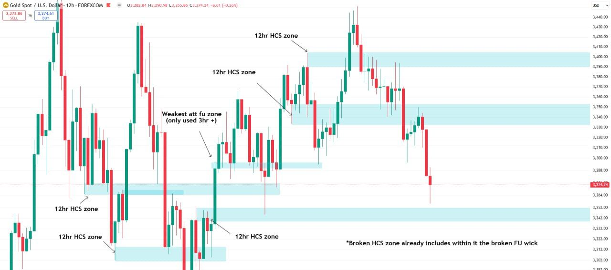

Chart annotations (12hr):

- "12hr HCS zone" (five zones)
- "Weakest att fu zone (only used 3hr +)"
- "*Broken HCS zone already includes within it the broken FU wick"

The higher-timeframe base is mostly 12hr HCS zones. A broken HCS zone can already contain a broken FU wick, so no separate zone is drawn for it.

#### 7hr

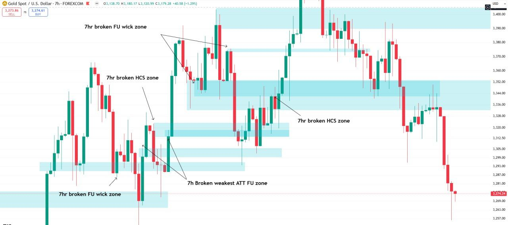

Chart annotations (7hr):

- "7hr broken FU wick zone" (two zones in the upper area, and one lower left)
- "7hr broken HCS zone" (twice)
- "7h Broken weakest ATT FU zone" (two zones)

#### 7hr: extend rather than draw a new zone

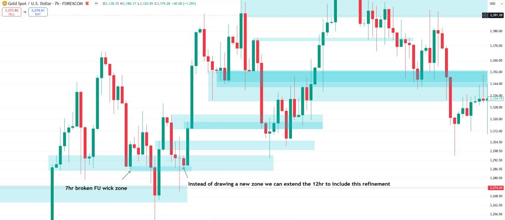

Chart annotations (7hr):

- "7hr broken FU wick zone"
- "Instead of drawing a new zone we can extend the 12hr to include this refinement"

#### 7hr: overlaps and fading

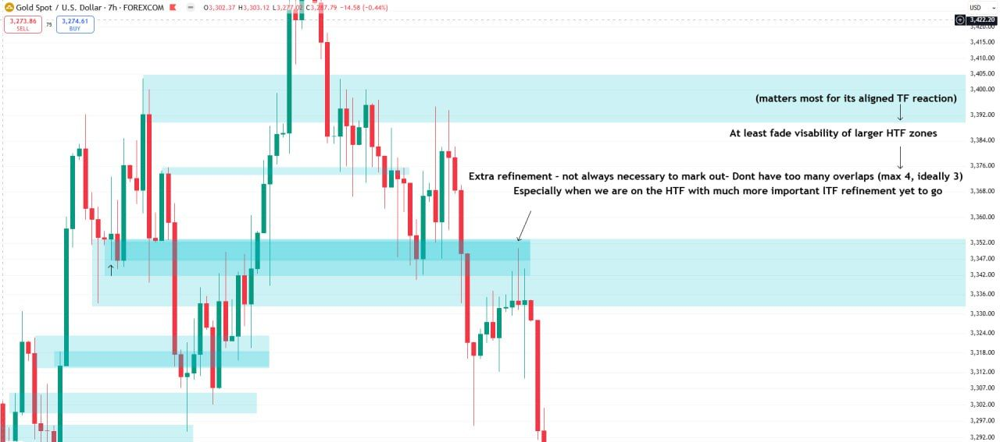

Chart annotations (7hr), read top to bottom:

- "(matters most for its aligned TF reaction)"
- "At least fade visability of larger HTF zones"
- "Extra refinement - not always necessary to mark out- Dont have too many overlaps (max 4, ideally 3) / Especially when we are on the HTF with much more important ITF refinement yet to go"

A zone matters most for the reaction on its own timeframe. As refinement is added, he says to "at least fade" the visibility of the larger HTF zones, to keep overlaps to four at most (ideally three), and not to over-refine on the HTF while the ITF refinement is still to come. On "fade", see [Zones · Full zone mark-up](/mrc-tasks/reference/zones/#full-zone-mark-up-for-a-ny-session).

*"ITF" is not defined in the material so far (presumably the intermediate timeframes).*

#### 5hr: marking after the fact

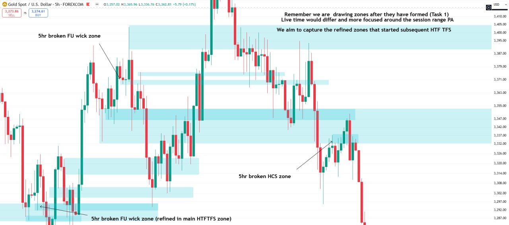

Chart annotations (5hr):

- "Remember we are  drawing zones after they have formed (Task 1) / Live time would differ and more focused around the session range PA / We aim to capture the refined zones that started subsequent HTF TFS"
- "5hr broken FU wick zone"
- "5hr broken HCS zone"
- "5hr broken FU wick zone (refined in main HTFTFS zone)"

*"(Task 1)" appears to refer to [Week 1 Task 1](/mrc-tasks/tasks/weeks/1/task-1/assignment/) (HTF zones marked after they formed); the chart does not say which Task.*

For live marking, see [Zones · Live-time application](/mrc-tasks/reference/zones/#live-time-application).

#### 4hr: adjustment and extreme refinement

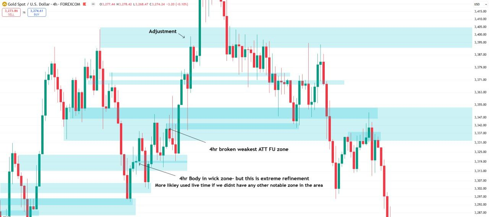

Chart annotations (4hr):

- "Adjustment" (arrow to the top zone's edge)
- "4hr broken weakest ATT FU zone"
- "4hr Body in wick zone- but this is extreme refinement / More likley used live time if we didnt have any other notable zone in the area"

Zone edges are adjusted as the lower timeframes refine them. A 4hr body-in-wick zone is extreme refinement, more for live use where there is no other notable zone nearby.

#### 3hr: refine further

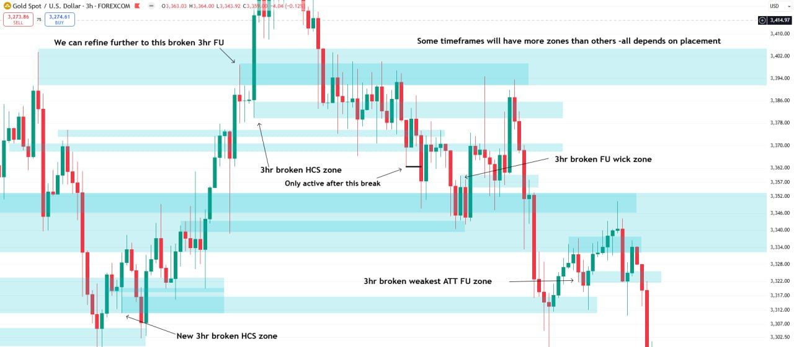

Chart annotations (3hr):

- "We can refine further to this broken 3hr FU"
- "Some timeframes will have more zones than others -all depends on placement"
- "3hr broken HCS zone" with "Only active after this break" (a short black line at the break level)
- "3hr broken FU wick zone"
- "3hr broken weakest ATT FU zone"
- "New 3hr broken HCS zone"

The HCS zone is active only after the break: see [Zones · When a zone becomes active](/mrc-tasks/reference/zones/#when-a-zone-becomes-active).

#### 50 min: don't overdo refinement

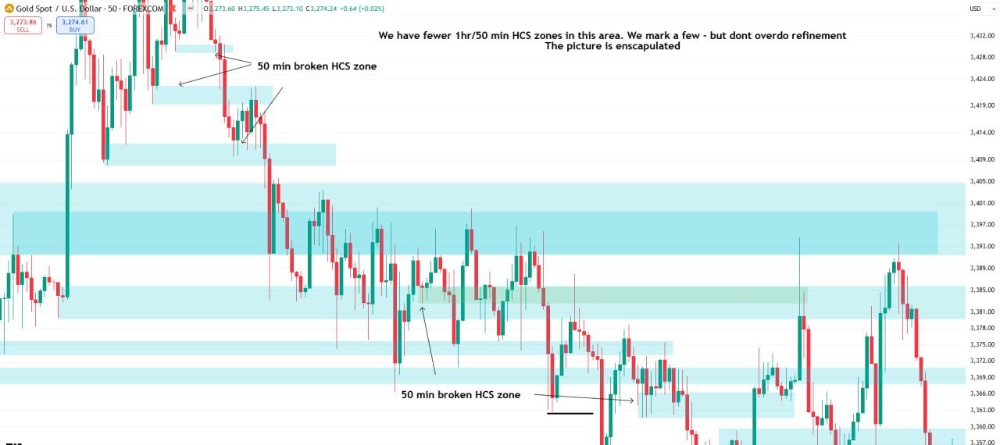

Chart annotations (50 min):

- "We have fewer 1hr/50 min HCS zones in this area. We mark a few - but dont overdo refinement / The picture is enscapulated"
- "50 min broken HCS zone" (two labels)

#### 50 min: remove the parent zones

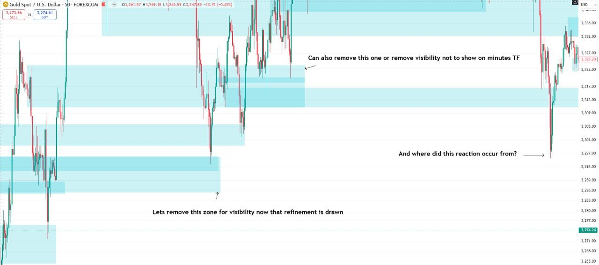

Chart annotations (50 min):

- "Lets remove this zone for visibility now that refinement is drawn"
- "Can also remove this one or remove visibility not to show on minutes TF"
- "And where did this reaction occur from?" (arrow at a sharp low, around 3,296)

Once a zone's refinement is drawn, the parent zone can be removed, or hidden on the minute timeframes.

His question is a small exercise: find the zone the arrowed reaction came from before opening the answer.

Show the answer

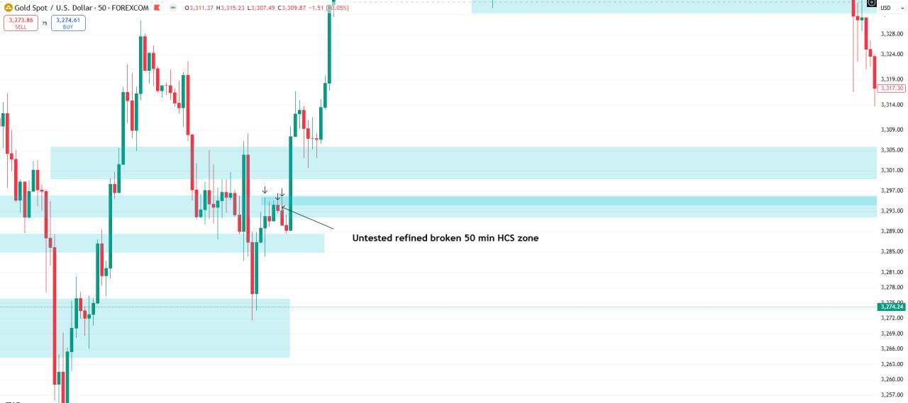

Chart annotations (50 min):

- "Untested refined broken 50 min HCS zone" (three small arrows over the candles that form it)

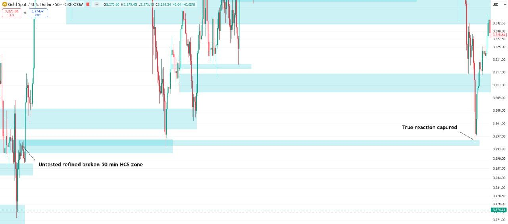

Chart annotations (50 min):

- "Untested refined broken 50 min HCS zone"
- "True reaction capured" (at the low, with the zone extended right)

The sharp reaction came from the untested, refined, broken 50 min HCS zone.

#### 50 min: final zone refinement

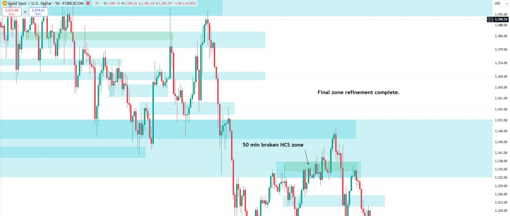

Chart annotations (50 min):

- "Final zone refinement complete."
- "50 min broken HCS zone"

### Step 2: TFS and liquidity on 30 min

> Then add TFS (bank order pressure - their signature of how much they want to move price- the more one understands liquidity the better understanding of their exact intentions) And basic 30 min + liquidity (unmanipulated doji, big wick to fill, ATT FU, breakout):

The same chart, now on 30 min and below. Horizontal black lines mark liquidity levels; teal lines mark established TFS POI (see [Timeframe Strength · Established](/mrc-tasks/reference/timeframe-strength/#established)).

#### 30 min: basic liquidity

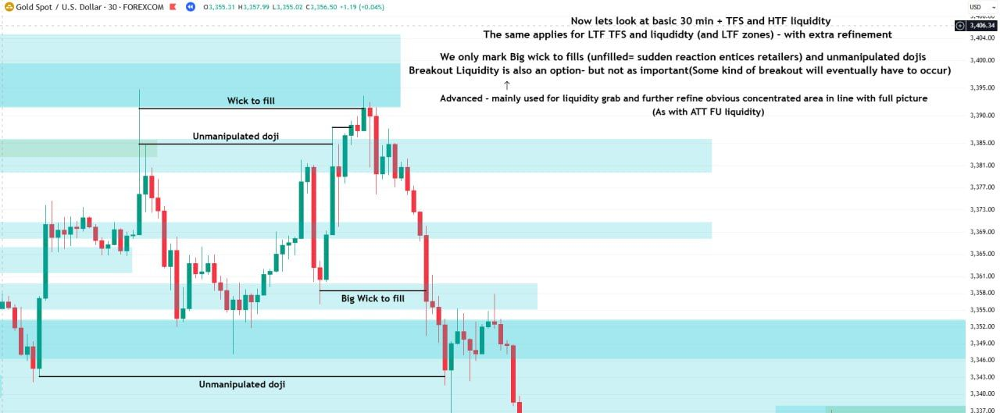

Chart header (30 min):

"Now lets look at basic 30 min + TFS and HTF liquidity / The same applies for LTF TFS and liquidty (and LTF zones) - with extra refinement / We only mark Big wick to fills (unfilled= sudden reaction entices retailers) and unmanipulated dojis / Breakout Liquidity is also an option- but not as important(Some kind of breakout will eventually have to occur) / ↑ / Advanced - mainly used for liquidity grab and further refine obvious concentrated area in line with full picture / (As with ATT FU liquidity)"

Chart annotations (30 min), top to bottom:

- "Wick to fill" (around 3,394)
- "Unmanipulated doji" (around 3,385)
- "Big Wick to fill" (around 3,359)
- "Unmanipulated doji" (around 3,344)

#### 30 min: advanced liquidity and the established TFS POI

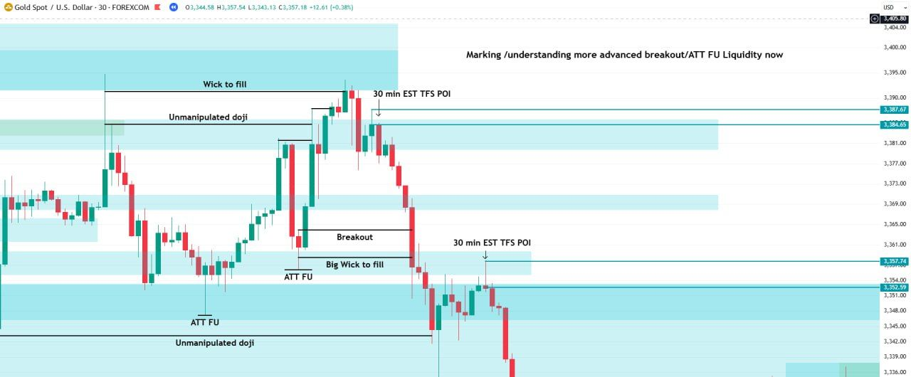

Chart annotations (30 min):

- "Marking /understanding more advanced breakout/ATT FU Liquidity now"
- "30 min EST TFS POI" (twice: 3,387.67-3,384.65 and 3,357.74-3,352.59)
- "Breakout" (around 3,364)
- "ATT FU" (twice: around 3,358 and 3,347)
- the liquidity lines from the previous chart

#### The last area of liquidity

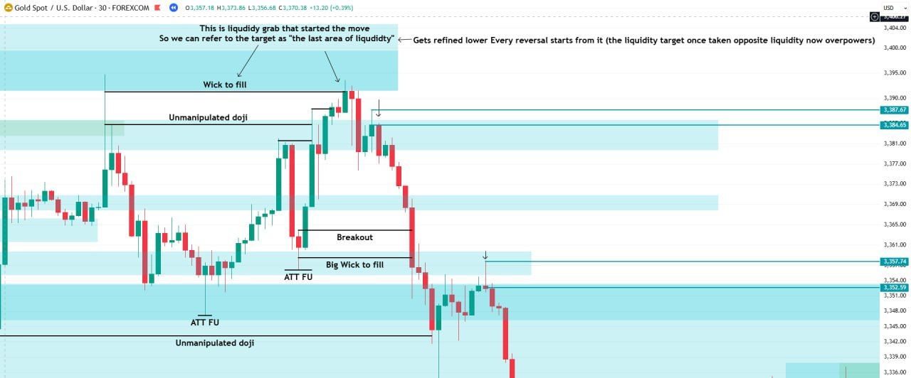

Chart annotations (30 min):

- "This is liquidiy grab that started the move / So we can refer to the target as "the last area of liquidty"" (arrows to the wick-to-fill level at the high)
- "Gets refined lower Every reversal starts from it (the liquidity target once taken opposite liquidity now overpowers)"
- the other labels as on the previous chart

This is his visual explanation of [LAOL](/mrc-tasks/reference/terminology/#laol). The liquidity grab at the high started the move down, and that target is "the last area of liquidity". It is refined on the lower timeframes. Every reversal starts from it, because once that target is taken, the opposite liquidity overpowers.

### The directional outlook on 45 min

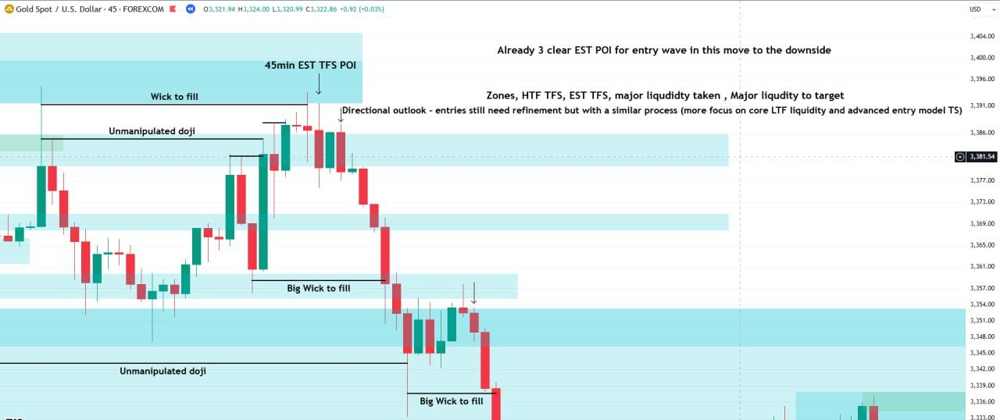

Chart annotations (45 min):

- "45min EST TFS POI" (arrow to the high area)
- "Already 3 clear EST POI for entry wave in this move to the downside"
- "Zones, HTF TFS, EST TFS, major liquidity taken , Major liquidity to target"
- "Directional outlook - entries still need refinement but with a similar process (more focus on core LTF liquidity and advanced entry model TS)"
- "Wick to fill", "Unmanipulated doji" (twice), "Big Wick to fill" (twice)

What each session should end with: the directional outlook built from those five things.

## Part B: his example (below 15 min)

His worked example continues on 10 min and 1 min, two timeframes below 15 min, the same as Part B asks for. Both charts zoom into one price area: the 30 min established TFS POI at the high.

### 10 min: which side is more major?

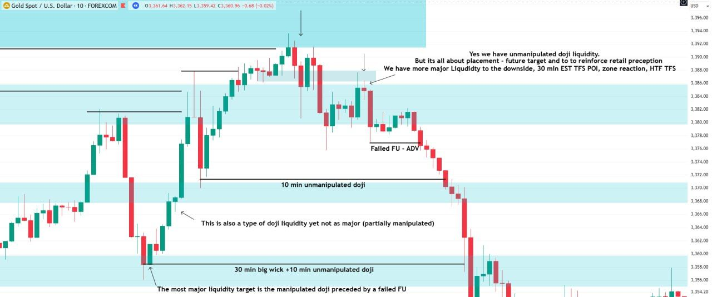

Chart annotations (10 min):

- "Yes we have unmanipulated doji liquidity. / But its all about placement - future target and to to reinforce retail preception / We have more major Liquidty to the downside, 30 min EST TFS POI, zone reaction, HTF TFS"
- "Failed FU - ADV" (a line around 3,377)
- "10 min unmanipulated doji" (around 3,371)
- "This is also a type of doji liquidity yet not as major (partially manipulated)"
- "30 min big wick +10 min unmanipulated doji" (around 3,358)
- "The most major liquidity target is the manipulated doji preceded by a failed FU" (arrow to the candle at around 3,358)

Liquidity sits on both sides; the point is weighing which side is more major. Explained in full on [Liquidity · 10 min](/mrc-tasks/reference/liquidity/#10-min-which-side-is-more-major).

*This chart calls "the manipulated doji preceded by a failed FU" the most major liquidity target. [Task 1](/mrc-tasks/tasks/1/assignment/#the-30-chart-task) calls the unmanipulated doji "The most major form of liquidity (HTF, pure doji)". The two statements differ, and the source does not explain the difference.*

### 1 min: the bank's execution

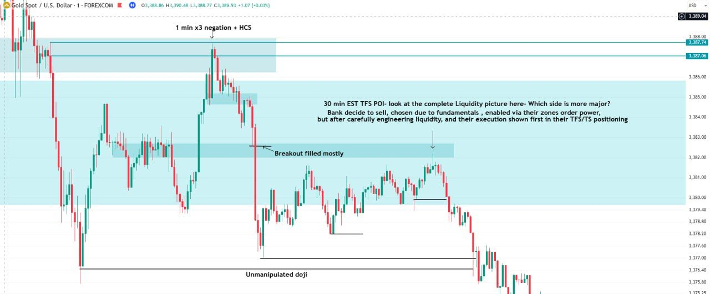

Chart annotations (1 min):

- "1 min x3 negation + HCS" (at the high, around 3,387.7)
- "30 min EST TFS POI- look at the complete Liquidity picture here- Which side is more major? / Bank decide to sell, chosen due to fundamentals , enabled via their zones order power, / but after carefully engineering liquidity, and their execution shown first in their TFS/TS positioning"
- "Breakout filled mostly" (around 3,382.6)
- "Unmanipulated doji" (around 3,376.4)
- three short unlabelled lines (around 3,378.1, 3,377.0 and 3,379.9)

The same price area on 1 min: the refinement a Part B price point asks for. His chain of cause is set out on [Liquidity · 1 min](/mrc-tasks/reference/liquidity/#1-min-the-banks-execution).

## On the repetitions

"The previous repetitions may be hard for some - but that is how it is intended. To jump-start your working memory." The effects show "weeks later (after your mind truly soaks in the information- and it should be mentioned, some minds need more rest than others, especially when doing multiple repetitions)."

---

Related: [Liquidity](/mrc-tasks/reference/liquidity/) · [Zones: Types, Rules & Refinement](/mrc-tasks/reference/zones/) · [Timeframe Strength (TFS)](/mrc-tasks/reference/timeframe-strength/) · [Terminology](/mrc-tasks/reference/terminology/) · [Task 1 - Major Liquidity](/mrc-tasks/tasks/1/assignment/) · [Week 1: Zones](/mrc-tasks/tasks/weeks/1/) · [Week 2: Timeframe Strength](/mrc-tasks/tasks/weeks/2/)
